# Абстрактно-геометрический фон в CorelDRAW

_Дата публикации: 02.11.2012  
Автор: Artur_

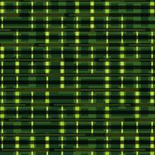

Урок будет не простой, в нем я передам вам сакральные знания о возможностях построения абстрактно-геометрических паттернов с помощью простого бленда и хитрой сетки по которой бленд будет пущен.

Этап первый. Построение сетки.

1\. Нарисуем линию длиной 10 мм.  
2\. Откроем докер Edit>Step and Repeat...(Ctrl+Shift+D), установим шаг копирования по горизонтали 10 по вертикали ноль, количество шагов для начала 15, жмем кнопку Apply, получаем ряд копий.  
Можно сделать все дублированием с шагом 10 мм, но через докер быстрее.  
3\. Поменяем значения, по горизонтали ноль по вертикали 10 и сделаем столько же копий ряда.

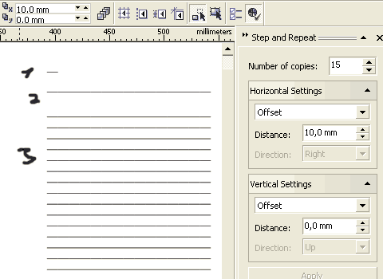

Повторяем три пункта для вертикальной линии, у нас получается две части которые если совместить образуют сетку.

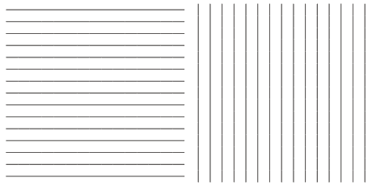

Самый ответственный этап, так как нам нужен хаотичный путь, нужно перемешать линии в обоих частях, но также нам нужна геометрическая точность, поэтому части не должны потерять свою изначальную форму, общий порядок размещения и расстояния между линиями. Делается это путем поочередного выделения некоторого количества линий и их «отражения», т. е. путем нажатия соответствующих кнопок меняется порядок выделенных линий относительно остальных (опытным путем установлено что делать это лучше не сразу с сеткой а с отдельными горизонтальными и вертикальными элементами). Нужно сделать много таких отражений, чем больше тем хаотичней получится путь для бленда и лучше конечный результат.

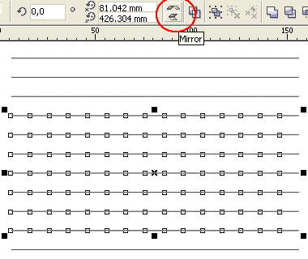

Для большей наглядности видео процесса «охаотичивания» порядка линий: [Народ.Диск (105 Кб)](http://narod.ru/disk/3741035000/random_path_mirror.zip.html)

После n-ного количества отражений должно получится примерно следующее:

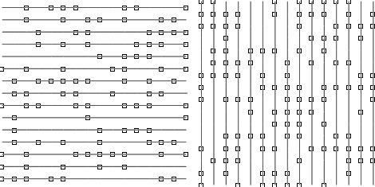

Линии разбросаны, но находятся в пределах изначальной формы и не перекрываются. Скомбинируем отдельно горизонтальные и вертикальные линии (Ctrl+L), превратив их в один объект — путь для бленда.

Этап второй. Заполнение.

Самый творческий этап, нарисуем две пары прямоугольников 12,5 х 2,5 мм, горизонтальных и вертикальных, делаем между ними перетекание инструментом Interactive Blend Tool и задаем блендам соответствующие пути, выбираем фиксированое расстояние между объектами кратное пяти, чем оно меньше тем соответственно больше объектов на пути:

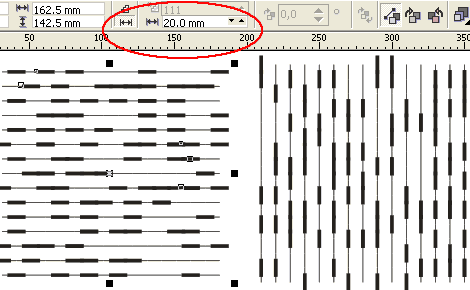

Совместим части сетки, получим некоторое подобие лабиринта (справа более «плотный» вариант с расстоянием между объектами 10 мм):

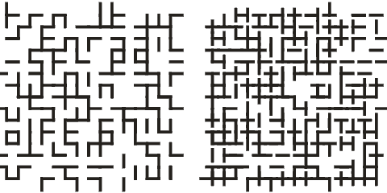

Видео демонстрирующее работу с блендом: [Народ.Диск (178 Кб)](http://narod.ru/disk/3741047000/blend_lab.zip.html)

Таким образом можно сделать несколько «слоев» пустив разное количество объектов по одному и тому же пути:

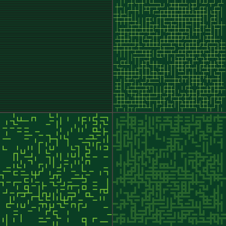

И получить нечто подобное:

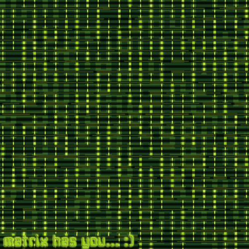

Можно сразу объединить горизонтальные и вертикальные линии в сетку и поэкспериментировать с другими формами:

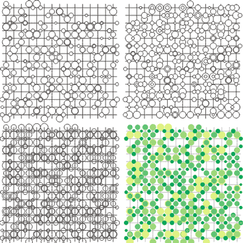

Или чуть по другому:

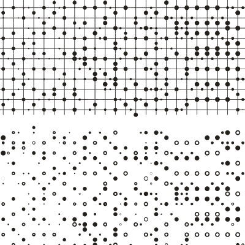

И с различными наложениями:

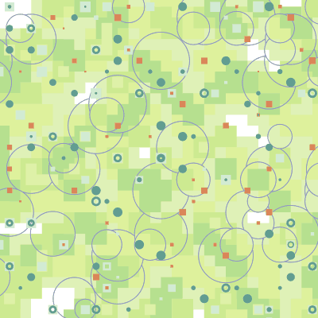

И даже можно поудалять отдельные линии сетки, результат тоже интересный:

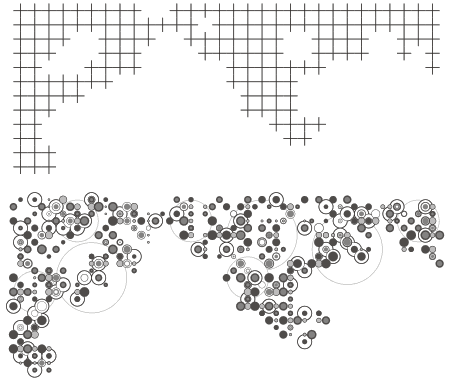

Простор для творческих экспериментов достаточно широкий. Изюминка данной техники в совмещении геометрической точности и хаотичности в расположении, форме и/или цвете.

Удачи!