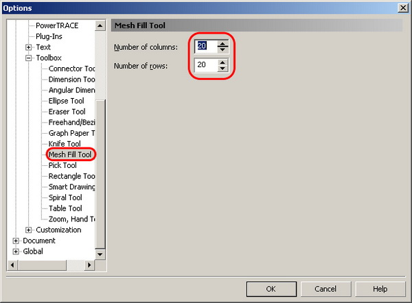
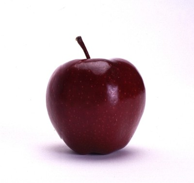
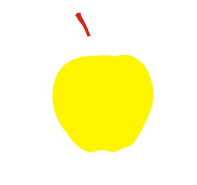
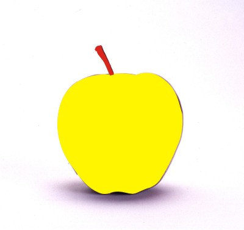
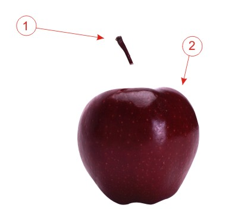
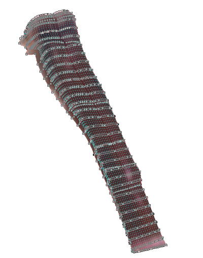
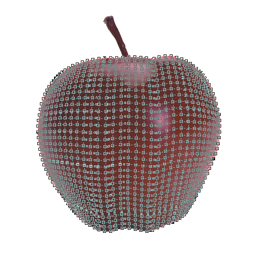
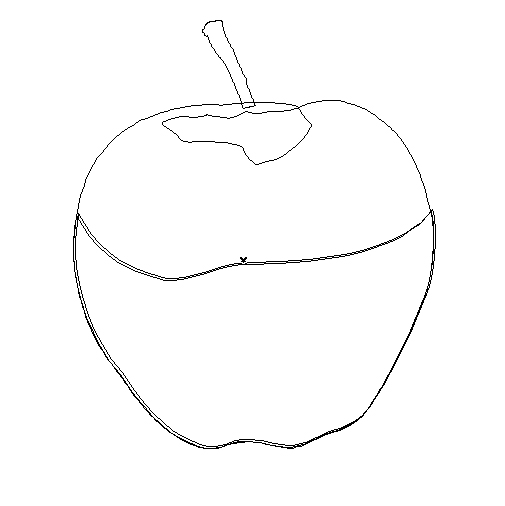
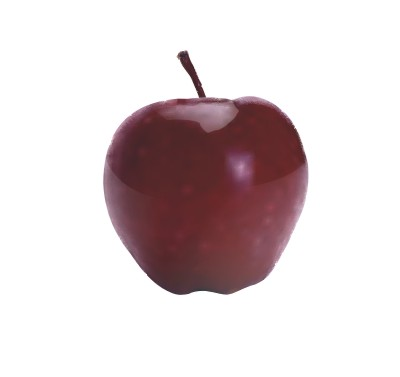

# Автомешь в CorelDRAW

_Дата публикации: 02.11.2012  
Автор: KarLsoN_

1\. Заходим меню tool>options>  
2\. В появившемся окне настроек, находим настройки Mesh Fill Tool, для данного примера я задал 20 строк и 20 столбцов, жмем «OK»

3\. берем фотографию, пусть это будет яблоко

3.1 рисуем маски для данного объекта(черенок яблока и плод), в данном случае нам понадобится их две.

4\. при помощи функции **intersect**, вырезаем из фотографии нужные нам фрагменты.

5\. к каждому фрагменту применяем Mesh Fill Tool

Пример:

6\. полученный результат собираем воедино

Я еще добавил пару бликов, это видно на сетке

Результат.

Совет: не ленитесь отредактировать полученную градиентную сетку, для лучшего результата! Я этого не делал, так как основной целью было донести суть данного способа

[automesh.cdr](/sites/default/files/article/files/automesh.rar)