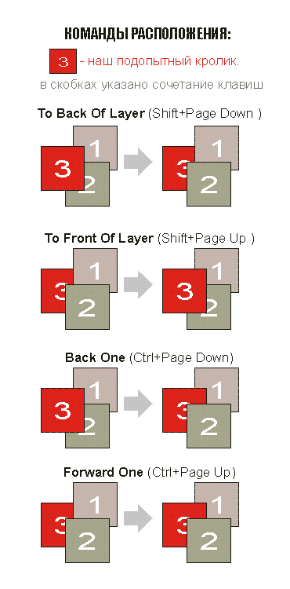
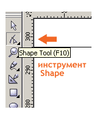
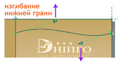
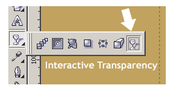

# Буклет в CorelDRAW

_Дата публикации: 02.11.2012  
Автор: VVV_

Как же сделать буклет в кореле? Так как в буклете очень много информации и приемы работы над теми или иными объектами буклета одинаковы, я сделаю лишь лицевую страничку буклета. А остальное будете делать сами, опираясь на те приемы, которые приведены в этом уроке, по моему их достаточно, чтоб сделать очень даже хороший буклет с нулевыми знаниями корела.

Буклет это- непериодическое листовое издание в виде одного листа печатного материала, сфальцованного в 2 и более сгибов так, что их читают или рассматривают, раскрывая как ширму.

### Итак приступим к подготовке корела:

Сначала поворачиваем лист с книжного формата в альбомный.

Кнопка "Landscape" предназначена для изменения расположения страницы с книжного в альбомное. Рядом находится кнопка "Portrait" которая поворачивает страницу обратно с альбомного в книжное расположение.

Затем ставим направляющие по краям страницы.

Направлюющие вокруг страници ставятся следующим образом. Вызываем окно Options (Ctrl+J) раскрываем списки Document -> Guidelines и жмем по пункту Presets, и ставим галочку в опции "Page Borders":

После этой операции появятся направляющие по краям страницы:

Эти пунктирные линии вокруг страницы называется направляющие.  
Они помогают придерживается точных размеров страницы.  
В кореле присутствует функция привязки к направляющим, можно сделать так чтоб объекты "липли" к направляющим. Для этого нажмите кнопку "Snap to Guidelines" на панели инструментов.

Далее нам необходимо обозначить места сгиба буклета. А обозначать сгибы мы будем направляющими.

Направляющую можно вытянуть из линейки, а можно скопировать с другой направляющей. Мы воспользуемся вторым вариантом. Для этого выделяем одну из вертикальных направляющих (желательно ту что слева) и делаем ее копию*. Затем задаем координату этой направляющей 98мм это расстояние от левого края страницы (координата задается в верхней панели, которая появляется, когда направляющая выделена).  
*(кнопка + на дополнительной панели создает копию над оригиналом)

Вот изакончена подготовка к рабооте.

### Теперь переходим к дизайну лицевой странички:

Мы будем делать дизайн буклета отеля с заурядным названием "Днипро".  
У нас есть много фотографий (предоставленных клиентом) и текст в двух вариантах на английском и на украинском. К делу!  
Заказчик желает золотистый фон в буклете. Мы берем в стандартной CMYK палитре корела цвет GOLD и заливаем им фон будущего буклета

  

Золотой цвет состоит и следующих пропорций (C=0 M=20 Y=60 K=20).  
Фоновый прямоугольник создается двойным щелчком левой кнопки мыши по пиктограмме инструмента Rectangle:

Берем логотип отеля и две фотографии, которые заказчик пожелал иметь на лицевой части буклета. И делаем предварительный набросок на лицевой части буклета.

Фото и лого можно вставить в корел методом перетаскивания.

Лично я вижу лицевую часть буклета вот такой:

Давайте сделаем ее такой!

Начнем с градиентной заливки в фоне. Создаем векторный прямоугольник, по ширине лицевой странички, инструментом Rectangle.

Затем заливаем прямоугольник градиентной заливкой.

щелкаем мышью по инструменту "Fill" чтоб выпало окошко с различными функциями заливки.

Открываем диалоговое окно "Fountain Fill Dialog" и делаем следующие настройки

Переключаем флажок "Two Color" на "Custom" это для того, чтоб наш градиент состоял не из двух цветов, а из нескольких.  
Задаем угол наклона градиента Angle=90;  
Добавляем еще два маркера цвета (двойной щелчок по полосе маркеров) и задаем этим маркерам следующий цвет (C=0 M=9 Y=20 K=9), а крайним маркерам задаем цвет - (C=0 M=20 Y=60 K=20) цвет задается при помощи кнопки "Others".

Это окно настройки цвета, корок появляется при нажатии кнопки "Others"

И что у нас получилось? А получилось у нас следующее, градиентный прямоугольник закрыл собой все остальные объекты (лого и фотки). Необходимо опустить прямоугольник ниже фоток и лого.

В нашем случае подойдет комбинация - Shift+Page Down (To back of layer), Ctrl+Page Up (Forward One).

Переходим к верхней волне.

Создаем прямоугольник вверху инструментом Rectangle:

Затем переводим прямоугольник в кривую

Перевод в кривую можно произвести сочетанием клавиш сочетанием клавиш Ctrl+Q или щелчком правой кнопкой мыши по прямоугольнику и выбором команды "Convert To curves".

Теперь изгибаем нижнюю грань прямоугольника в виде волны

Для того, чтоб изогнуть нижнюю грань - переводим ее в криволинейную инструмент "Shape", щелкнув правой кнопкой мыши по нижней грани в выбрав команду "To curve".

Воздействуя инструментом "Shape" на рычажки (с квадратиками на концах если у вас 9-12-я версии корела и со стрелочками, как у меня, если 13-я) изгибаем линию - подымаем левый рычаг вверх а нижний опускаем вниз, чтоб получилась волна.

Заливаем получившуюся волну оттенком золотистого цвета (C=0 M=12 Y=30 K=12)

По моему с цветами лучше всего работать с помощью докера Color:

докер Color в меню:Window/Dockers/Color

Переходим к чайкам в фоне.  
Создаем прямоугольник (желательно на соседней странице) и переводим прямоугольник в кривую (Ctrl+Q) или упомянутым выше способом.

Включаем инструмент "Shape" и создаем приблизительный набросок чайки методом передвижения узлов прямоугольника.

Затем приводим все линии в криволенейные.

Для перевода всех линий в криволинейные необходимо выделить все узлы будущей чайки, обведя ее инструментом "Shape". Затем жмем на верхней панели инструментов кнопку "To curve"

Далее работая над узлами линиями и рычагами добиваемся следующего результата.

Все это делается инструментом "Shape" (F10)

Теперь расставляем чаек на лицевой части буклета:А чтоб они не "резали глаз" применяем к ним эффект прозрачности

Чтобы сделать чаек прозрачными выделяем их и включаем "Interactive Transparency" (эффект прозрачности), нажав соотвецтвующую кнопку на панели инструментов справа.  

В появившейся сверху панели параметров прозрачности задаем следующие значения: вид прозрачности Uniform, процентовка 70

Осталось выяснить как сделаны рамки у картинок  
Чтоб сделать подобную рамку картинок. Необходимо вставить картинку в Powerclip

Powerclip-м может быть любой векторный объект, в нашем случае прямоугольник. Чтобы поместить фото в прямоугольник выделяем ее и применяем к ней команду "Place Inside Container" через меню Edit/ Powerclip/ Place Inside Container.

Появившейся после команды "Place Inside Container" черной стрелкой жмем на недавно созданный нами прямоугольник, если мы промажем корел выдаст следующее окно в котором он оповещает нас о неудачной попытке и предлагает попробовать еще, жмите "ДА" и пробуйте (старайтесь попасть кончиком стрелочки по контуру прямоугольника).

После того как картинка окажется в Powerclip-е приминяем к нему эффект контур.

Докер контур открывается сочетанием клавиш Ctrl+F9.  
Выделяем наш Powerclip и задаем показанные выше настройки (ставим галочку Outside, задаем отступ (Offset=2,0), шаг один (Steps=1)) и жмем Apply.

Затем отбиваем контур сочетанием клавиш Ctrl+k и заливаем полученный вектор следующим цветом (C=0 M=7 Y=14 K=0).

Осталось разобраться с контуром нашей рамки и она готова.

Чтобы изменить контур, вызываем окно опций контура (F12) и настраиваем следующие параметры: цвет GOLD, размер 1.0 мм

Тоже самое делаем с второй фотографией.  
Что касается нижней волны, она делается методом отзеркаливания верхней волны

Отзеркаливение производится при помощи соответствующих кнопок на верхней панели (но не забывайте, что эти кнопки появляются только тогда, когда выделен объект над которым необходимо произвести операцию отзеркаоивания)

Вот и готова лицевая часть дальше разбирайтесь сами. А вот таким у меня получился этот буклет в целом. Конечно долек от идеала, но в целом очень даже ничего

Ну вот пожалуй и все что я хотел показать в этом уроке. И помните, что в этом уроке я всего лишь показал несколько приемов работы с программой CorelDRAW на примере буклета, а как пользоваться этими уроками, выбирать вам. Дизайн за вас никто не сделает!