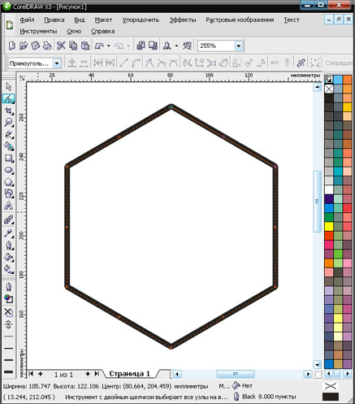
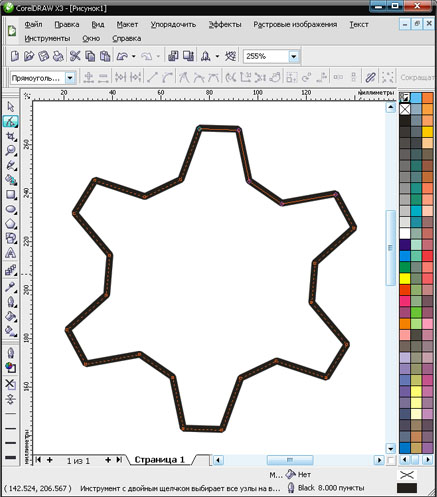
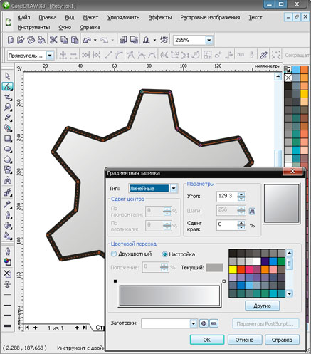
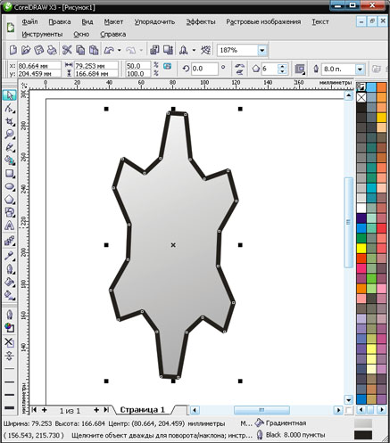
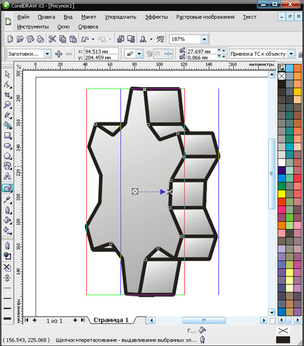
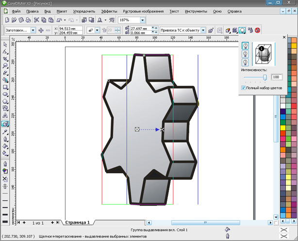
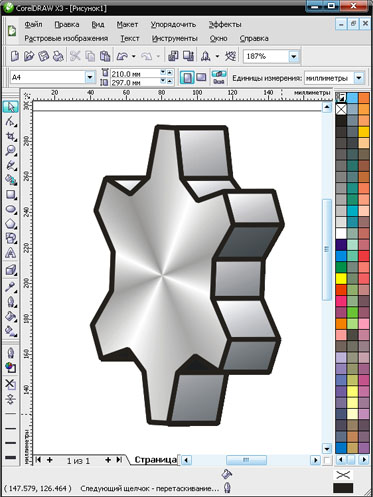
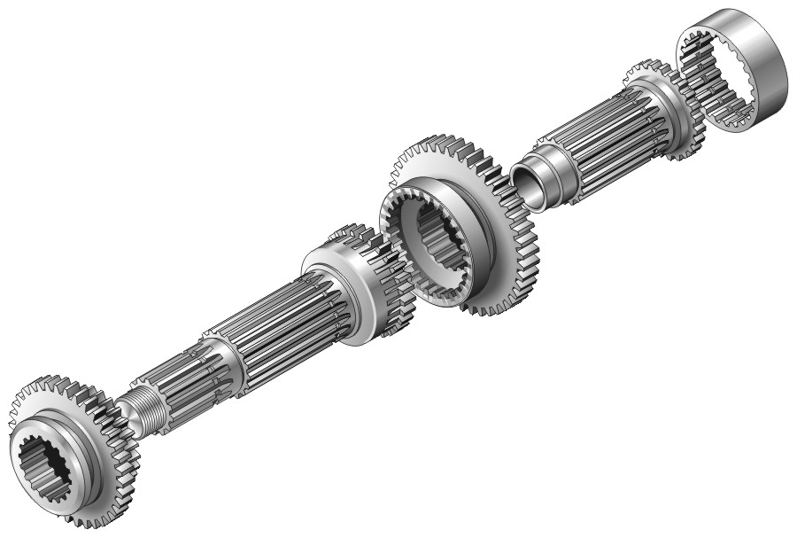

# Быстрое рисование шестерни

_Дата публикации: 02.11.2012  
Автор: sergey_

Создаем многоугольник, граней столько — сколько должно быть зубьев в шестерне

Добавляем 2 узла на одной из граней

Двигаем узлы до желаемой шестерни

Даём заливку

Деформируем

Выдавливаем

Освещаем

Копируем и вставляем торец шестерни, меняем заливку

Результат

