# Cнежинки

_Дата публикации: 02.11.2012  
Автор: VVV_

Включаем инструмент Poligon и рисуем небольшой полигон:

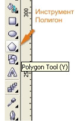 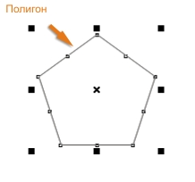

Задаем полигону девять углов (углы задаются на верхней панели при выделенном полигоне)

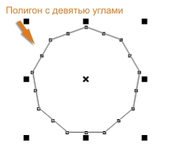 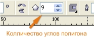

Берем один из узлов инструментом Shape и тянем его к центру полигона:

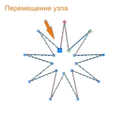

Зумируем (приближаем) один из углов нашей звезды (зум в кореле хорошо делать клавишами F2, F3, F4)

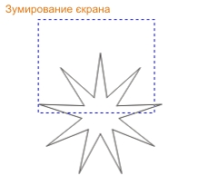

Добавляем узлы инструментом шейп (двойной щелчок по линии)

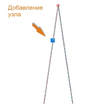 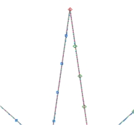

Выделяем группу узлов и переводим их в криволинейные (перевести в кривые можно нажатием кнопки to curve на панели инструментов):

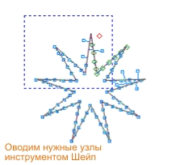 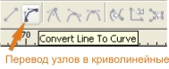

Искривляем узлы чтоб предать полигону декоративную форму снежинки:

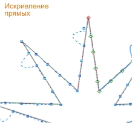 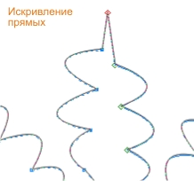

ЗЫ. По играйтесь с искривлением узлов, чтоб получить разные виды снежинок, выставляйте ваши попытки в этой теме.

