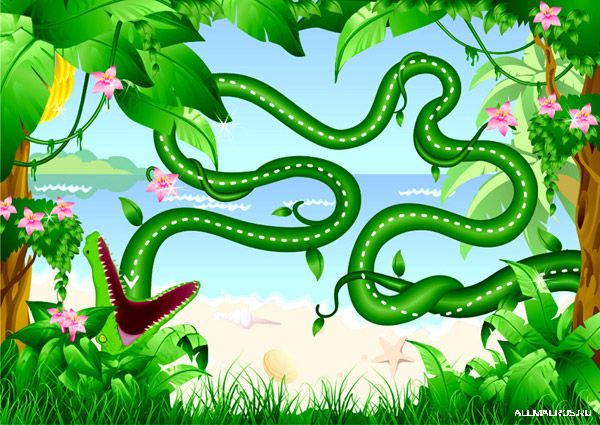
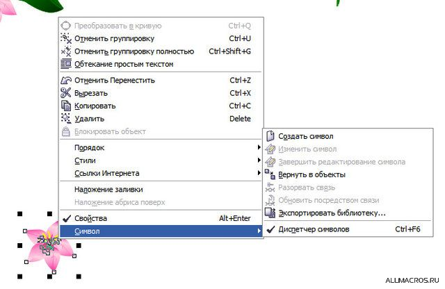
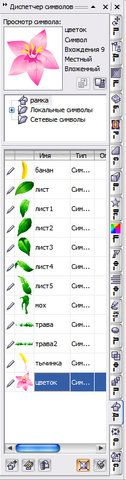
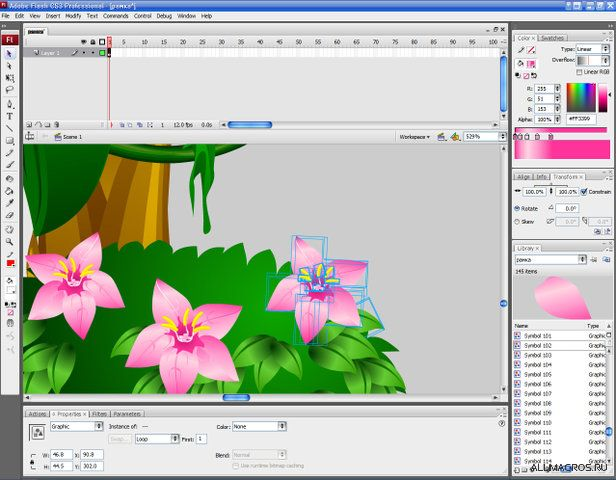
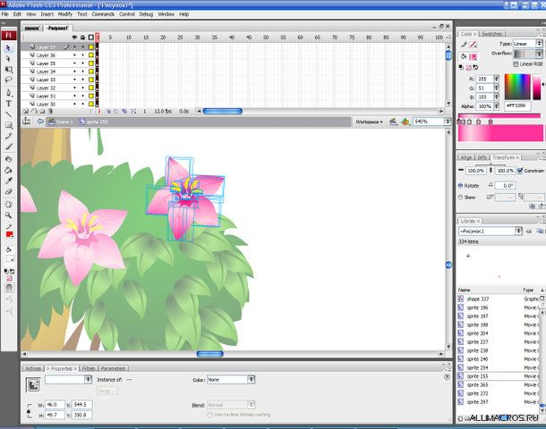

# CorelDRAW + Adobe Flash

_Дата публикации: 02.11.2012  
Автор: salllka_

Готовила как-то исходники для игрушки.

Рисовалось это безобразие в кореле, но экспорт во флеш я не доверю никому (зная любовь всех к корелу, а особенно знание его. Выгонят ведь тупо растром и фсе).

Объектов множество, все они повторяющиеся, соответственно, нам нужен флеш-исходник уже с символами, а не просто набором объектов. Выделять и конвертить в символ каждую кривульку во флеш -- долго и нудно. Также долго конвертить во флеш из корела по одному листику, и складывать во флеше картинку по-новой.  
Чтоб значительно упростить себе подготовку флеш-исходника, изначально рисуем в корел с использованием символов:

Символы в корел, практически то же, что и во флеш: сокращают размер файла, при использовании повторяющихся элементов; к каждому образцу символа можно применять трансформации, что не скажется на остальных образцах; при редактировании самого символа, эти изменения касаются всех используемых образцов.  
Также в файле доступна библиотека символов (диспетчер символов):

При экспорте в swf эти символы сохраняются. Но разобьются на исходные элементы (т.е. на отдельные объекты, если символ в корел состоит из нескольких кривых), каждый из которых уже флеш поймет как символ типа графика, если просто импортировать полученную swf-ку во флеш.

(Т.е. каждый лепесток у цветка -- это символ Graphic (напр. symbol 102 -- он есть во всех цветах)  
В принципе, и этого достаточно: каждый кусочек лепестка, листика и т.д. -- флешевый символ, файл имеет небольшой вес (но замучаемся группировать, для удобства редактирования).  
Чтобы во флеше сохранились кореловские символы целиком, нужно выполнить не сложный танец с бубном: загнать экспортированную из корел swf-ку в декомпилер (пользуюсь Sothink SWF Decompiler 3.6). И потом работать уже с полученным с помощью него fla-файлом:

Т.е. Получаем набор символов MovieClip (соответствующих кореловским символам и состоящих уже из отдельных символов Graphic). C таким исходником управляться уже на порядок проще.  
Надеюсь, пригодится =-)