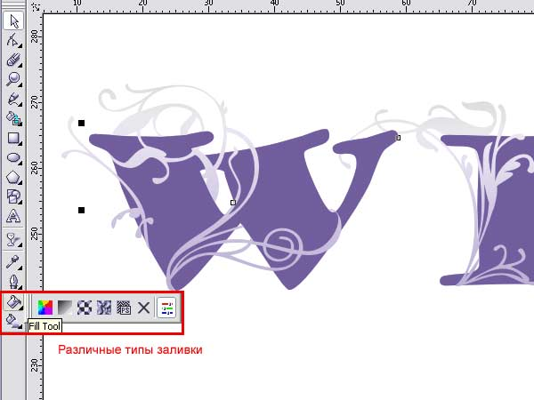
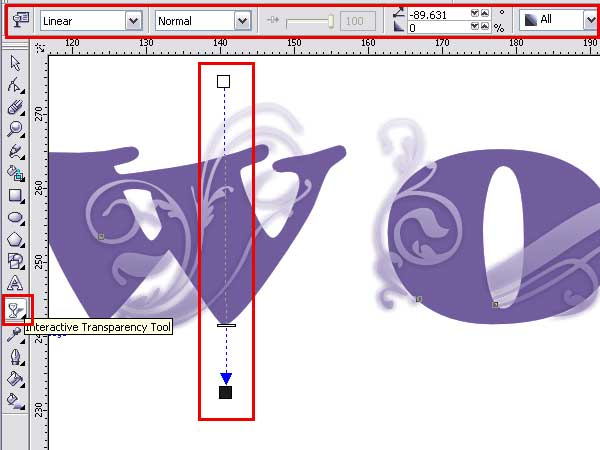

# Декоративный текст в CorelDRAW X3

_Дата публикации: 02.11.2012  
Автор: wi-wo_

Сегодня мы создадим в CorelDRAW надпись, украшенную декоративными элементами. Это очень просто, но нам все-таки потребуется небольшая помощь Photoshop.  
Урок получился объемный, потому что я поставила перед собой задачу написать все как можно подробнее.

Конечный результат урока будет выглядеть примерно вот так:

Почему примерно? Потому что вы можете использовать любые узоры и получить результат кардинально отличный от моего. К тому же целью данного урока является не повторение моего рисунка во всех деталях, с заданными настройками, а обзорный рассказ о некоторых функциях и инструментах программы, с целью облегчить вам задачу по реализации ваших творческих замыслов.

**Нулевой этап,"Образец".**

Что делать, если у вас нет красивых  
векторных завитков для оформления текста и нет времени или, как у меня, умения,  
чтобы их нарисовать? Воспользоваться кистями для Photoshop! У вас наверняка есть  
какие-нибудь декоративные кисти: завитушки, веточки, цветочки, листочки, кляксы.  
Если у вас нет красивых кистей для Фотошоп - посетите наш файловый архив, в нем масса различных красивых кисточек, а также масса других полезных вещей. Единственное, но обязательное условие для выбора - для этого урока кисти должны быть с однородной заливкой, без полупрозрачностей.

Итак вы нашли или установили кисти. Откройте Photoshop.  
Создайте документ размером примерно 800*800 px, цвет холста белый, CMYK или rgb, разрешением 300 dpi, хотя размер файла - это совершенно не принципиально, он может быть как больше, так и меньше, все зависит от размера кистей.  
Выберите инструмент Кисть (Brush (B)) и сделайте несколько произвольных отпечатков различных, приглянувшихся вам кистей, следя за тем, чтобы рисунки не пересекались. Впрочем, можно воспользоваться и одной-единственной кисточкой и получить впечатляющий результат. Все отпечатки можно выполнить на одном слое.

Теперь  
сохраните файл в формате TIFF или jpeg. Вы получили образец для вектора. Можно закрывать фотошоп.

**Первый этап, "Трассировка".**

Откройте CorelDRAW. Импортируйте (**File-import**) ваш подготовительный файл.  
А теперь превратим Растр в вектор.  
Для начала преобразуйте его в двухцветное изображение: меню **Bitmaps - Convert to bitmap**.

Разрешение лучше выбрать побольше, чтобы сохранить детали, а вот на цветах можно сэкономить, выбрав режим Black and white.

Теперь снова откройте меню **Bitmaps - Trace bitmap** - и выберите любой из вариантов. Также вы можете воспользоваться кнопкой Trace bitmap на панели свойств. В любом случае перед вами откроется вот такое диалоговое окно.

В нем вы можете настроить параметры трассировки по своему вкусу.  
Общие советы: увеличьте Масштаб и перетащите в окно просмотра наиболее детализованный участок Изображения - для этого есть кнопки наверху окна. Не делайте параметр Smoothing на 0, чтобы сохранить все точки - в таком случае их будет очень много. Чтобы сохранить детали, воспользуйтесь параметром Detail.

После этого у вас получатся два Изображения одно на другом (если вы конечно не поставили галочку удалить оригинал (Delete original image) в диалоговом окне). Внизу растровый оригинал, сверху группа из векторных элементов. Для дальнейшего редактирования удобно создать прямоугольник с контрастным фоном и перетащить на него нашу векторную группу. (Если после перетаскивания узоры пропадут - нажмите Ctrl+Page Up, если у вас выделен рисунок, чтобы поднять его на один уровень вверх или выделите прямоугольник, перекрывающий рисунок, нажмите Ctrl+Page Down и прямоугольник переместится вниз.) Вот, теперь наглядно видно, что на рисунке остались ненужные участки фона внутри узоров.

Выделите рисунок, и разгруппируйте его (**Arrange - Ungroup** или Ctrl+U). Теперь вы можете избавиться от ненужных деталей.

Также для удаления ненужных участков фона можно воспользоваться менеджером объектов (**Window - dockers - object manager** или **Tools - object manager**). Используя его, можно не создавать контрастный фон. Просто разгруппируйте ваш рисунок, откройте менеджер объектов и удалите все кривые, имеющие белую заливку (выделите, удерживая Ctrl и нажмите Delete).

Подготовительный файл можно удалить или оставить как образец для доводки завитков. Цветной прямоугольник тоже больше не понадобится.

Оцените результаты вашего труда. У меня узоры получились вполне приличные, но при приближении видно, что они угловаты, я думаю, что у вас примерно такая же картина. Сгладим их немного. Выделите рисунок (если у вас несколько узорных элементов, то не стоит выделять их все сразу, выделите один из элементов - так вы сможете лучiе оценить результат) и переключитесь на инструмент **Shape tool (F10)**. Воспользуемся кнопкой **Select all nodes,** чтобы выделить все точки элемента. А затем используйте ползунок **Curve Smoothness** (или можете сразу ввести значение и нажать Enter). Главное в этом деле не переборщить, иначе потеряется весь рисунок.

Теперь все зависит от вашей дотошности. Если вы хотите, чтобы завитушки были ровные и без лишних точек и заломов - инструмент **Shape tool** вам в помощь. Меняйте свойства узлов (например меняйте Cusp на Smooth или наоборот) или свойства участков кривой (Line на Curve), можно проставить новые точки там, где вы считаете нужным. На нашем форуме есть очень полезный урок, где подробно описаны свойства различных узлов и работа с этим инструментом. Выравнивать уже готовый рисунок - не сложно, хотя можно вообще пропустить весь этот этап с трассировкой и нарисовать новые узоры, кому как удобнее.

**Второй этап, "Текст".**

Напишите текст. Тем шрифтом, который вам нравится, то есть любым.  
Выберите инструмент текст, щелкните на странице и начинайте писать.

Чтобы отредактировать уже написанное слово - выделите его и поменяйте нужные параметры через панель свойств. Когда вы точно определитесь с тем, какая у вас будет надпись - переведите ее в кривые (**Arrange - Convert to curves (Ctrl+Q)**), то есть превратите в векторное изображение. Перевод шрифта в кривые даст вам возможность корректировать рисунок шрифта, если он вас по-каким-то причинам не устраивает, а также гарантирует точное отображение шрифта при открытии cdr файла на других машинах, где этого шрифта может и не оказаться. Но при этом перевод в кривые также гарантированно лишает возможности использовать инструменты для редактирования текста, то есть изменить гарнитуру и начертание.

**Третий этап, "Размещение".**

Разместите ваши векторные узоры по поверхности текста, копируя (очень просто: выделите, переместите и перед тем, как отпустить левую, щелкните правой кнопкой мышки), меняя размер, отражая и разворачивая их. Главное в этом деле: помните, что после окончания работы надпись должна читаться.

Для удобства:  
1\. Сделайте шрифт и узоры контрастными по цвету - так будет легче увидеть удачные варианты размещения.  
2\. Переносите на текст копии узоров. Я советую это делать потому, что каждый вновь создаваемый (или копируемый) элемент по умолчанию размещается на самом верху слоя, а значит будет находиться над текстом, а не под ним (если воспринимать все объекты на рабочем столе как стопку цветной бумаги). Если вы не хотите копировать - тогда используйте для перемещения объектов вверх-вниз **Ctrl+Page Up** и **Ctrl+Page Down** (или правая кнопка мышки - контекстное меню объекта - раскрывающееся подменю Order).  
Но мне кажется, что после того как вы проделали такую трудную (и, прямо скажем, довольно нудную) работу по выравниванию, вам наверняка захочется сохранить эти векторные узоры, потому что это готовый векторный клипарт, а если вы внесете в них собственные элементы, трансформируете и скомбинируете как-то по новому - то еще и авторский.

**Четвертый этап, "Стирание деталей".**

Сымитируем обвивание букв узорами.  
Для этого можно использовать несколько различных способов, мы рассмотрим самый простой.  
Воспользуемся ластиком **Eraser tool (X)**. Это очень удобно. Ластик стирает части векторных изображений, автоматически создавая новую границу и проставляя точки. Выделите узор, который хотите редактировать, выберите инструмент ластик и стирайте. Если у вас получились не идеально ровные края - вы можете всегда их подправить, используя все тот же **Shape tool**.

Если, к примеру, вы используете маленькие узорчики, либо кляксы, листья и цветочки без веточек - то может вполне достаточным оказаться расположение рисуноков с обеих сторон текста - под ним и над ним (не забываем, что это всего лишь стопка резаной цветной бумаги). А стирание участков рисунка, оказавшихся под текстом - в таком случае совершенно необязательно.

**Пятый этап, "Окраска".**

Раскрасим наш текст и узоры.  
Вы можете раскрасить ваши текст и узор как вам угодно. Узоры можно сгруппировать между собой, чтобы изменения происходили одновременно. Можно выполнить заливку одним цветом или градиентом. Различные варианты окраски объектов скрываются за кнопкой **Fill tool.**  
Для тех, кто не знает, как окрашивать фигуру, или как убрать контур. Справа в окне программы почти всегда имеется палитра. Если ее нет, то идете в меню **Window - Color Palettes - default CMYK palette** (там их много, если вам требуется другая - выбирайте нужную). Когда палитра найдена или появилась на экране, выделяете объект. Щелчок левой кнопкой мыши на нужном вам цвете в палитре окрасит фигуру, а правой - окрасит контур. Чтобы убрать заливку или контур, нажмите самый верхний перечеркнутый квадратик.

**шестой этап, "Тени и прозрачности".**

Вы можете остановиться на этом или добавить к вашим узорам тень или сделать их полупрозрачными.  
Многие не любят тень в CorelDRAW, но она достаточно легко настраивается.  
Выделяем узор, один или если вы их сгруппировали, то всю группу. Находим инструмент **Interactive Drop Shadow tool** и протягиваем тень сверху вниз или снизу вверх.

Она получилась действительно довольно грубой, но после некоторой настройки при помощи открывшейся панели свойств стала гораздо приятнее.

Также вы можете сделать узоры полупрозрачными, применив инструмент **Interactive Transparency tool**. Точно также выделяем узор и протягиваем сверху вниз или снизу вверх. Затем, передвигая черный, белый квадратики или средний ползунок на линии, образованной инструментом, отрегулируйте прозрачность.

Вот и все. Я снова изменила тень, вернее ее направление, протянув ее не снизу вверх, а сверху вниз и результат мне понравился больше.

Желаю вам удачи в освоении CorelDRAW X3 и дальнейших творческих успехов!

Дополнение к уроку.

Использовать полученные нами векторные элементы можно по разному.  
Например, вот еще один из вариантов.  
Создаем надпись, переводим ее в кривые, точно также размещаем на ней векторные узоры.

(я использовала один и тот же рисунок, разворачивая, уменьшая и отражая его)

Текст должен быть внизу, а узор сверху. Теперь выделяем все полностью и текст и узоры. и нажимаем кнопку в панели свойств **Back minus Front** (или меню **Arrange - Shaping - Back minus Front**)

И получаем вот такой симпатичный результат!

