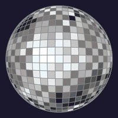

# Дискобол в CorelDRAW X3

_Дата публикации: 02.11.2012  
Автор: Artur_

Однажды мне понадобилась эта штука в векторе, и как всегда, все что надобится срочно таинственным образом исчезает из всех клипартов и со всех известных сайтов. Особого реализма или стиля не требовалось, поэтому я решил найти простой и действенный способ самому нарисовать. Побаловавшись энвелопом и блендом по отдельности я не пришел к хоть более-менее приличному результату, немного поэкспериментировав у меня наконец получилось нечто похожее. Это не совсем урок и я не уверен что единственный способ нарисовать эту хреновину, но этот способ дает вполне приличный результат, далекий от того как дискобол выглядит в жизни, но и временные затраты гораздо ниже чем при ручной прорисовке.  
Сначала я думал что тупо вогнав сетку из квадратов в круг Envelope Tool`ом ("форма" в русифицированных версиях) у меня получится отличный клубный девайс, но не тут-то было, квадраты искажались совсем не так как надо, расширяясь к краю круга, делая что-то больше похожее на оптическую иллюзию.  
Я понял что квадраты должны уменьшатся отдаляясь от центра, но уменьшать их в ручную не наш метод ;) И я вспомнил как на уроке толи черчения толи вышки мы строили графики с помощью окружности и линий, итак...

### Часть первая, подготовительная

Нарисуем круг и пару одинаковых линий подлинее, между линиями делаем неретекание и пускаем его по кругу, получившееся дублируем и поворачиваем на 90 градусов так чтобы линии пересекались.

То что получилось в результате пересечения будит своего рода текстурой для будущего дискобола, текстуры принято разукрашивать, и чтобы не терять времени можно это делать сразу по ходу рисования, и делать это проще всего Smart Fill Tool`ом. Выбирая цвета в свойствах инструмента нужно затыкать все ячейки "текстуры".

Если стандартные цвета не подходят (что вероятней всего), нужно заготовить свои и сделать из них палитру, которой и пользоваться для раскраски. Самый простой способ создать палитру это закрасить своими цветами набор прямоугольников выделить их и нажать кнопку Creates a new pallete from selected objects в докере Color Palette Browser (Window>Dockers).

Теперь временно назначив палитру дефолтовой заполняем сетку объектами нужных цветов.  
Можно и подругому: сначала заполнить сетку объектами одного цвета, сделать то что написано во второй части и закрашивать например с помощью Eyedropper Tool`а (пипетки), клацать ею в выбранный цвет затем с зажатым Shift заливать нужные сегменты.  
Кстати чисто эксперементальным путем пришел к выводу что крайний ряд самых маленьких прямоугольников можно пропустить, мало того без них будит лучше.

### Часть вторая, натягивательная

Группируем все объекты. Открываем докер Envelope (Ctrl+F7 или в меню Effects), выделим группу и нажав кнопку Create From кликнем появившейся стрелкой по предварительно нарисованной окружности. После нажатия кнопки Apply группа объектов примет форму напоминающую шар.

Переведя объекты в кривые можно добавить контур. Я это сделал так: применил к группе контур внутрь и получившиеся объекты скомбинировал с кругом немного большим шара по диаметру.  
Ну вот вроде и все, дополнения и комментарии приветствуются. Удачи!

