# Эффект боке в Corel Draw

_Дата публикации: 02.11.2012  
Автор: Viva_

Многие наверное видели уроки про то, как создается Боке в Фотошопе.  
А чем мы (любители Corel Draw) хуже? А ничем.

**1\. Для начала создадим и настроим инструмент для рисования кружочков, эмулирующих будущее боке:**

1\. Инструментом **Ellipse tool** с зажатым **Ctrl** нарисуем несколько кругов разного размера. Заливка: **90% Black, обводка: черная, толщиной 5 points.**  
2\. (В принципе этот шаг можно пропустить, ибо потом все равно мы будем задавать новые параметры прозрачности) Воспользуемся инструментом **Transparency Tool** и для каждого круга зададим разные варианты прозрачности. Тут действуем на свой вкус, но у меня параметры такие (Если смотреть снизу вверх на картинке):

1.  Uniform, Normal, прозрачность 80, Fill;
2.  Uniform, Normal, прозрачность 56, All;
3.  Uniform, Normal, прозрачность 78, All;
4.  Uniform, Normal, прозрачность 50, Fill;
5.  Uniform, Normal, прозрачность 50, Fill

3\. В результате у меня получилась вот такая картинка:

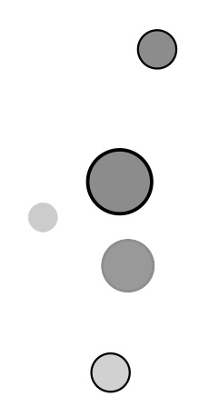

4\. Выберем инструмент **Artistic Media Tool**. В настройках этого инструмента выберем **Spayer** (1).

1.  В **Spraylist File List** (2) выберем пункт **New Spraylist**.
2.  Кликая на каждом из кругов, созданных ранее, при помощи кнопки **Add To Spraylist** (2) - добавим их все в новый спрейлист. Если вы несколько раз добавили одно и то же, или еще что - посмотреть состав спрейлиста можно, кликнув по кнопке **Spraylist Dialog.**
3.  В выпадающем списке **Choice a Spray order** (4) - выбрать **Sequentially** (поэкспериментировать с другими вариантами - приветствуется).
4.  Нажать кнопку **Save Artistic Media Stroke**.
5.  Ура. Спрейлист создан.

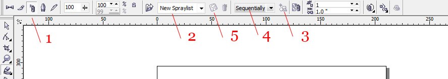

**2\. Теперь приступим к созданию, непосредственно, боке.**

1\. Рисуем прямоугольник, заливаем его **90% черного.**  
2\. Копируем прямоугольник, заливаем его градиентом, как на рисунке:

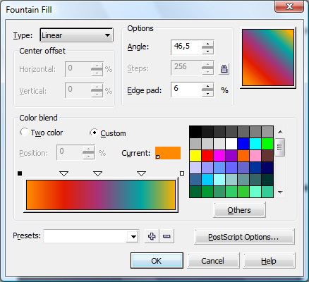

3\. Выбираем инструмент **Interactive Transparency Tool**, применяем его к второму прямоугольнику, выставляем настройки, как на рисунке.

4\. Возвращаемся к нашему спрейлисту (**Artistic Media Tool - Spray**), и пользуемся им по назначению, нарисовав призвольную кривую внутри нашего квадрата. В случае, если круги вышли за пределы квадрата, можно подправить путь спрея при помощи инструмента **Shape Tool**. Цвет объектов задаем, как **белый**.  

5\. Разбиваем получившуюся кривую. (В **Object Manager - правый клик - Break Artistic Media Group Apart**). Получается группа объектов, и кривая. Кривую можно удалить. Займемся группой объектов.  
6\. Выбираем инструмент **Interactive Transparency Tool**, применяем его к группе. Настройки как на скрине.

7.Теперь дело за размытием. Нам понадобится инструмент **Interactive Shadow Tool**, примененный к группе. Выбираем пресет **Small Glow**, затем настраиваем его, как на скрине

8\. Результат:

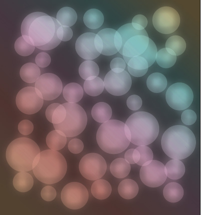

9\. Начиная с этого пункта, действия будут повторяться, меняться будут только настройки и цвета:

1.  В очередной раз пользуемся спреем, Разбиваем бленд, кривую долой, цвет объектов - в **Default CMYK Palette** Он именуется **Baby Blue**, иначе - светло-голубой. (Цвета а принципе можно любые не темные, подбираем на вкус. На итоговый результат это не оказывает особого влияния). Разгруппировываем, выделяем все объекты при помощи **Pick Tool**, жмем **Combine**.
2.  Настройки **Interactive Transparency Tool**:  
    
3.  Результат:

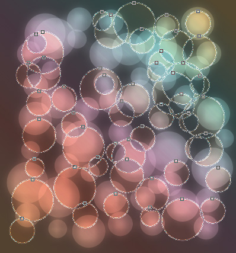

10\. Повторяем пункт 9\. Все то же, за исключением настроек прозрачности:

Результат

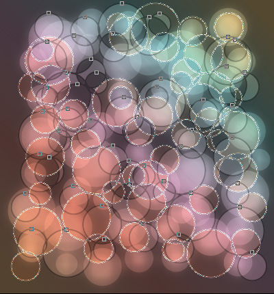

11\. Повторяем шаг 9\. Вместо заливки цветом используем градиент, как на картинке:

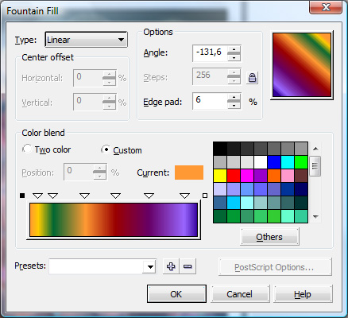

Параметры прозрачности:

Результат:

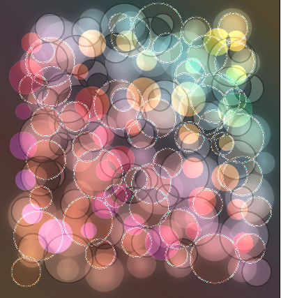

12\. Еще раз повторяем пункт 9\. Цвет - **Pink (розовый)**. Только на этот раз - не комбинируем, оставляем группой. Настройки прозрачности:

Результат:

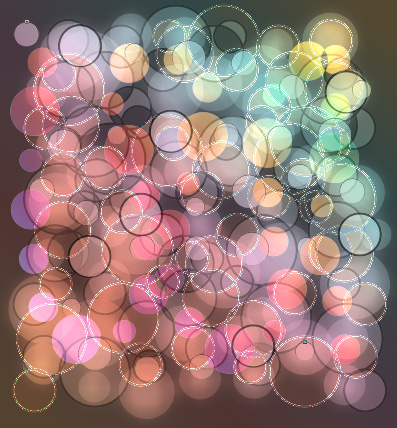

13\. Чего-то как-то у нас бледненько получилось. Исправим. Копируем наш квадрат из подложки, заливаем его конической заливкой со следующими настройками:

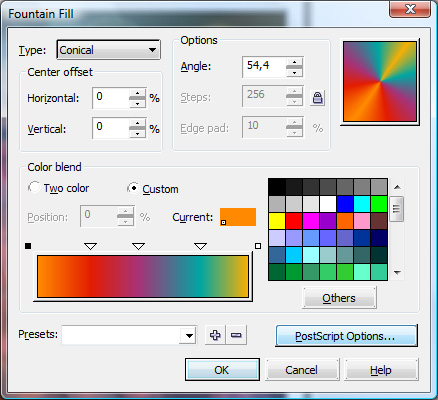

Настройки прозрачности:

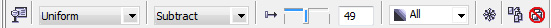

Результат:

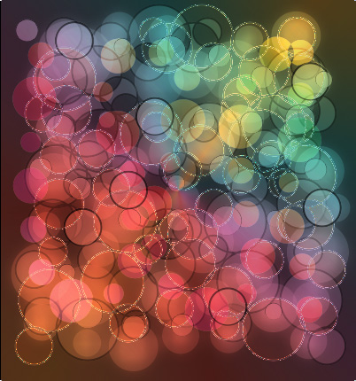