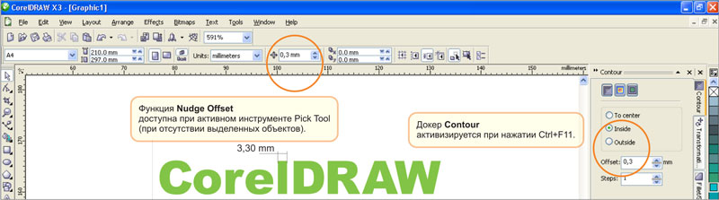
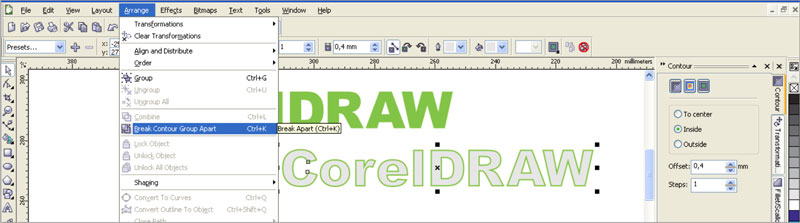
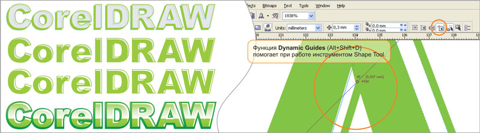

# Эффект объемного текста в векторе

_Дата публикации: 02.11.2012  
Автор: Artur_

Это подобие урока рассчитано по идее на начинающих и средних векторных маньяков)))  
может кому понравится)))

Для получения подобного эффекта «бликов» на тексте, человеку, знакомому с CorelDRAW потребуется не более 10-15 минут, все манипуляции стандартными средствами программы требуют лишь индивидуального подхода к тому или иному решению задачи.

Для начала, определившись с размером и толщиной шрифта нужно настроить параметры Nudge Offset (доступна при активном инструменте Pick tool, при отсутствии выделенных объектов) и величену эффекта Contour (докер активизируется при нажатии Ctrl+F11 или через меню Effects), около 1/10 от средней толщины элементов букв. Nudge Offset позволит производить точные смещения второстепенных объектов, это полезно когда потребуется применить схожие эффекты к другим шрифтам или просто сделать все аккуратно и ровно.

Предварительно подготовленный текст переводится в кривые (Ctrl+Q), и применяется эффект Contour, затем текст с эффектом разбивается на отдельные объекты с помощью меню Arrange>Break Apart (Ctrl+K).

Исходный шрифт дублируется нажатием «+» на цифровой клавиатуре и смещается стрелками вниз и влево (или наоборот если потребуется). Инструментом Pick Tool выбираем смещенный шрифт затем(!) с зажатой клавишей Shift внутренний контур и производим операцию Trim, смещенный дубликат - объект второстепенным и больше не нужен.  
Оставшиеся объекты доводятся инсрументом Shape Tool (F10). При этом следует включить функцию Dynamic Guides (Alt+Shift+D), это значительно облегчит задачу, все узлы и линии перемещаются точно и ровно. Таким образом получаются аккуратные блики.

Той-же техникой можно добиться довольно приличных объемных эффектов, теней и рефлексов. Даже без использования Transparency (прозрачности) и Fountain Fill (градиентной заливки), что не маловажно при подготовке изображений к некоторым видам печати.  
фсё...