# Этапы построения фотореалистичного изображения

_Дата публикации: 02.11.2012  
Автор: Алексей Оглушевич_

Векторная иллюстрация сегодня — не просто изображение особенностью которого является инструментарий, с помощью которого оно создается, это тот вид цифрового искусства, который вышел за рамки особенностей создания произведений как файлов в векторных редакторах, это целый ряд абсолютно разнящихся стилей художников и иллюстраторов, неповторимая эстетика и уникальный, широкий для творчества простор, подкрепленный постоянно совершенствующимся инструментарием редакторов. Коммерческая востребованность, технические особенности превосходящие аналоги других форматов, инструментарий дающий возможность адаптации под стилевые особенности художников и иллюстраторов, открывают огромные перспективы применения векторной графики.

Одним из распространенных стилей в иллюстрации является приближенный к фотографичному реализму. Плюсы такого стиля очевидны — при всей эффектности, выразительности форм и реализме, заимствованном у фотографии, художник имеет полный контроль над цветом, светом, детализацией и стилистическими особенностями изображения, что позволяет добиваться решения тех или иных художественных задач, художественной интерпретации того или иного сюжета. По большому счету, векторная фотореалистичная иллюстрация — это симбиоз художественной фотографии и традиционной иллюстрации, или даже живописи. Это, прежде всего самостоятельное произведение, со своими особенностями и эстетикой, созданное пусть не на холсте и не привычными средствами, но средствами современными, еще не успевшими укрепиться в традиционных представлениях об искусстве, не менее ценное и перспективное.

Получение фотореалистичного вектора — довольно  трудоемкий процесс, поэтому кто пойдет по этому пути, должен быть терпелив и трудолюбив, тогда и вы сами и те, кому вы покажите свои творения,  получат эстетическое удовольствие.

Существует две основные техники создания фотореалистичного изображения в векторных редакторах:  
при помощи «меша» и «блендов». Первая основывается на стандартных инструментах заливки по векторной сетке и использует растровый формат с векторными элементами управления и возможностью масштабирования без потерь качества (чтобы в этом убедится, достаточно в **CorelDRAW** выделить растровый объект и кликнуть по инструменту «Интерактивная заливка сетки»).  Вторая техника, построения изображений с помощью «блендов», основывается исключительно на использовании векторных объектов и инструментария, с упрощением рутинного процесса отрисовки с помощью инструмента **Blend** (Интерактивное перетекание). Кратко вышесказанное можно свести к двум утверждениям:

1.  Меш — менее трудоемкая, менее творческая, растровая техника (но надо признать, освоенная в совершенстве, техника дает впечатляющие результаты, например: работы **Прокофьевой Татьяны** очень впечатляют).
2.  Бленды — более трудоемкая и более творческая, векторная техника.

В статье речь пойдет именно о втором способе получения фотореалистичного вектора.

### Создание основы рисунка из простых фигур

На первом этапе нужно создать рисунок из простых фигур, плашек (рисунок из замкнутых объектов, залитых одним цветом), причем не очень детализированный. На этом этапе основной задачей является определение основной палитры цветов,  которые будут использованы в работе, а также основных форм и композиции. Пользуясь стандартным инструментарием, **Bezier** (Кривыми Безье) и **Shape** (Формой) создается основа будущего изображения.

Я выбрал рисунок, где почти невидно лица, потому что фотореалистичный портрет требует более подробного описания и кропотливого подбора палитры, но принцип рисования портрета тот же. Если соберусь, то возможно посвящу портрету в векторе отдельный урок.

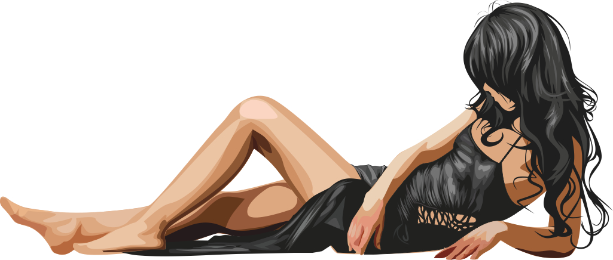

_Совет: Слои в CorelDRAW  
Многие не пользуются слоями (меню Инструменты > Диспетчер объектов), но при создании фотореалистичного изображения они просто необходимы, поскольку очень часто даже не слабые машины просчитывают ваши «мысли» очень долго, поэтому просто отключаем те слои, с которыми на данном этапе вы не работаете.  
В этой работе, например, удобнее разделить изображение на 6 слоев:_

1.  _контуры тела_
2.  _теневые области тела_
3.  _светлые участки_
4.  _контур платья из 3х плашек_
5.  _складки на платье_
6.  _волосы_

_Слои обычно добавляю в процессе. На дальнейших этапах, возможно, добавлю еще слои. Возможно добавление и самих плашек с другими цветовыми характеристиками, процесс то творческий._

### Создание объема основных форм.

Второй этап включает создание верхних плашек на основе уже сделанных нами и построение прозрачных блендов, эта операция придаст объем и форму изображению. Верхнюю плашку создавать очень просто — копипаст нижней плашки (удобнее всего клавишей «+» на цифровой клавиатуре),  если эта очень простая плашка просто трансформируем  ее в меньший размер и устанавливаем  в нужное место. Например, самую светлую область, если это сложная по конфигурации плашка с острыми углами и прочее, то пользуемся инструментом **Shape** (Форма), захватываем опорные точки верхней плашки и перетаскиваем их в нужное место. Определение нужного места это чисто ваши ощущения, приходит с опытом, и основываются на понимании закона света и тени.  
Нижней  или основной плашке назначается однородная прозрачность со степенью прозрачности, близкой к 100%:

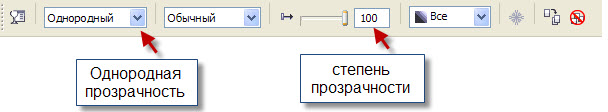

Чаще всего хватает степени прозрачности в пределах 80-98%, в зависимости от эффекта, которого вы хотите достичь. Например, при рисовании румянца на щеках я использую 98%.  
Почему прозрачный бленд? – Отвечу, так проще добиться более нежных переходов оттенков и цвета.  
Разберем  получение фотореалистичного вектора на этом участке.

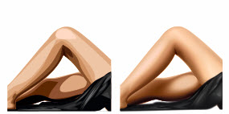

Отключив все остальные слои, у нас остался фрагмент тела девушки.

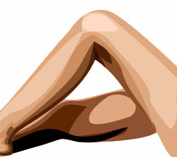

Начинаем работать с теневыми участками тела. Выделяем плашку и жмем «+», тем самым получаем точную копию выделенной плашки. Затем инструментом  форма начинаем формировать вновь испеченную плашку.

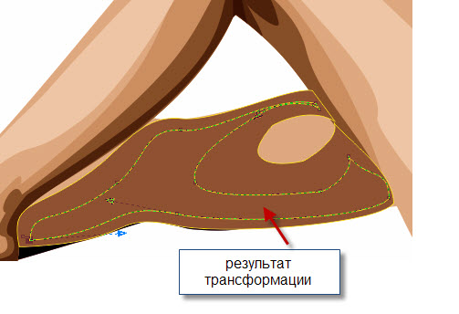

Я сразу поправил и основную плашку это можно сделать и на третьем этапе, но поскольку я понял, что допустил оплошность при создании плашечного рисунка, решил поправить сразу.

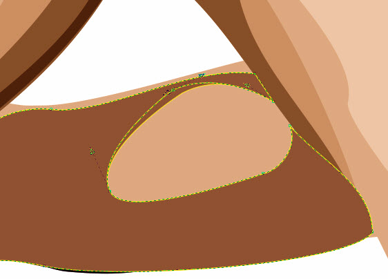

Теперь настала очередь прозрачностей, назначаем основной плашке однородную прозрачность со степенью прозрачности 100%, дубликату  84% и образуем бленд с помощью инструмента **Blend** (перетекание). Результат вы ведете на рисунке.

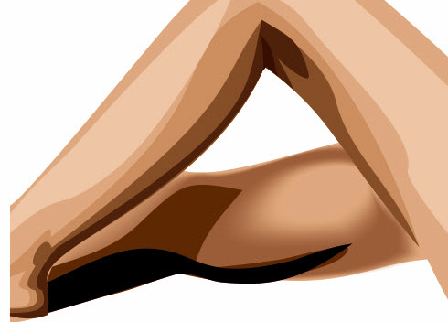

Обычно я пользуюсь стандартными настройками панели перетекания.

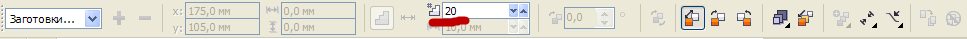

Самое важное правило при построении аккуратного бленда — нельзя сокращать количество опорных точек на верхней плашке, то есть количество опорных точек нижней фигуры и верхней должны совпадать, поэтому все манипуляции с опорными  точками выполняем еще при создании плашечного рисунка, то есть на первом этапе. Есть отдельные случаи, при которых этим правилом можно пренебречь, но это уже совсем другая история.

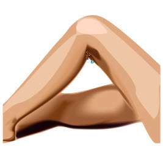

Те же самые операции проделаем со всеми видимыми плашками. В итоге у нас получилось вот такое изображение.

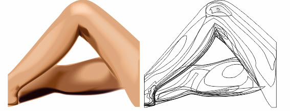

Тоже самое проделываем и освещенными областями.  
Положение абриса перед третьим этапом, поскольку  вектор еще далек от фотореалистичности, переходы грубоваты.

### Окончательная доводка блендов

Третий этап включает:

*   настройку местоположения опорных точек
*   изменение прозрачности верхней плашки
*   иногда замену цвета верхней плашки
*   настройку степени трансформации бленда.

_Совет:  
На третьем этапе по чаше сохраняйте результаты проделанной работы, бывает очень обидно, если потрачено  много времени  и проскачет глюк и результат будет потерян._

Теперь применяя инструменты форма,  настраиваем и верхние и нижние плашки блендов, пробуем менять степень прозрачности,  если у вас не получается с существующими  плашками строим дополнительные.

После третьего этапа тело и платье выглядят уже так:

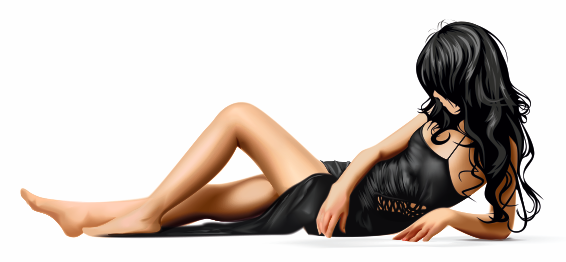

Теперь отключим все слои кроме слоя с  волосами, проделываем все те же операции, но  тут надо уделить немного больше времени, поскольку некоторые  исходные плашки  очень тонкие и с ними надо работать аккуратно, чтобы они не получились ломанными, волны  волос должны быть плавными, будем стараться выполнить задуманное.  
При  работе с волосами я обычно совмещаю второй и третий этап построения изображения.  Поскольку опорных точек довольно много, и возвращаться потом сложно.

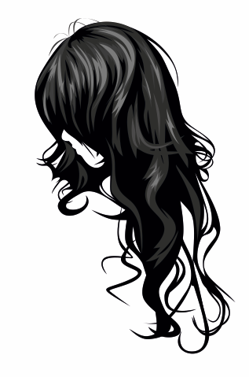

Добавим рюмочку и получаем работу «Одиночество».

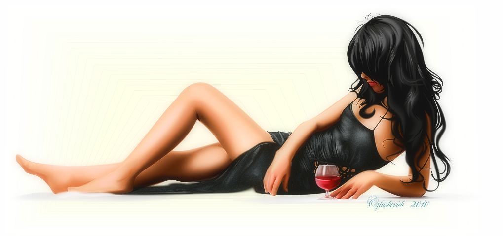

По времени вместе с написанием урока ушло около 40 часов. Детализировать изображение можно продолжать и дальше, но в принципе урок сделан, а работа надоела.

_Еще один совет напоследок.  
Если работа уже вам нравится, оставьте ее дня на два, вернетесь, обязательно захотите что-то добавить, что-то исправить._

**Понятия, которые прозвучали в уроке, принятые в среде векторщиков:**  
**Плашка** — замкнутая фигура произвольной формы, залитая одним цветом.  
**Плашечный рисунок** — рисунок выполненный плашками.  
**Бленд** — перетекание объектов (плашек), реализуется с помощью последовательности из промежуточных объектов и цветов. Бленд используется для придания псевдо-объема объекту.  
**Фотореалистичный рисунок** — рисунок, приближенный к параметрам фотографии  
**Меш** — растровая заливка плашек по специальной сетке, управление которой осуществляется инструментом Mesh Fill.  
**Глюк** — программный сбой.

Корректировка: Артур Верховод