# Георгиевская лента в CorelDRAW

_Дата публикации: 02.11.2012  
Автор: salllka_

Возникла необходимость в подобной надписи. Можно нарисовать вручную (будет красивее, конечно, и живее, но надо быстро).

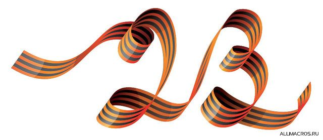

Для начала в кореле инструментом Безье (Bezier Tool) рисуем остов цифирек:

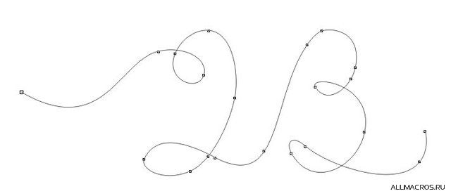

И с помощью инструмента Художественное оформление (Artistic Media) → Каллиграфия создаем объект, уже имеющий сходство со свернутой лентой:

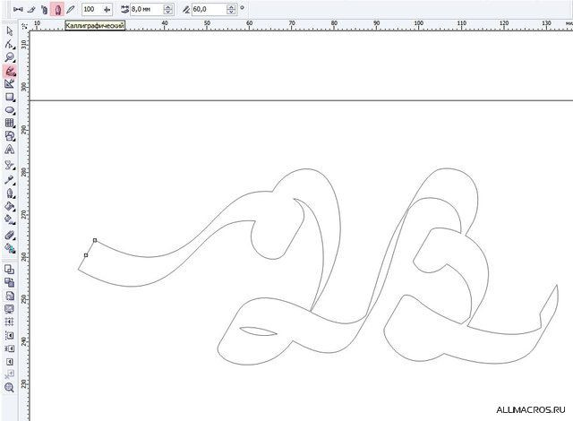

И внимательно смотрим на места, в которых лента закручивается. Ставим в этих местах точки и на этих точках разрываем кривую:

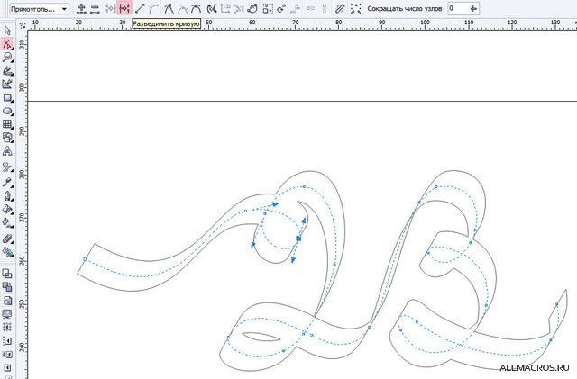

Проделываем так во всех местах, где лента переходит из плоскости в плоскость. Отменяем Калиграфический контур, разбиваем кривую на составляющие (ctrl+K). Должно выйти нечно подобное (выделила каждый отрезок отдельным цветом):

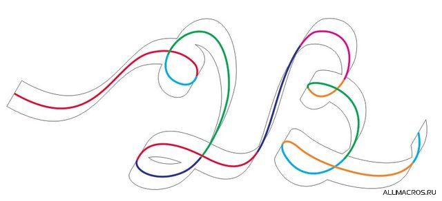

Теперь, выделив все полученные кривые, снова применяем им каллиграфический контур. Получаем набор витков ленты:

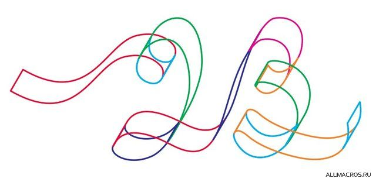

Клацаем на нем правой кнопкой и в выпадающем меню выбираем Разъединить группу Художественное оформление, либо жмем Ctrl+K. Направляющие можно удалить.  
Теперь полученные участки раскрашиваем градиентом (если не надо ничего другого, как в моем случае), можно добавить бликов/теней, если надо -- вручную некоторым участкам добавить красивости и вуаля:

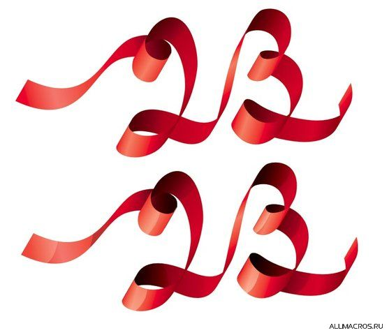

Но мне нужна была георгиевская ленточка. Поэтому полученную основу я раскрасила в черный (с градиентом для живости) и начала шаманить дальше:

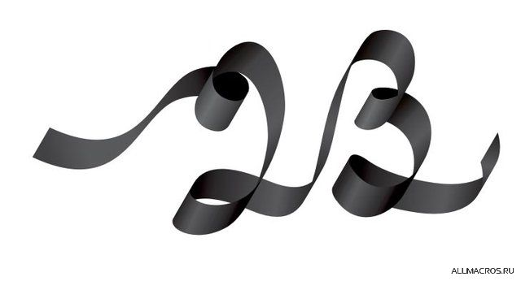

Дублируется отдельный виток (просто жмем [+], создается дубликат объекта в том же месте, над исходным), и задаем этому дубликату Outline (выбрала красный цвет, чтобы было лучше видно, но это не принципиально) с параметрами:

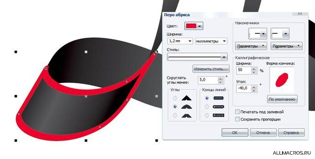

Заливка объекту не нужна. Его можно продублировать еще раз и отложить в сторону, чтобы потом с него копировать свойства заливки/обводки (эту операцию можно завесить на горячие клавиши -- очень удобна в хозяйстве):

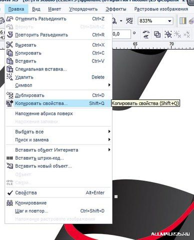

Дальше от кривой оставляем только верхнюю и нижнюю части, и разбиваем ее на 2 кусочка. Которые сдвигаем немного к середине ленты (ниже на картинке в режиме Wireframe я выделила смещение этих кривых):

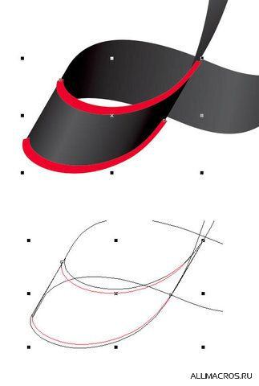

Между этими кривыми создаем бленд:

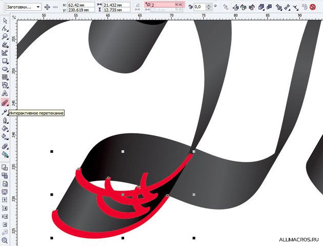

Ничего, что коряво, просто изменим направление одной из опорных кривых и все станет на свое место:

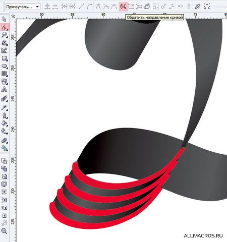

Потом разбиваем группу бленда, объединяем 4 кривые в одну и преобразовываем абрис в объект (Arrange → Convert Outline To Object). Удаляем исходную кривую, которая осталась после преобразования (В X4, если кривая не имеет заливки, она удаляется автоматически!). Выделяем 2 объекта (красный с полосочками и черный виток ленты), чтоб обрезать полоски под размер витка:

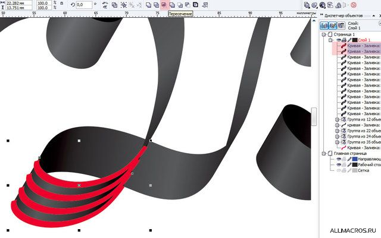

Операция Пересечение. Удаляем красные объект. Он нам не нужен. Полученный объект перекрашиваем как надо:

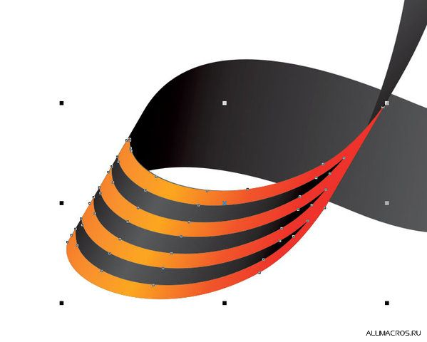

Если нужно, можно вручную подравнять. Так поступаем со всеми витками.

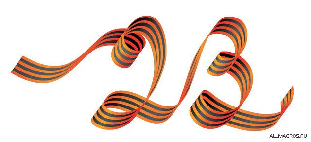

Добавляем блики-тени. Теням можно назначить режим Умножение (Multiply):

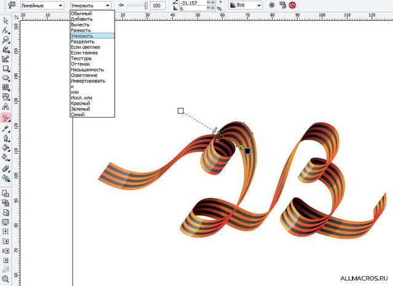

Вот и все.  
Да уж, описание заняло больше времени, чем создание цифирек о_О