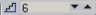

# Гильоширная композиция и Blend tool

_Дата публикации: 02.11.2012  
Автор:_

1\. Инструментом Polygon tool (Y) нарисуйте равносторонний пятиугольник, удерживая ctrl.

2\. Продублировав его (Ctrl+D), потяните инструментом Shape tool (F10) за любой узел между вершинами. Затем выделите обе фигуры и отцентрируйте их (Arrange > Align and Distribute). Придайте фигурам обводку разного цвета.

3\. Выберите Interactive blend tool и потяните курсором от одного объекта к другому.

4\. В панели свойств вы можете выбрать количество шагов сопряжения 

5\. Если вы выделив внутреннюю фигуру и переместите, у нее появится шлейф. Чтобы его закрутить, выставите градусы поворота в панели свойств (Blend direction) и нажмите кнопку Loop blend 

Поэкспериментировав с формами и настройками, можно добиться очень необычных результатов

Перевод - Shmell