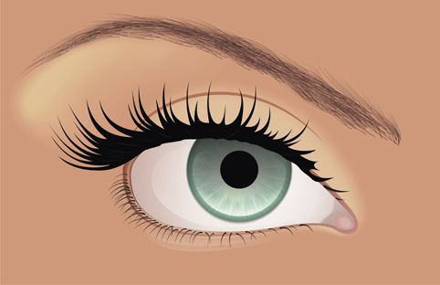

# Глаз в CorelDRAW

_Дата публикации: 02.11.2012  
Автор: Evgeniy-TG_

Этот урок рассчитан на более-менее опытного пользователя, и я не буду расписывать, что нажать для той или иной операции. Он больше объясняет принцип рисования, нежели процесс. Итак, рисуем глаз:

Рисуем заготовку, чтоб определить форму и положение.

Затем рисуем ресницы, веки, придаем цвет радужной оболочке и белку. Я это сделал при помощи градиентов, но можно и блендами (особо извращенные могут нарисовать мэшем). Для рисования нижних ресниц я сделал кисть, а верхние обычной кривой.

Приступаем к зрачку: радужка имеет довольно сложный рисунок и для его изображения я использовал инструмент «Звезда». Итак, рисуем звезду, стягиваем шейпером (F10) серидину, превращаем ее в кривую и кривим все узлы. Затем удаляем все центральные узлы и смещаем каждый луч от центра в произвольном порядке.

Я спользовал 6 таких звезд с разной длинной и количеством лучей, некоторые из которых я скомбинировал.

Красим звезды в белый и светлые оттенки радужки и задаем им радиальную прозрачность с разной степенью прозрачности. В результате должно получиться нечто подобное.

Приступаем к «оживлению» зрачка: для этого дублируем окружность зрачка, заливаем ее 100% полноцветом и делаем линейную прозрачность в режиме Multiply от 100% верха к прозрачному низу. Рисуем блик от света и смягчаем края прозрачным блендом.

Рисуем слезную железу. Я это сделал двумя блендами с прозрачностью.

Глаз почти готов, осталось добавить макияжа, придать объем подбровной части и нарисовать саму бровь. Для брови я создал кисть.

Чего-то нехватает… Правильно! Бликов. Рисуем блики на всех влажных поверхностях и вуаля! Глаз готов и, как мне кажется, довольно похож на настоящий.

ЗЫ: Форма глаза не является эталоном для равнения. Урок не является пособием по анатомическому строению органов зрения. Это всего лишь метод рисования без притензий на высокохудожественность.