# Имитация 3D в CorelDraw

_Дата публикации: 02.11.2012  
Автор: Kimberly_

**Доброго времени суток!** С Corel Draw я «общаюсь» два года, раньше приходилось использовать его как инструмент для создания чертежей,затем был небольшой опыт работы в наружной рекламе, который дал мне открыл другие возможности Corel`а. А теперь я в нем рисую для собственного удовольствия – так сказать, экспериментирую. И вот одним из экспериментов я хочу поделиться с вами.

В этом уроке я хочу показать то, что в Corel Draw можно делать не только двухмерные картинки, но и вполне реалистичные 3D объекты. Идея имитации 3d в Corel Draw понимает под собой некое подобие освещенности, создание бликов (эффект которых можно сделать, изменяя прозрачность слоев) и эффект объема (который можно реализовать при помощи инструмента Interactive Contour tool.)

Итак, для начала определимся с объектом «моделирования». Это будет мр3 плеер.

### Чaсть первая - бокс

Для начала рассмотрим его бокс. Разобьем его на три части- три одинаковых окружности, а затем расположим их вот так:

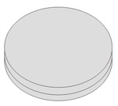

Нижнюю и среднюю окружности зальем цветом; к средней применим инструмент Interactive Contour tool. Выбираем Оutline Color и Fill Сolor Двигаем ползунок так, чтобы получилось следующее:

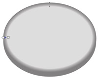

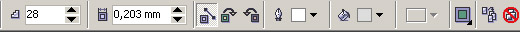

Теперь уменьшаем верхнюю окружность, заливаем ее синим цветом (я пользовалась палитрой Trumatch), делаем копию. Немного уменьшаем полученную (уже четвертую по счету) окружность. Применяем к ней тот же инструмент Interactive Contour tool , где выбираем Оutline Color и Fill Сolor,а цвет контура делаем белым (правый щелчок мыши в палитре). Теперь работаем с ползунком так, чтобы наш плеер стал похож на то,что находится на рисунке справа:

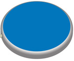

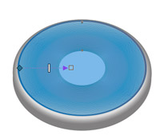

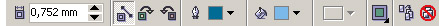

Делаем фирменный значок. На моем плеере это выглядит как металический кружок в центре с двумя надписями - навзванием фирмы и маркой модели девайса. Но так как они за рекламу еще не расплатились, то последние две детали мы опустим:) Рисуем маленькую окружность по побразу и подобию крышки. Заливаем серым , перемещаем в центр. Затем делаем ее копию, заливаем цветом темнее, применим к ней прозрачность, указав в настройках оной тип Radial.

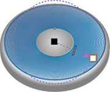

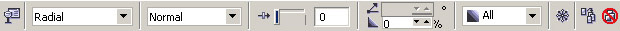

Делаем ободок. Рисуем обычную линию, искривляем ее, задаем ей толщину и преобразовываем в объект (Arrange - Convert outline to object) затем берем инструмент Shape tool и работаем с узлами так, чтобы получился ободок такой формы:

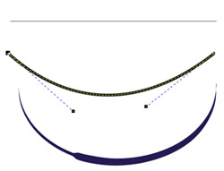

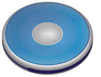

Теперь рисуем кнопки – одну большую и шесть маленьких. Для этого нарисуем прямоугольник, инструментом Shape Tool сглаживаем его углы. Делаем несколько копий слоя, масштабируем их, меняем прозрачность и компонуем как показано на рисунке. По желанию можно добавить рифленые «полосочки» или выступающие «пупырышки» (кому как больше нравится)- для них техника выполнения такая же, как и для большой кнопки.

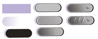

Теперь делаем маленькую кнопку.

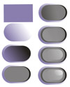

Как видно из пошагового создания кнопки, она состоит из нескольких слоев с измененной прозрачностью, наложенных друг на друга. Делаем так, как показано на рисунке:).Затем "размножаем" кнопки до шести штук.Переносим на ободок плеера, масштабируем, поворачиваем. Вуаля!

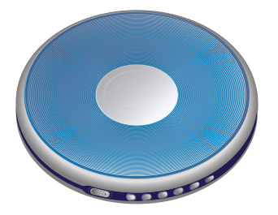

### Часть вторая. Пульт

Для пульта я брала длинный прямоугольник, сглаживала его концы.Затем делала несколько копий, смасштабировала их и расположила в порядке, показанном на рисунке. Затем выделяем наши прямоугольники и жмем кнопку Trim. Дальше действуем с помощью инструмента Interactive Contour tool. Вот что у насполучилось

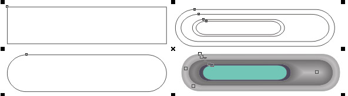

Как видно из рисунка, экран на пульте делается просто;-) Джойстик оказался тоже довольно примитивным в исполнении - брались простейшие фигурки, немного видоизменялись, накладывались друг на друга - и готово. Доводим корпус до ума - делаем блик, наносим надписи и выставляем значки, добавляем мелкие детали.  
Кстати, блик с заблюренными краями можно сделать очень просто - я брала окружность, отбрасывала от нее тень, задавала цвет, прозрачность и размытие тени, а затем дейтсвовала с помощью пункта меню (правый клик мыши- Break Drop Shadow group Apart). Тень отделяется от объекта,а последний за ненадобностью можно удалить.

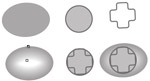

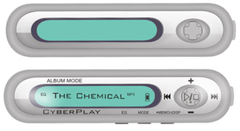

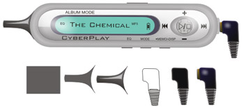

Рисуем джек, делаем шнуры. Они кстати, рисуются просто - обычные кривые, затем преобразованные в объект и немного подделанные Interactive Contour tool - для объема и ощутимости. Можно прилепить еще и наушники - делаются с помощью тех же кривых, которые затем преобразовываются в объект и довдятся до ума. Дальше - по желанию, можно отбросить тень от пульта на крышку бокса и от бокса на то место, где он лежит:)

В итоге у меня получилось следующее:

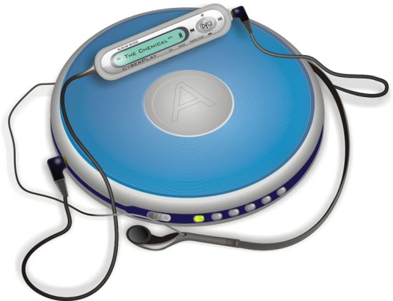

Ну вот и все, собственно говоря;)...

**Успехов Вам!**