# Инструмент Interactive Mesh Fill в CorelDRAW

_Дата публикации: 02.11.2012  
Автор: Sokolovich_

**Gradient Mesh Fills**, или проще говоря, Градиентные Сетки (или совсем просто – меши) являются наиболее мощным и универсальным инструментом для моделирования сложных цветовых переходов. Кроме того, что они могут включать множество различных цветов, а градиенты между ними иметь самую произвольную форму, к ним вдобавок совершенно свободно можно применить любой из доступных алгоритмов наложения прозрачности. Все это делает объекты данного класса исключительно полезными и порой почти незаменимыми при создании сложных иллюстраций с претензией на реализм. Потому неудивительно, что рано или поздно руки любого, кто пытается всерьез работает с CorelDRAW, начинают сами собой тянуться к кнопке Interactive Mesh Fill Tool, спрятанной в самом низу панели инструментов под пиктограмкой градиентной заливки.

Разумеется, я тоже не мог пройти мимо этой темы. Поначалу, прямо скажем, механизм действия инструмента Interactive Mesh Fill казался мне довольно капризным и неудобным. Но с одной стороны помог некоторый опыт борьбы с полигональными сетками в 3ds max (кстати сказать, в трехмерных редакторах обычно в том или ином виде присутствует функция Vertex Paint по смыслу сходная с Gradient Mesh), а с другой – оказалось, что на самом деле ничего особо страшного тут нет, и если соблюдать определенные правила, то результат может превзойти самые смелые ожидания. В общем, довольно скоро я в этой теме освоился и теперь вот решил поделиться некоторыми своими наблюдениями. Может даже, кому-то из начинающих (и не только) они окажутся очень кстати.

В качестве примера возьмем одну из моих последних работ. (На момент создания она была всего лишь третьей по счету, выполненной в данной технике).

### Pin-up Stewardess, август 2008

Сразу оговорюсь, что не ставил перед собой задачу описать работу инструмента во всех подробностях, тем более, что литературы по этой теме в Интернете хватает. Я просто остановлюсь на некоторых нюансах, которые мне самому оказались наиболее интересными в процессе освоения приемов работы с мешами.

### Способы создания градиентных сеток. Часть 1.

Градиентные сетки можно получить двумя способами:  
а) преобразовать в меш существующий контур.  
б) построить нужный контур, взяв за основу шаблон в виде простой геометрической фигуры, конвертированной в меш с предустановленным количеством ячеек. Так как ячейки всегда имеют прямоугольную форму, то и фигурой проще всего назначать прямоугольник.

Рассмотрим сначала первый вариант. Для этого попробуем конвертировать в градиентную сетку правую руку Стюардессы. Вызываем команду Interactive Mesh Fill Tool (горячая клавиша по умолчанию – M) или разыскиваем соответствующую кнопку в панели инструментов. Выставляем в панели свойств формат сетки равным 4х4 ячейки и кликаем курсором на контуре руки.

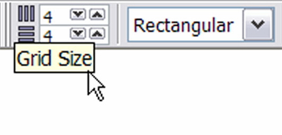

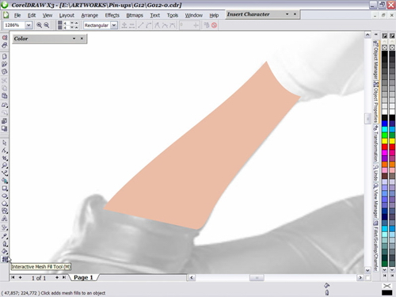

Результат автоматического преобразования не внушает особого оптимизма…

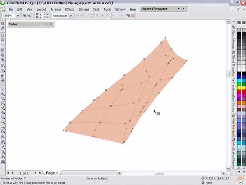

Получившаяся конструкция выглядит очень нескладной, и работать с ней явно будет не слишком удобно. Дело в том, что линии сетки при автоматическом построении с одной стороны более-менее повторяют конфигурацию ближайших к ним сегментов контура, но с другой всегда стремятся к горизонтали и вертикали. В данном случае остается только развернуть исходный объект таким образом, чтобы максимально приблизить возможности программы к нашим потребностям.

Кстати: Если поворачивать несимметричные объекты интерактивно (с помощью указателя), центр вращения смещается вместе с центром координат такого объекта. Это приводит к тому, что при последующем развороте в обратную сторону его исходную позицию приходится отлавливать вручную. Чтобы этого не случилось, перед поворотом следует задать центр трансформации. Для этого нужно либо выделить объект двойным кликом и вручную же сдвинуть центр вращения в новую позицию (которая после этого сохраняется при последующих поворотах), либо воспользоваться палитрой Transformation. Здесь выделяем контур, снимаем галочку в окошке Relative Center, задаем угол поворота (Angle) и жмем Apply. После этого центр вращения объекта также фиксируется в одном положении.

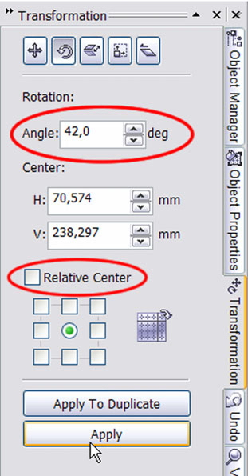

Применяем Interactive Mesh Fill Tool еще раз с теми же установками. Число ячеек в момент создании сетки можно изменять интерактивно с помощью счетчика на панели свойств.

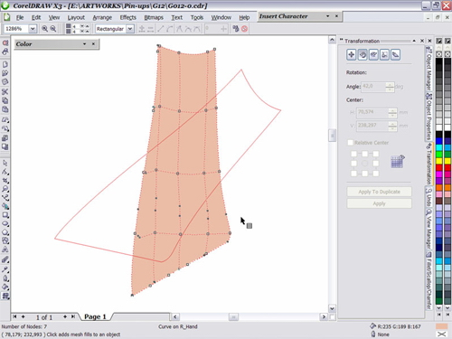

В этом месте опять придется сделать небольшое отступление насчет трансформации. Дело в том что CorelDRAW по каким-то причинам не считает нужным отслеживать угол поворота градиентных сеток в панели свойств объекта. Поэтому наиболее простой способ вернуть объект точно в исходное положение заключается в том, чтобы запомнить значение в градусах, отображаемое в окошке угла поворота на панели свойств перед преобразованием контура в меш, и после генерации сетки вбить то же самое значение, но с противоположным знаком в соответствующем окошке палитры Transformation. (Если поворот на предыдущем шаге был сделан в один прием, достаточно поменять значение Angle, которое все еще значится в указанном окошке на противоположное и нажать Apply).

На следующем этапе имеет смысл сразу же упростить сетку убрав лишние опорные точки. К ним как правило относятся дополнительные узлы (Node), которые в отличии от основных (Intersection) не образуют пересечения линий и обычно не несут особой смысловой нагрузки – им нельзя назначать цвет и в процессе правки геометрии они скорее мешают. Исключение могут составлять дополнительные узлы расположенные на внешних линиях сетки. Они определяют форму объекта и потому их удаление не всегда целесообразно. Узлы расположенные на внешних линиях угловых ячеек являются их неотъемлемым элементом (поскольку каждая ячейка должна включать 4 вершины) и потому не могут быть удалены. Им также можно назначать цвет.

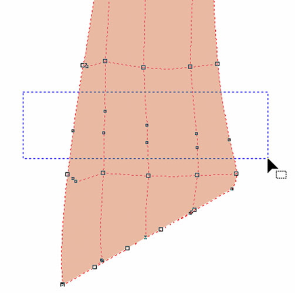

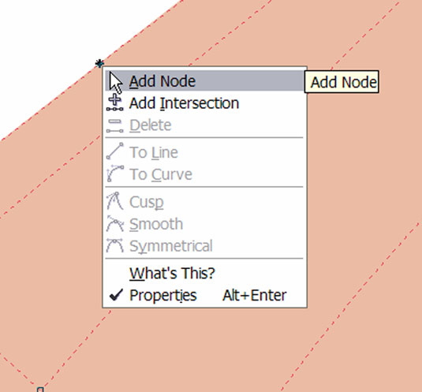

В процессе моделирования сетки можно добавлять новые узлы. Двойной клик на линии или внутри ячейки сразу создает новое пересечение (Intersection), а после одинарного появляется маркер вставки. Вызвав правой кнопкой контекстное меню можно выбрать тип создаваемого узла – основной или дополнительный. Вновь создаваемые линии ложатся параллельно существующим.

Все пересечения, создаваемые программой являются угловыми Для удобства работы обычно стоит сразу конвертировать их в плавные. Делается это обычным для кривых Безье способом.

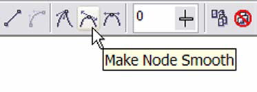

После начальной настройки объект можно вернуть в исходное положение. Для того чтобы свойства сгенерированной сетки зафиксировались достаточно произвести над ней какое- нибудь одно действие, например подвинуть или удалить опорный узел. Если повернуть объект сразу после наложения сетки, все ее свойства теряются. Добавляя или удаляя опорные узлы и передвигая их в нужную позицию в итоге получаем нужную нам форму сетки.

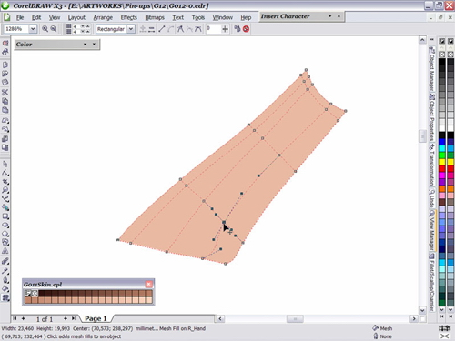

Теперь можно приступать к ее раскрашиванию.

### Работа с цветом.

В ходе освоения методов наложения цвета на градиентные сетки особо интересных открытий зафиксировано не было. Цвета можно применять как к отдельным узлам, так и к целым ячейкам. Образцы цвета можно брать либо с помощью пипетки (в режиме Sample Color) с исходного изображения (если таковое имеется), либо из заранее составленных пользовательских палитр, или получать путем смешения компонентов в палитре Color. Присвоение цветов выбранным элементам происходит обычным для всех других объектов способом. Порядок действий во многом зависит от сложности сетки. Если количество ячеек в ней относительно небольшое, можно вначале построить сетку полностью и затем приступить к ее раскрашиванию. Если цветовых переходов много, удобнее бывает сначала наметить общую форму сетки и присвоить цвета ее ключевым узлам, а затем раскрашивать дополнительные узлы и ячейки в процессе их добавления. Общее правило такое – чем сетка проще, тем лучше. Необязательно создавать дополнительные узлы там, где можно обойтись настройкой кривизны линий с помощью управляющих элементов уже существующих. В процессе редактирования нужно следить за тем, чтобы линии не перехлестывались и не имели резких «заломов».

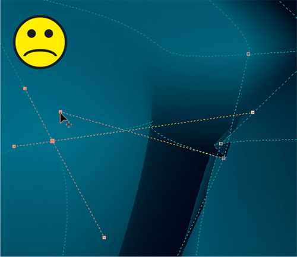

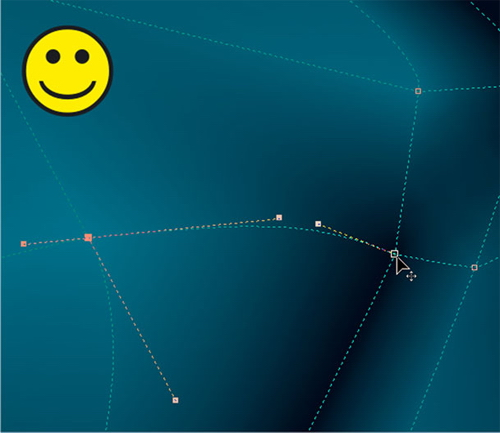

Подобным образом можно моделировать как простые объекты…

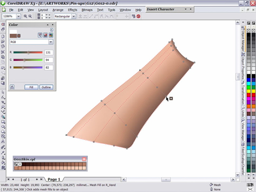

Так и сложные. (Верная смерть для всех ленивых и неусидчивых).

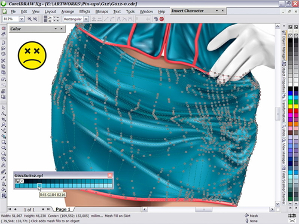

Кстати, меши как инструмент для изображения складок ткани – просто вне конкуренции по удобству и гибкости использования.

Любопытный нюанс: Всем градиентным сеткам в момент создания присваивается цветовая модель CMYK, даже если исходный объект имел перед этим заливку в RGB. При попытке присвоить отдельным элементам такой сетки цвет в модели RGB, происходит автоматическая подстановка ближайшего аналога в CMYK, в чем можно легко убедиться взяв пробу цвета пипеткой и заглянув в палитру Color. Собственно, это заметно и невооруженным глазом. Если все же работа выполняется в RGB, то единственный (известный мне) способ привести меш к нужному цветовому пространству заключается в применении заливки одним RGB цветом ко всем ячейкам сразу. Для этого выделяем все узлы инструментом Interactive Mesh Fill Tool и назначаем им нужный цвет любым из указанных выше способов.

### Способы создания градиентных сеток. Часть 2.

Теперь рассмотрим более сложный пример построения сетки. Для этого попробуем конвертировать в меш такой достаточно непрямолинейный объект как губы Стюардессы.

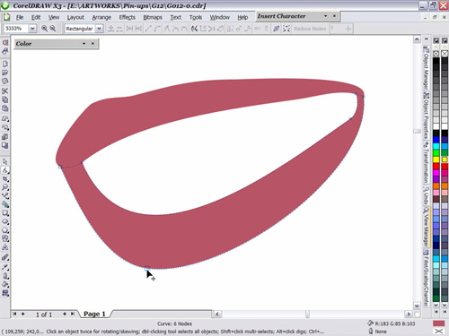

Сетка, получаемая при автоматическом преобразовании также не отличается особой стройностью и выглядит неудобной для дальнейшего редактирования. Поворот объекта в данном случае желаемого эффекта не дает.

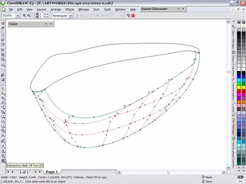

Поэтому мы пойдем другим путем, более привычным для тех кто знаком с трехмерным моделированием. Если правка неудачной геометрии объекта грозит отнять много времени и сил, то проще будет создать градиентную сетку с необходимыми нам параметрами с нуля. За ноль возьмем обычный прямоугольник. В панели свойств инструмента Interactive Mesh Fill зададим формат сетки равным например 8х3 и применим его к выбранному объекту:

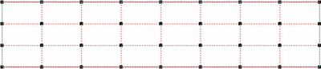

Как уже отмечалось, все создаваемые программой опорные точки по умолчанию являются угловыми (т.е. острыми) – на сей раз с этим нужно горячо согласиться и вдобавок преобразовать в прямые все линейные сегменты (по умолчанию они являются кривыми).

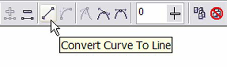

Теперь можно приступить к расстановке узлов по местам.

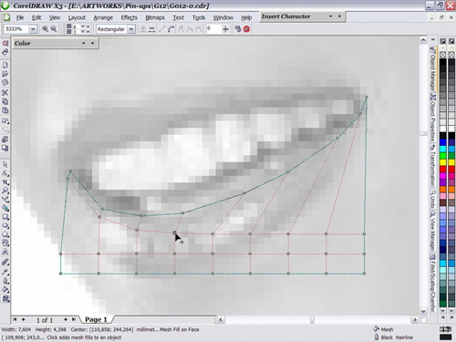

По мере расстановки и добавления новых узлов сетка принимает вполне стройный и логичный вид. Направление линий соответствует основным осям объекта.

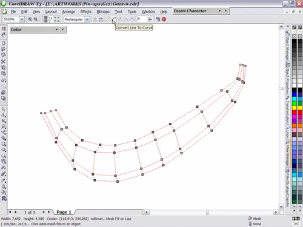

Здесь нам вновь может понадобиться контур губ, оставшийся не у дел на предыдущем этапе. Во-первых его можно использовать как направляющий для более точной расстановки опорных узлов. А во-вторых им можно воспользоваться в качестве контейнера для размещения внутри него получившейся сетки (Effects > Power Clip > Place Inside Container). Данный способ имеет как свои преимущества так и недостатки. С одной стороны не надо особо тщательно расставлять узлы сетки по периметру объекта, поскольку края контейнера маскируют все ее неровности, и если нужно немного изменить внешнюю форму объекта, то для этого достаточно подправить один или два узла внешнего контура не затрагивая геометрию ячеек. С другой, правда, градиентную сетку внутри контейнера не очень удобно раскрашивать, поскольку в момент редактирования нельзя оценить как ее цвета сочетаются с окружающим фоном. В данном случае я этим приемом пользоваться не стал, предпочтя большую наглядность.

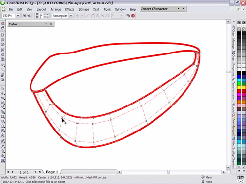

Теперь для сглаживания формы все линии можно преобразовать обратно в кривые, а узлы соответственно сделать плавными.

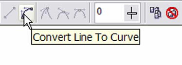

В итоге автоматического сглаживания получаем вот такую структуру:

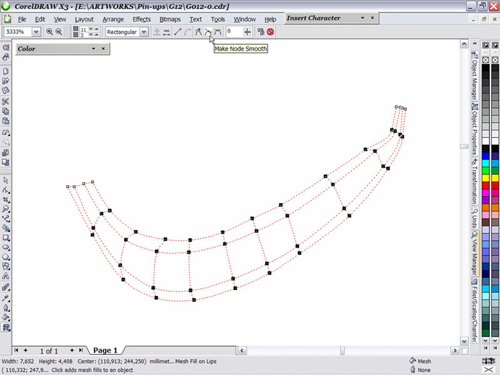

Добавляя в нее новые элементы и корректируя существующие находим окончательную форму нижней губы и подготавливаем ее к наложению цветов.

Некоторые узлы делаем заостренными, чтобы с их помощью добиться эффекта складок.

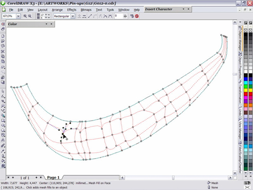

То же самое проделываем с верхней губой. Затем берем помаду… Ну и дальше в ринципе все очень наглядно.

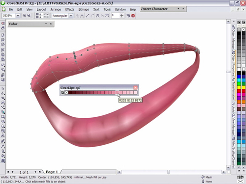

Тем же способом были выполнены ножки Стюардессы…

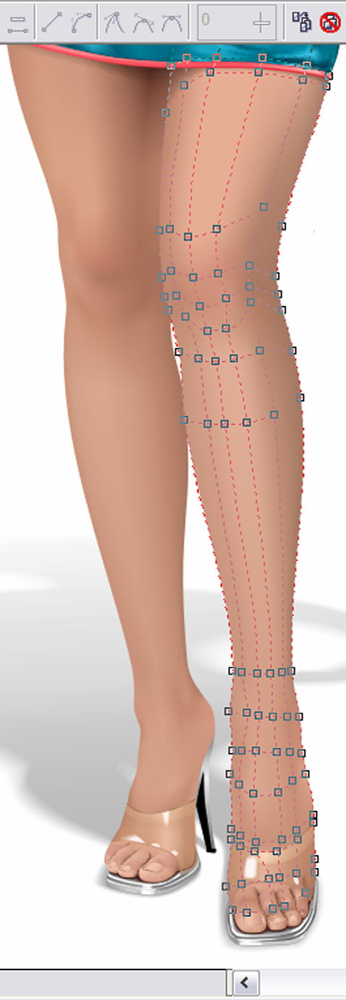

### Комбинирование градиентных сеток.

При всей своей универсальности меши имеют ряд естественных ограничений. Так, например максимальный формат сетки равен 50х50 ячеек. Основные опорные узлы (Intersection), в отличии от вертексов в программах трехмерного моделирования, могут соединять строго определенное количество линий – либо 3 (для узлов лежащих на внешних границах сетки), либо 4 (для всех остальных). Узлы нельзя произвольно разбивать, соединять и т.п. Вместе с тем при создании реалистичных иллюстраций иногда возникает необходимость моделирования сложных поверхностей, с переменным уровнем детализации. Таких, например, как человеческое лицо, где относительно плоские участки (щеки или лоб) соседствуют с рельефными (глазные впадины, веки, нос, уши). Градиентные сетки подходят для решения таких задач как нельзя лучше. Просто не везде их применение оказывается одинаково удобным. В принципе ничто не мешает разбить любой участок на какое угодно количество ячеек. Но проблема заключается в том, что при этом в сетку добавляется масса новых линий, которые по причине общей линейности ее структуры распределяются по всем участкам (в т.ч. даже там, где они нужны меньше всего). В итоге это приводит к чрезмерному усложнению сетки и делает ее плохо управляемой. Задача изобразить лицо посредством одной градиентной сетки сама по себе выглядит привлекательной, но не всегда себя оправдывает. В данной работе я опробовал другой способ, который можно назвать «моделированием патчами». В отличии, например, от 3ds max здесь их нельзя объединить в одно целое, но свою прямую задачу по созданию участков сетки с разной структурой они выполняют успешно. Работая над портретом я решил разделить голову Стюардессы на 6 фрагментов, каждый из которых содержал бы по возможности только необходимое количество ячеек. Не стану утверждать, что все получилось именно так, как было задумано, но в целом итоги эксперимента были признаны удовлетворительными.

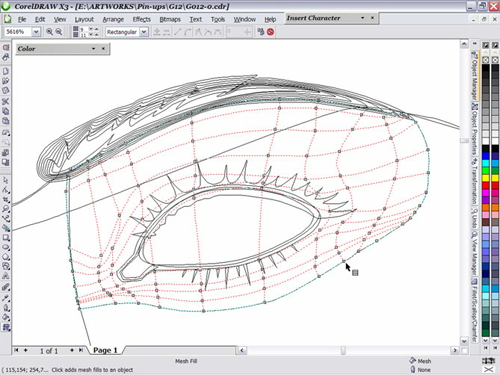

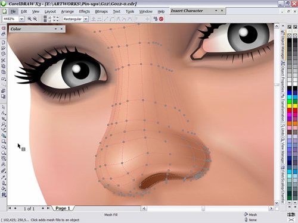

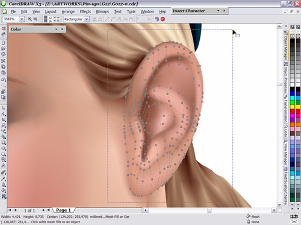

«Патчи» располагались так, что частично или почти полностью перекрывали друг друга. Ключевым моментом, конечно же, стала маскировка стыков отдельных фрагментов. В целом задача оказалось не слишком сложной – просто потребовалось правильно подобрать и распределить цвета на границах сеток (что правда местами привело к появлению незапланированных узлов). Глаза, брови и рот, разумеется, были выполнены как отдельные объекты и помещены на лежащий выше слой. Костюм Стюардессы, к слову сказать, тоже был скроен по этому принципу. Но там задача склеивания отдельных фрагментов облегчалась наличием вшитых кантиков и прочих естественных швов маскирующих линии стыка.

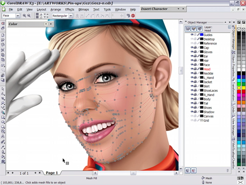

Не знаю как Вам, а мне лично результат понравился и даже вдохновил на новые свершения. К написанию вот этой статьи, например…

© V_ Sokolovich 2008  
Специально для CDRPRO.RU