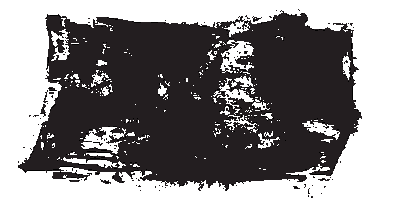

# Искажение текста

_Дата публикации: 02.11.2012  
Автор: Artur_

О создании гранжевых эффектов для фона я упоминать не буду, благо в сети полно всего на эту тему: и уроков и кистей. Расскажу только о эффекте искажения текста, достаточно простого в создании но имеющего ряд преимуществ перед использованием готовых шрифтов. Во-первых полученный в результате текст будет состоять из абсолютно разных символов. Во-вторых эффект предусматривает ручную кастомизацию и достаточно вольную, степень искажения может сильно варьироваться. Ну и относительная простота позволяет при достаточных навыках работы в CorelDRAW затратить на искажения стандартного шрифта меньше времени чем на поиск подходящего.

Итак для начала возьмем подходящий шрифт (чем выше степень искажения тем толще он должен быть), в моем случае я взял стандартный Arial Black:

Нужно добавить побольше узлов: переведя шрифт в кривые и выделив все узлы два-три раза нажать «+» на цифровой клавиатуре, или кнопку Add Node(s) на панели свойств инструмента Shape Tool. Получится примерно так:

Теперь немного ручной работы: шейпером нужно пооттягивать некоторые узлы в разные стороны, исходя из предположения о будущем искажении:

Я получил такой вот результат:

Копируем текст, выделяем все узлы, переводим их в кривые и с помощью ползунка Curve Smoothness доводим искажение до нужной степени:

Чуть с другими параметрами проделываем тоже самое для копий которые наложатся одна на другую:

Можно добавить гранжевых эффектов, для этого я взял предварительно оттрассированое изображение полученное мною с помощью листка бумаги, чернил из гелевой ручки, сканера и с трудом отмытых после рук :)

Изображение накладывается на текст и командой Intersect или Trim получаем что-то подобное:

Все, «сглаженные» с разными параметрами тексты накладываются друг на друга, раскрашиваются и т.д. и т.п..

Удачи!