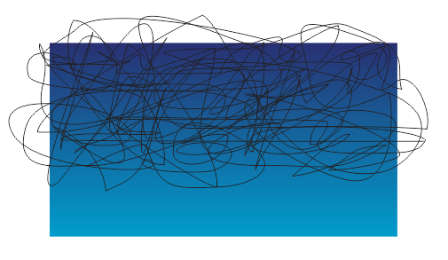
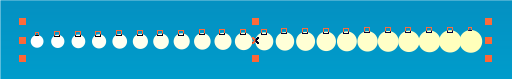
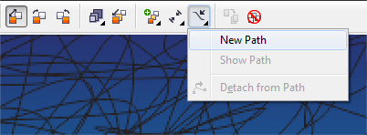
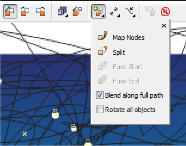
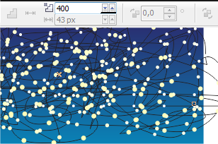
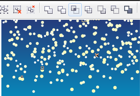
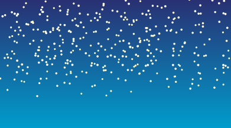

# Использование Blend Tool в CorelDraw

_Дата публикации: 02.11.2012  
Автор: Artur_

Изобразить звездное небо, снегопад, дождь и мрогое другое, требующее наличия бльшого количества обьектов может занять всего 5-10 минут, при нестандартном использовании стандартных средств.

Начнем с просого, со звездного неба:

1\. Создадим фон нужной формы и цвета, затем инструментом Freehand Tool нужно создать кривую, которая послужит путем для "перетикания". Чем запутаней кривая тем случайнее будит расположение звезд и реалистичнее небо. Нужно стараться чтоб кривая шла из угла в угол, о одного края к другому со множеством петель, неровностей и пересечений.

2\. Создадим два объекта (круга), отличающихся размером и цветом (в моем случае белый и 20% желтого). Теперь инструментом Interactive Blend Tool делаем перетикание между ними,

в опциях инструмента назначаем наш путь,

ставим галку Blend Along Full Path,

ставим количество "звезд" по вкусу (у меня 850).

3\. Применим команду Break Blend Arart, удалим кривую-путь, сгруперуем все звезды и при помощи команды Intersect предварительно выделив сначала фон потом(!) с клавишей shift группу звезд, удалим лишние объекты.

Все, звездное небо готово.

