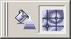
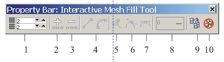
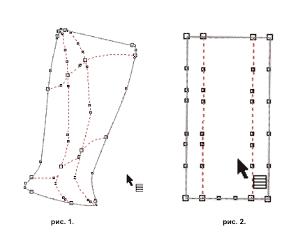
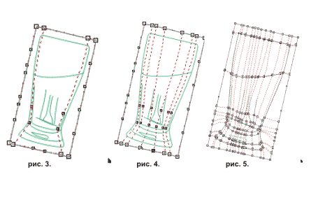
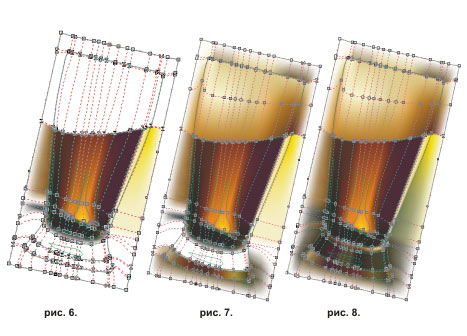
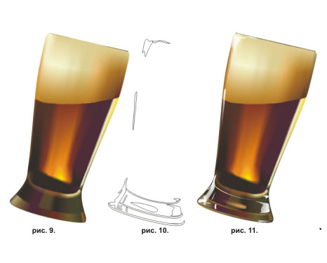
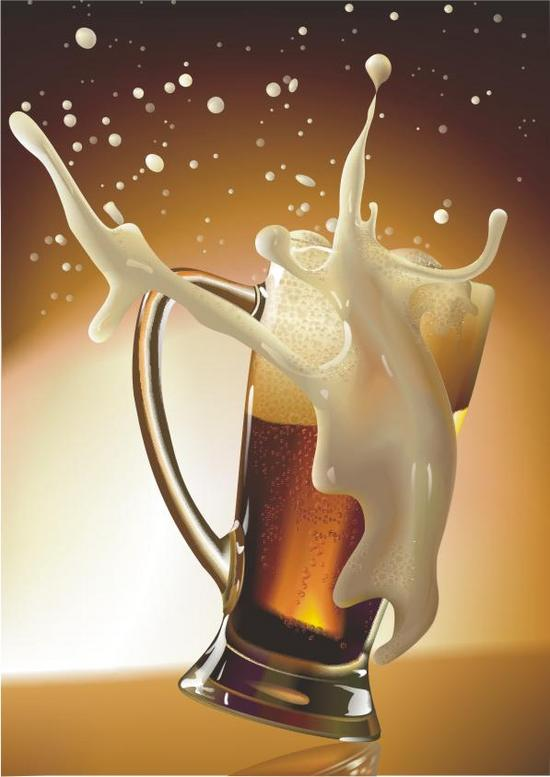

# Использование Interactive Mesh Fill в CorelDRAW

_Дата публикации: 02.11.2012  
Автор: Татьяна Прокофьева_

### ТЕОРИЯ

Инструмент Interactive Mesh Fill (Интерактивная сетчатая заливка) находится в группе Interactive Fill (Интерактивная заливка). Такая градиентная заливка, при которой переход цвета происходит не вдоль выделенных направлений, а от точки к точке заливки. Этот способ позволяет добавлять в нужных местах объектов плавные цвета и тени. Между тем его можно использовать и для обработки растровых изображений. При выборе инструмента Interactive Mesh Fill на панели свойств становятся доступными следующие управляющие элементы:

1\. Текстовые поля Gri Size задает количество столбцов и строк создаваемой сетки;  
2\. Кнопка Add Intersection используется для создания вместе щелчка мышью нового узла, расположенного на пересечении линий сетки;  
3\. Кнопка Delete Node(s) удаляет выделенные узлы;  
4\. Кнопка Convert Curve To Line преобразует кривые линии в прямолинейные участки сетки;  
5\. Кнопка Make Node A Cusp преобразует выделенный узел в острый;  
6\. Кнопка Make Node Smooth преобразует выделенный узел в гладкий;  
7\. Кнопка Make Node Symmetrical преобразует выделенный узел в симметричный;  
8\. Ползунок Curve Smoothness устанавливает степень сглаживания линий сетки рядом с выделенными узлами;  
9\. Кнопка Copy Mesh Fill Properties from используется для копирования параметров заливки другого объекта;  
10\. Кнопка Clear Mesh удаляет из выделенного объекта сетчатую заливку.

Сетки можно создавать только из простых контуров. Составные контуры, текст, не переведнный в обычные контуры, и особые объекты (например, перетекания) невозможно превратить в градиентные сетки.

### Этап 1\. Построение сетки.

Рисуем контур бокала. Выделяем объект. При нажатии горячей клавиши М линии сетки строятся автоматически. По направлению они всегда стремятся к горизонтали и вертикали. Конфигурация линии приблизительно повторяет конфигурацию ближайшей к ней части контура объекта рис.1\. Если форма объекта сложная, то результат построения сетки не предсказуем, чтобы привести к нужному результату нужно приложить много усилий. Мы не мазохисты и пойдем другим путем. Сетку мы строим вручную в прямоугольнике как показано на рис. 2, для этого задем количество столбцов — 1 и строк — 1\. На любой горизонтальной линии щелкаем мышью добавляем два новых узла.

### Этап 2\. Редактирование сетки.

Накладываем на прямоугольник вспомогательные линии (зеленого цвета) по которым мы будем изгибать сетку. Сначала редактируем вертикальные крайние линии, которые будут повторять форму стенок бокала рис. 3\. Двигая дополнительные точки мы изгибаем линии, ненужные дополнительные точки мы удаляем. Дальше мы добиваемся сглаживания линий. Узлы и сегменты этой сетки можно редактировать по правилам кривых Безье. Добавляем вертикальные линии сетки, теперь они будут изгибаться автоматически рис. 4\. Строим горизонтальные линии сетки по вспомогательным линиям рис. 5\. От построения сетки зависит направление перетекания цвета, поэтому сетку нужно строить как можно более тщательно, заботясь о том чтобы соседние линии не пересекались. На этом построении сетки не заканчивается, в процессе заливки она будет усложняться и уточняться.

### Этап 3\. Добавление заливки

Линии сетки задают направление распространения цвета. Редактирование линий и узлов сетки очень похоже на работу с узлами обычного контура. Если на линии сетки есть перегиб, в этом месте переход цвета будет резким. Можно задавать и цвет узлов, находящихся на контуре объекта. Одновременно можно назначить цвет нескольким узлам. Для этого щелкните на свободном месте внутри зоны (появится черная точка) и выберите цвет на цветовой палитре. Экспериментируя с палитрой цветов добиваетесь желаемого результата.

### Этап 4\. Завершение работы.

Из вспомогательных линий оставляем только контур бокала. Создаем контейнер: выделяем прямоугольник, после Effects — PowerClip —Place Inside Container... и стрелкой щелкаем по контуру бокала, получается рис. 9\. Усложняем бокал добавляя все новые и новые элементы рис. 10 и работая над этими элементами разными средствами (градиенты, меши, прозрачности) добиваемся желаемого результата.

### ФИНАЛ

[Скачать и посмотреть файл](http://powerclip.ru/modules/myalbum/visit.php?lid=950&cid=2)