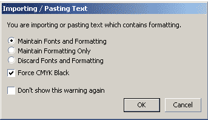
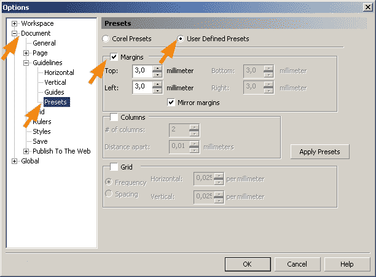

# Как сделать визитную карточку?

_Дата публикации: 02.11.2012  
Автор: VVV_

Наверно многие из вас желали сделать себе визитную карточку собственными руками. Этим уроком я хочу помочь людям, которые не имеют отношения к дизайну, но желают иметь визитку «собственного производства».  
Итак создаем визитную карточку, на примере вымышленного героя – Балтунова Николая Владимировича (модератор).  
Я не буду забивать вам голову лишней информацией касательно истории визитных карточек, этого добра и на других сайтах хватает, но предупреждаю, что у визиток есть определенные правила построения. В большинстве случаев на визитных карточках присутствует следующая информация:

*   логотип фирмы;
*   название, вид деятельности фирмы в которой вы работаете (Балтунов net – форум о дизайне) здесь же размещается вид деятельности которым вы занимаетесь (например: интернет промотинг);
*   ИФО владельца визитки (Балтунов Николай Владимирович);
*   должность (модератор);
*   координаты (Украина, г. Киев, ул. Николаева, 25, оф. 320 тел.: 8(096)470-50-70 baltunov [a] baltunov.net, www. baltunov. net)

**Подготовка к работе.**

Открываем CorelDRAW (можете вместо него воспользоваться другой программой например Microsoft Word, но лучше все-таки CorelDRAW).

Задаем размер страницы 90Х50 (размер визитной карточки в мм):

Задаем направляющие по краям страницы, для этого делаем двойной щелчок мощью на линейке и в открывшемся окне Options раскрываем списки Document -> Guidelines находим пункт Presets и ставим галочку в пункте Page Borders:

Должна получится вот такая картина:

(предупреждаю: если у вас девятая версия CorelDRAW пропускайте этот шаг, у него в этом месте глюк)

**Набираем или копируем текст в CorelDRAW.** Для этого воспользуемся инструментом Text (F8)

Если вы набираете текст в CorelDRAW то щелкните инструментом Text в любом месте страницы и приступайте к набору. Если вы набирали текст в сторонней программе, к примеру в Microsoft Word, скопируйте и вставьте текст в CorelDRAW следующим образом: так как и в случае набора текста непосредственно в CorelDRAW (описанным выше) щелкните инструментом Text в любом месте страницы (чтобы появился курсор ввода текста) и жмите сочетание клавиш Ctrl+v (вставить) либо через меню Edit/Paste (но не забывайте перед этим скопировать текст в Microsoft Word Ctrl+с), появится следующее окно:

Оставьте все как есть и жмите ОК (если такое окно не появилось не расстраивайтесь, главное чтоб текст вставился в CorelDRAW)  
**Дизайн визитной карточки.**

Итак подготовка окончена приступаем к дизайну: Разбиваем текст на блоки (название фирмы или род деятельности, ИФО владельца визитки, должность, координаты) Делается это следующим образом, делаем двойной щелчок на тексте, автоматически включается инструмент Text и появляется курсор ввода текста, в том месте где был произведен щелчок (примечание если у вас инструмент Text уже включен, пропустите этот шаг):

Выделяем нужный нам фрагмент

и вырезаем его (Ctrl+х) затем поставив курсор ввода текста, в любом другом месте страницы, вставляем вырезанный нами текст (Ctrl+v):

И так со всем текстом фраза за фразой, пока не разобьем текст на нужные нам блоки. Если у вас каждый новый блок начинается с новой строки (как у меня) то разбиение делается проще: выделяем текст и жмем Ctrl+k или (если сочетание клавиш не сработает) выбираем из меню Arrange/Break Artistic Text:

Дальше делаем небольшой текстовый набросок визитки с учетом кегля (размера) шрифта:

Примечание: оранжевым указаны варианты кегля (размера) шрифта

Не забывайте, что ФИО владельца – главная информация, за ней (по степени важности) идет название, вид деятельности фирмы и должность, а уж потом координаты. Не делайте шрифты сильно большими, это создаст неприятно ощущение тесноты в визитке:

**Вставляем в CorelDRAW логотип.**

Это можно сделать двумя способами:

*   методом перетаскивания (это обычная операция для Windows) этим способом в CorelDRAW можно «затянуть» любую картинку (jpeg, gif, psd, png, bmp…);
*   через меню File/Import.

У меня логотип в формате CorelDRAW поэтому я просто открваю документ с логотипом и копирую его в документ с визиткой. Кстати переход между документами в CorelDRAW производится с помощью сочетания клавиш Ctrl+Tab или через меню Window:

Форма и композиционное построение логотипа навязает нам следующий сюжет:

Обратите внимание как размещены ФИО, правосторонняя отбивка, таким образом мы уравновешиваем «тяжелый» логотип:

Визитка выглядит вполне закончено, но можно еще поиграться с оттенками:

Вот так пожалуй лучше.

**Дизайните но не задизайнивайтесь:**

Не забывайте, что после вашего дизайна и печати визитка будет резаться. По этому не ставьте текст к краю визитки ближе чем на 3мм. А чтоб об этом не забывать во время дизайна советую поставить направляющие. Вызываем окно Options раскрываем списки Document -> Guidelines находим пункт Presets а в нем переключаемся на User Defined Presets:

В раскрывшейся вкладке ставим галочку Margins и указываем параметры top: 3 left: 3 жмем ОК вуаля!

А вот еще пару примеров дизайна:

