# Каустика - на примере "граната"

_Дата публикации: 02.11.2012  
Автор: KarLsoN_

**Пользователь:**  
**_Zeram_**: _«Хочу урок по рисованию прозрачных массивов, т.е. не плоских, а объемных прозрачных тел (стекло, лёд, янтарь и т.п.), причем не только гранёных, а и округлых, произвольной формы.»_

**Отвечаю:**  
CorelDRAW – далеко не 3D редактор, в котором можно с легкостью реальзовывать подобные «тела» и их свойства(каустика)

**Для справки:**  
_Ќаустика (от лат. жгучий) в оптике — геометрическое место всех фокусов негомоцентрических пучков, то есть пучков световых лучей, не сходящихся в одной точке. Можно сказать, что каустики — это особые точки световых поверхностей, и именно потому каустики легко заметить: в них резко возрастает интенсивность светового поля._

**практика:**  
Данный урок общего характера. Сразу же хочу отметить, что я не буду в уроке подробнейше описывать, как я рисовал плашку за плашкой, это элементарно просто, и не однократно описывалось в уроках опубликованных на нашем сайте. Для примера, я взял камень «гранат»

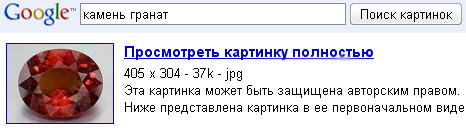

Далее импартировал изображение в CorelDRAW, и для удобства создал для себя отдельную палитру цветов, которую и исспользовал в работе.

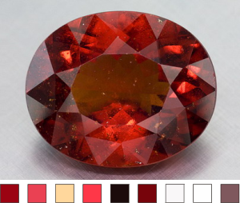

Создаю фон для будущего изображения.

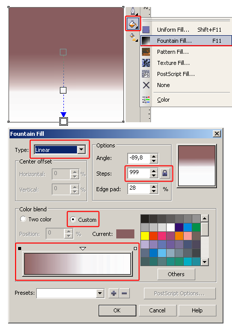

Далее рисую примерную форму будущего «камня», конвертирую полученную несуразицу в кривые Bizier и правлю форму, пока не получаю необходимое очертание заготовки.

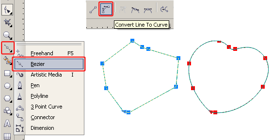

Переношу полученую форму на фон и заливаю ее радиальным градиентом. Примерно представив для себя, что источник света находится перед нашим объектом, чуть правее и выше его центра.

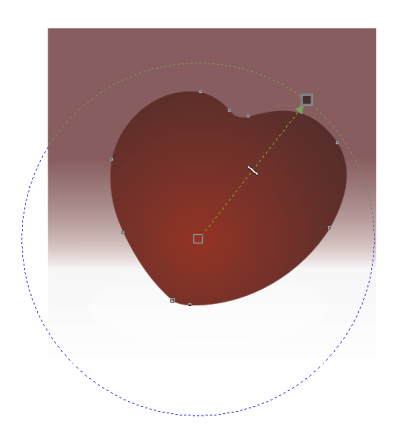

Далее пользуясь наглядным примером, найденым мною в интернете, плашками прорисовываю самые темные места нашего камушка, пользуясь цветами из созданной мною палитры.

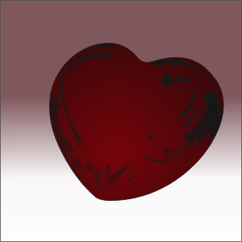

Все тем же способом прорисовываю, самые свелые места нашего камушка и расставляю блики.

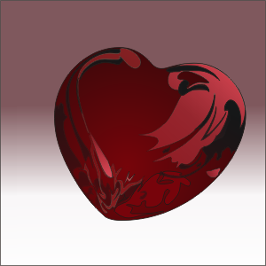

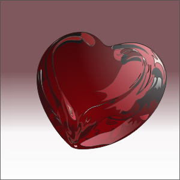

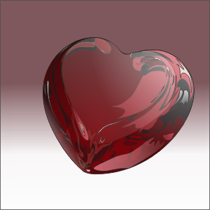

При помощи прозрачности, придаю плашкам более мягкие цвета, создавая эффект объема.

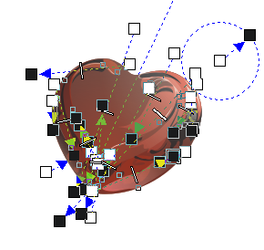

но наш «гранат» умеет не только приломлять, отражать, но рассеивать свет, и отбрасывать тень

для реализации рассеивания и отбрасывания тени я исспользовал инструмент Blend

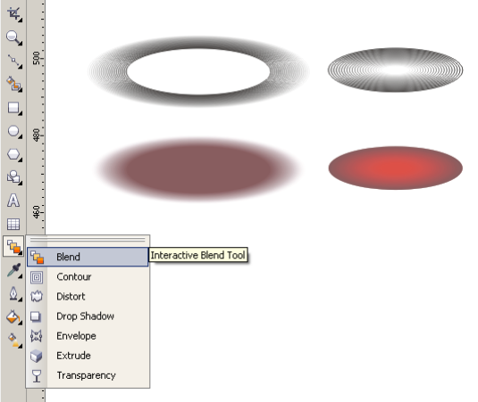

Получаем вот такой вот «гранат» огранненый в форме сердца, у меня на него ушло не более 20 минут.

**Результат:**

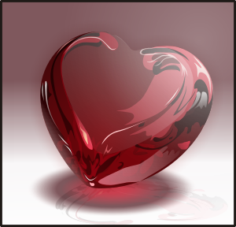

**ссылка на исходник:** [Гранат - работа для урока - cdr 14 (73.1Kb)](load/15-1-0-110)