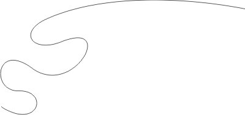
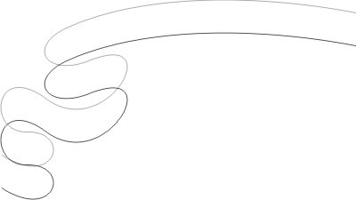
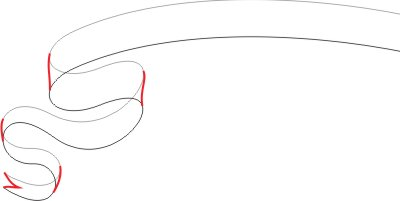
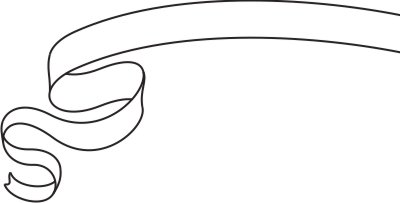
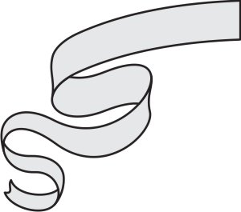

# Лента

_Дата публикации: 02.11.2012  
Автор: Artur_

Иногда в работе требуются красивые ленты, не стоит спешить перерывать клипарты, на рисование подобной ленты уйдет 20-30 минут. Итак приступим:

1\. для начала определимся с формой, завитками и т.д. и нарисуем подобную кривую (это будет один горизонтальный край ленты):

2\. Когда форма будущей ленты готова, дублируем получившуюся кривую (соответствено это второй край):

3\. Дорабатываем сдублированую кривую, добавляем недостающие элементы (получаем такой себе векторный скетчик):

4\. Путем редактирования кривых или просто нарисовав элементы поверх добиваемся такого результата (чтобы лента состояла из объектов перекрывающих друг друга):

поскольку моя лента будет симметричная, делаем такую половину чтобы потом сдублировать:

5\. Самый приятный момент Раскрашиваем по вкусу, и лента готова!

Вот и все, как я говорил делов на 20-30 минут, для маньяков и того меньше. Пробуйте, эксперементируйте, совершенствуйте технику и пишите! Удачи!

П.С. я рисовал в кореле, но способ думаю актуален для всех программ где есть кривае Безье