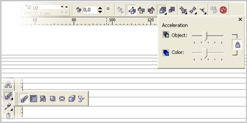
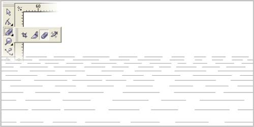
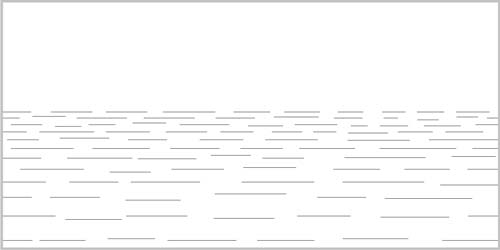
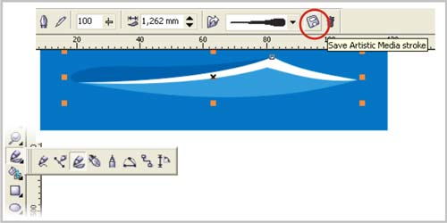
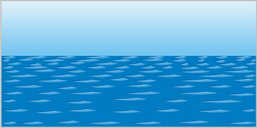

# Морские волны с помощью кистей в CorelDRAW

_Дата публикации: 02.11.2012  
Автор: Artur_

Bezier Tool'ом рисуем две горизонтальные линии и делаем перетекание Blend Tool'ом, настраиваем нужное количество шагов и параметр Acceleration, для эффекта перспективы.  
Разбиваем Blend (Arrange>Break Apart или Ctrl+K) и объединяем все линии командой Arrange>Combine (Ctrl+L).

Инструментом Eraser Tool кромсаем получившийся объект по форме будущих волн.

Снова разбиваем (Ctrl+K) объект и Pick Tool`ом немного растаскиваем отдельные линии для хаотичности. Объединяем все линии в один объект (Ctrl+L).

Рисуем волну, у меня она состоит из трех объектов: белого пикового блика, затененной и засветленной стороны. Группируем, выбераем инструмент Artistic Media Tool и справа от выпадающего меню с выбором кисти жмем по иконке Save Artistic Media stoke, сохраняем группу как кисть.

Тем же Artistic Media Tool`ом кликаем по объекту из линий и выбираем заготовленую кисть. Регулируем пораметры размера для достижения нужного эффекта и преобразуем Artistic Media Group в редактируемые объекты тем же Break Apart.

В примере сырой вариант, набросок, для достижения более реальных результатов имеет смысл вручную поуменьшать более отдаленные волны и подправить некоторые волны Shape Tool`ом, обязательно те что на переднем плане, чтобы не было заметно клонирования. Само-собой можно поэксперементировать с градиентными заливками. Удачи!)