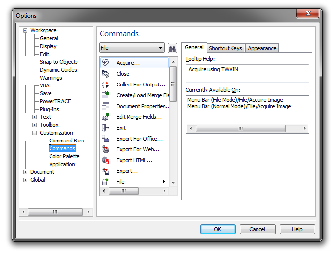
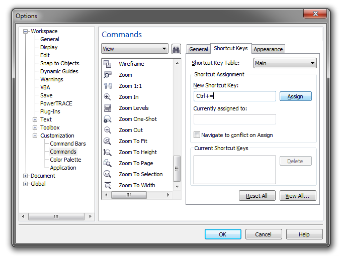

# Назначение пользовательских горячих клавиш

_Дата публикации: 02.11.2012  
Автор: Edwards_

В работе каждого из нас есть своя специфика. Кто-то часто выполняет в CorelDraw одни операции, кому-то нужнее другие. Создатели программы не могут предусмотреть вкусы всех пользователей. Зато они предусмотрели для пользователя возможность самому настроить программу под свои, уникальные нужды. В частности, мы можем назначать собственные, пользовательские сочетания горячих клавиш для практически любой команды, которую мы используем в CorelDraw.

Это делается так.

Скажем, мы хотим приблизить Кореловский интерфейс к привычной адоберской модели. И для навигации по файлу, для зуммирования использовать привычные клавиши "Ctrl"+"+" и "Ctrl"+"-". Идём в Tools - Options - Customization - Commands. В нашем случае в меню File меняем на View.

Находим ниже Zoom In. Жмём Shortcut Keys. Ставим курсор в поле New Shortcut Key. Жмёшь наше любимое адоберское сочетание "Ctrl" + "+". Жмём Assign (см. скриншот).

Для Zoom Out (отдаление от холста) в Кореле предусмотрена клавиша "F3". Но мы можем добавить своё, адоберское клавиатурное сочетание "Ctrl" + "-". Можем даже удалить «F3» из списка горячих клавиш: окошко "Current Shortcut Keys" – выделяем «F3", жмём "Delete".

Не забываем нажать "ОК" выходя из "Options". Таким образом мы можем назначить любую программную команду любому, на свой вкус, сочетанию горячих клавиш.

Приведу напоследок мой личный список пользовательских горячих клавиш, с ним удобно работать лично мне в (CorelDraw X3):

1) File-Close – Ctrl+W  
2) Arrange–Group - G  
3) Arrange–Ungroup - U  
4) Arrange–Align and Distribute – D  
5) Arrange– Align and Distribute-Align Centers Horizontally – V  
6) Effects-Powerclip-Place Inside Container – S  
7) Effects-Powerclip-Extract Contents – E  
8) Text-Paragraph Formatting – Ctrl+T  
9) Toolbox-Bezier – A  
10) Toolbox-Eyedropper – I  
11) View-Wireframe – W  
12) View-Enchanced – Q  
13) View-Zoom In – Ctrl++  
14) View-Zoom Out – Ctrl+-