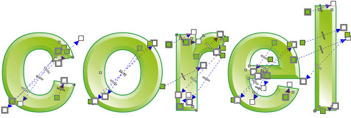

# Объемный текст в CorelDraw (2 вариант)

_Дата публикации: 02.11.2012  
Автор: Artur_

Эффект гранености (тоже быстро и легко):

Текст переводим в кривые (Ctrl+Q), эффектом Contour (Ctrl+F9) делаем предварительные грани.  
Инструментом Free Hand Tool с включенной привязкой к объектам (Alt+Z) набрасываем «засечки» ребер граней (достаточно линии из двух узлов объединяющей углы текста и контура).

Инструментом Smart Fill Tool превращаем область ограниченную контурам и «засечками» в отдельный объект, простым кликом.

Удаляем засечки и контур, разбиваем текст на отдельные буквы (Ctrl+K).  
Градиенты (G) по вкусу. Грани одинаково обращенные к условному источнику света красятся путем перетягивания градиента со Status Bar`a (по умолчанию в правом нижнем углу) или зажав уже закрашенный объект правой кнопкой мыши наводим на новый и отпускаем когда курсор превратится в прицел выбрав в меню Copy Fill Here.

П.С.: актуально для CorelDraw X3, в предыдущих версиях чуть сложнее.