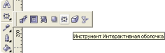
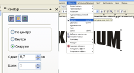
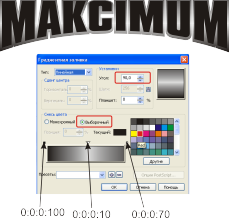
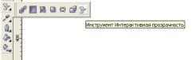

# Оформление текста.

_Дата публикации: 02.11.2012  
Автор: ElizaLIV_

Вот такой вот несложный урок, но добавит свою изюминку в оформление текста  
шрифт Compo

А теперь применим к тексту “интерактивную оболочку”

Для наилучшего эффекта добавим конур тексту

Отделим контур от текста. Далее немного опустим нижний фон и сразу применим градиентную заливку.

Далее применяем цвет для основы текста, в нашем случае это 0:0:0:10  
и снова применим контур, но с гораздо меньшим сдвигом (в моём случае 0,2 мм).  
Также его отделяем от текста и сдвигаем немного вниз.

К основному фону применим прозрачность.

Делаем копью основного фона и помещаем поверх, красим его в 0:0:0:80  
Применяем линейную прозрачность.

Делаем ещё одну копию помещаем поверх, красим его в 100:100:100:100  
Применяем линейную прозрачность.

Получается вот такой вот текст.

