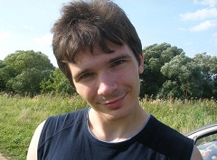
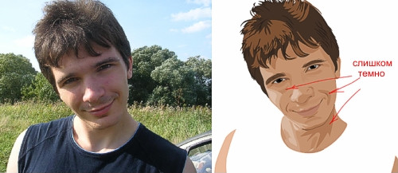
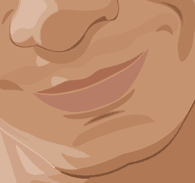
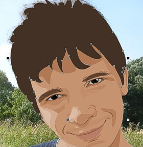
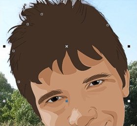

# Портрет в CorelDraw

_Дата публикации: 02.11.2012  
Автор: vectora_

Нарисовать портрет без навыков художника или никогда не имея за плечами художественного образования Вам кажется очень сложным? В уроке мы рассмотрим, как можно обойтись без долгого обучения с неплохими результатами. Мы нарисуем портрет по фотографии, упростив сложные детали, создадим слои, чтобы облегчить себе работу.

Сразу скажем, первый блин скорее всего будет комом.

**Оглавление**

1\. Фотография  
2\. Начнём с лица  
3\. Выбираем образец  
4\. Светлое и тёмное  
5\. Рисуем черты лица  
6\. Добавляем светлые области  
7\. Приступаем к деталям  
8\. Рисуем глаза  
9\. Сверяемся с оригиналом  
10\. Рисуем рот  
11\. Волосы. Начинаем с цвета  
12\. Теперь светлее  
13\. Одеваем футболку  
14\. Максимальный эффект  
15\. Регулируем контраст

**Портрет в CorelDraw - конечный результат**

Фотография

1.1 Находим нужную нам фотографию и открываем ее в новом документе CorelDraw (File > New > Import > имя файла)

рис. 1.1 Выбор фотографии

1.2 Делаем закладку в правом меню (Window > Dockers > Object Manager)  
1.3 Создаем новый слой в этом меню (New Layer) и называем его, к примеру, – "pic"  
1.4 Блокируем наш объект (в правом меню нажимаем на маленькую иконку – карандаш)

**Начнём с лица**

2.1 Создаём следующий слой, на котором предстоит отрисовать лицо.  
2.2 Назовём этот слой – «face»  
2.3 Инструментом Freehand Tool начинаем повторять черты лица, шеи и тела.

рис. 2.3 Инструмент Freehand Tool

2.4 Лучше всего использовать тонкие линии, скажем, толщиной hairline. Это можно настроить на панели под верхним меню.

рис. 2.4 Контур лица, шеи и тела

**Выбираем образец**

3.1 Нарисовав большую часть линий лица, нужно выбрать основной оттенок кожи из импортированного изображения. Инструментом — Eyedropper Tool

рис. 3.1 Инструмент Eyedropper Tool

3.2 Щелкаем по картинке до тех пор, пока не подберем цвет, который нам понравится и который можно использовать в качестве основного оттенка кожи.  
3.3 Делаем заливку нарисованному контуру выбранным цветом.

рис. 3.3 Заливка лица

**Светлое и тёмное**

4.1 Теперь можно приступить к созданию палитры оттенков кожи. Выбираем на картинке оттенок, более темный по сравнению с основным. Это будут затемнённые участки кожи. Таким же образом нужно выбрать цвет для освещённых участков.

рис. 4.1 Тёмные участки лица

**Рисуем черты лица**

5.1 Используя более тёмный оттенок, продолжаем рисовать затемнённые участки лица инструментом — Freehand Tool (см. п.2.3.). Слои назовем Shadow dark и Shadow light

рис. 5.1 Контур затемнённых участков лица

5.2 Добавляем в палитру более тёмные цвета и прорабатываем самые затемнённые участки, после чего переходим к деталям.

**Добавляем светлые области**

6.1 Завершив с тенями, переходим к светлым областям. Возможно, тут самый простой способ — скрыть слои с тенями на лице, чтобы лучше видеть оригинал на фотографии. Чтобы спрятать слои, нажимаем на небольшой глаз в левой панели инструментов (где создаём слои) рядом с каждым из них.

рис. 6.1 Светлые участки лица

6.2\. Для того, чтобы получить реалистичные, нежные светлые области, можно не подбирать цвета поиском, а использовать белую заливку и экспериментировать с прозрачностью Interactive Transparency Tool

рис. 6.2 Эксперимент с прозрачностью

**Приступаем к деталям**

7.1 Приступим к мелким деталям: начнём с носа и бровей. На этом этапе лицо постепенно становится более реалистичным и приближается к тому, что мы хотим увидеть.

рис. 7.1 Брови и нос

7.2 Каждую часть лица (брови или нос) создаем в разных слоях и после их полной доработки фиксируем в правой панели инструментов "маленький карандашик".

рис. 7.2 Панель инструментов "маленький карандашик"

**Рисуем глаза**

8.1 Рисуем основные элементы глаза, такие как ресницы, контур глаз, зрачок и радужку, и заливаем их цветами.

рис. 8.1 Рисуем глаз

8.2 Цвет белка глаза не должен быть ярко белым, чтобы он не бросался сильно в глаза сделаем его бледно-сероватым.

рис. 8.2 Затемнение глаза

8.3 Чтобы придать глазам блеск, цвета нужно подбирать очень тщательно, изучая их на фотографии. Также заранее необходимо определить, какие детали необходимо немного утрировать по сравнению с оригиналом.

рис. 8.3 Упрощение элементов

8.4 Самой яркой деталью глаза станет маленький блик на зрачке.

рис. 8.4 Блик на зрачке

**Сверяемся с оригиналом**

9.1 Теперь копируем фотографию, предварительно ее разблокировав, и вставляем копию сбоку от нашей иллюстрации. Это поможет настроить все оттенки цветов так, чтобы они наиболее удачно и гармонично сочетались друг с другом. Наиболее продуктивно это можно сделать, сравнив отдельно расположенную фотографию и рисунок.

рис. 9.1 Сравнение рисунка и фото

**Рисуем рот**

10.1 Работа над ртом начинается с его основного контура, нарисованного инструментом — Freehand Tool и заполненного подходящим слегка розоватым цветом.

рис. 10.1 Рисуем контур рта

10.2 Добавляем промежуточный оттенок темного цвета для верхней губы и где-то на два тона светлее для нижней.

рис. 10.2 Расстановка теней на губах

10.3 Рисуем самую тёмную полосу, ту, где губы сомкнутся.

рис. 10.3 Тёмная полоса на губах

10.4 Создаем блик на губах так же, как мы рисовали глаз. Добавим к нему немного прозрачности инструментом — Interactive Transparency Tool в левой панеле инструментов.

рис. 10.4 Инструмент Interactive Transparency Tool

**Волосы. Начинаем с цвета**

11.1 Волосы тоже стоит рисовать на отдельном слое. Создаем их основной контур инструментом Freehand Tool, не особо вдаваясь в детали, закрашиваем их градиентом или обычным тоном. Это будет основной цвет волос.

рис. 11.1 Общий контур волос

11.2 Дорисовываем мелкие локоны отдельно от основной массы волос (так же инструментом Freehand Tool.)

рис. 11.2 Мелкие детали волос

**Теперь светлее**

12.1 Теперь рисуем инструментом Freehand Tool более светлые области на волосах и заливаем их светло-коричневым тоном.

рис. 12.1 Светлые части волос

**Одеваем футболку**

13.1 Определим основные цвета футболки. В нашем случае это будут разные оттенки синего.

рис. 13.1 Рисуем контур футболки

13.2 Рисуем складки на майке. Их нужно тоже нарисовать инструментом Freehand Tool. Сначала тёмные, затем светлые. Лучше не злоупотреблять деталями, поскольку наша основная задача — сосредоточить всё внимание зрителя на лице.

рис. 13.2 Cкладки на майке

**Максимальный эффект**

14.1 Всё хорошо, но немного поработать над деталями для достижения максимального эффекта не будет лишним. Выбираем основной объект в группе объектов лица и, используя линейную прозрачность, при помощи инструмента — Interactive Transparency Tool меняем его резкие края на пропадающие.

рис. 14.1 Инструмент Interactive Transparency Tool

14.2 Меняем направление так, чтобы прозрачность получилась как можно плавнее.

рис. 14.2 Работа с прозрачностью

**Регулируем контраст**

15.1 Накладываем такие же тени с неяркими переходами на другие участки кожи.

рис. 15.1 Регулирование прозрачности

15.2 Взглянув на иллюстрацию целиком, смотрим, какие моменты нам необходимо доработать.

15.3 Добавляем фон, какой больше понравится.

рис. 15.3 Финишная работа с фоном

15.4 Главное правило — всего всегда должно быть в меру.

15.5 Voila!