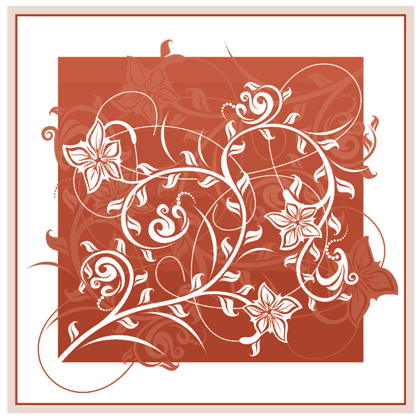
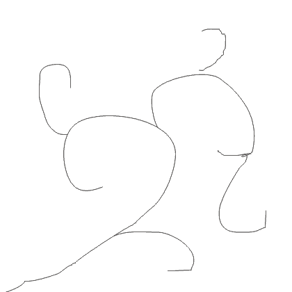
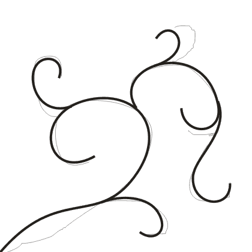
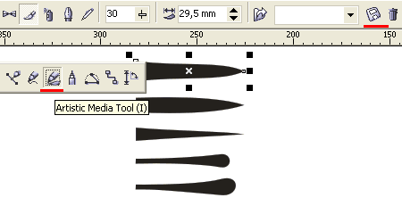
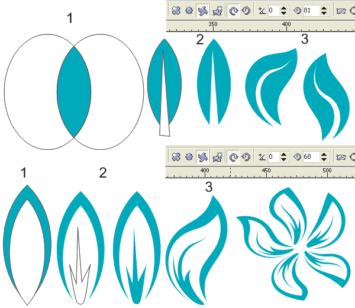
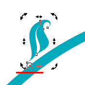
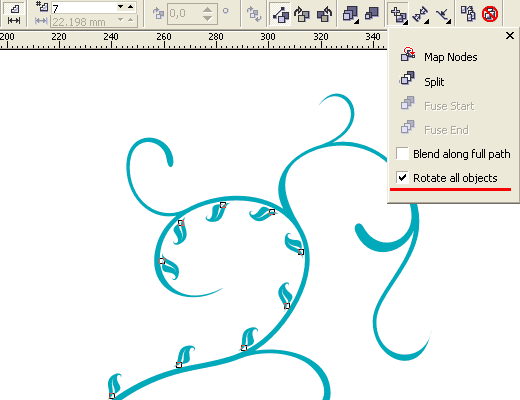
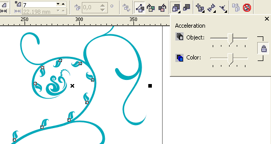
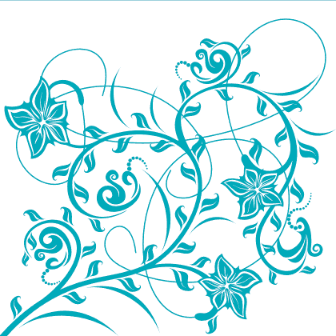

# Растительный орнамент

_Дата публикации: 02.11.2012  
Автор: Artur_

Урок рассчитан на подготовленных пользователей, которые уже имеют навыки работы с основными инструментами, в особенности с кривыми.

Урок разделен на несколько этапов:  
1) выбор и построение формы орнамента  
2) подготовка элементов  
3) детализация

Приступим.

Выбор и построение формы.

Определившись с будущей формой и композицией сделаем набросок инструментом Freehand Tool (F5) или на бумаге кому как удобнее.

Теперь поверх наброска или отсканированного скетча аккуратно отрисуем линии Bezier или Pen Tool`ом, линии должны быть именно незамкнутыми линиями а не объектами, это пути для кистей.

Это и есть первый этап, забегая вперед скажу что орнамент представляет собой некий конструктор, к разным формам можно применять разные кисти и оформлять различными элементами, формы можно редактировать, модифицировать, собирать простые в сложные и т.д. тем самым создавая множество вариаций. Так что рекомендую сохранять в сторонке все этапы создания.

Подготовка элементов.

Теперь нужно создать кисти для основы орнамента а также листики, цветочки и другие детальки для детального оформления.  
Достаточно нескольких вариантов кистей, заостренных и закругленных, тонких и пузатых, остальное делается с помощью настроек и ручной правки. Как правило кисть представляет собой простой объект как на рисунке, но можно поэксперементировать и с более сложными формами.  
Сохраняем кисти выбрав инструмент Artistic Media и нажав на значок сохранения рядом с выпадающим меню кистей.

Листики и цветочки также можно предварительно набросать на бумаге, можно как я рисовать кривыми, особо сложных форм тут не требуется и самые простые элементы при должном подходе будут хорошо смотреться в общей композиции.

Из автоматических способов приведу пример работы с Interactive Distortion Tool`ом:

1\. Создаем простую форму из пересечения двух эллипсов.  
2\. Делаем прожилку для листика обрезав простой кривой, и контур для лепестка обрезав ее уменьшенной копией, также рисуем простенькую серединку в лепестке.  
3\. Копируем заготовку несколько раз и применяем эффект скручивающий искажения Interactive Distortion Tool`ом к каждой копии с разными настройками, тем самым создавая разнообразные элементы оформления. Из нескольких лепестков собираем цветок.

Детализация.

Подготовительные этапы закончены, приступим к самой интересной части.  
Придадим форму основе орнамента, применив различные кисти к различным частям формы. Отделив кисти от путей сольем все объекты и пройдемся шейпером исправляя неровности, должно получится примерно так:

Теперь расставим вдоль основных линий орнамента листики. Для этого можно использовать Blend Tool (перетекание) и указывать в качестве пути форму, регулировать расстояние между листиком и формой следует смещая его центр вращения:

Так же незабудьте поставить галочку Rotate all objects, чтобы листики вращались в соответствии с изгибом пути:

Когда объекты перетекания привязаны к пути их можно без проблем перемещать, поворачивать и изменять размер, это очень удобно и наглядно, естественно заполнить всю форму одним блендом не получится, все делается в несколько этапов, а кое где возможно потребуется ручная расстановка. Так же можно поиграться с опциями Acceleration:

Расставляем цветы и более крупные элементы, а чтобы небыло ощущения пустоты добавим тонких завитушек - просто набросаем линии и переведем в объекты.

Все почти готово, осталось раскрасить, на фон можно кинуть градиент или продублированный зеркальный орнамент покрашенный в оттенок фона или и то и другое, опять же это дело вашего вкуса и фантазии.

Удачи!