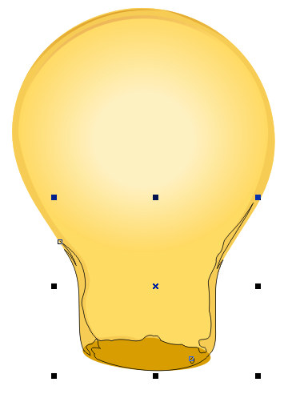

# Рисуем лампочку при помощи бленды

_Дата публикации: 02.11.2012  
Автор: vectora_

В данном уроке мы создадим почти реалистичную лампочку. Все это мы сделаем для того, чтобы понять каким образом можно использовать бленды. Нам придется запастись терпением и большим желанием сделать правдоподобную натуральную лампочку. Не стоит браться за урок, если Вы предпочитаете добиться хотя бы какого-нибудь простого результата за 15 минут. Эта работа требует большой концентрации внимания

**Оглавление**

1\. Рисуем основные контуры колбы лампочки  
2\. Свечение внутри лампы  
3\. Рисуем тени на колбе лампочки  
4\. Светлые блики на колбе лампочки  
5\. Стеклянный центр лампочки  
6\. Рисуем тени центра  
7\. Прорисовываем нить накаливания  
8\. Рисуем цоколь  
9\. Фон и свечение от лампочки

Лампочка с применением бленд в CorelDraw

**Рисуем основные контуры колбы лампочки**

1.1 Создаем новый документ в CorelDraw и называем слой "Колба" (закладка справа).

рис. 1.1 Закладка слоев (Object Manager)

1.2 Выбираем инструмент Ellipse Tool (F7) и рисуем круг.

рис. 1.2 Инструмент Ellipse Tool и создание им круга

Для того, чтобы сделать идеально ровную фигуру, необходимо работать мышью при нажатой кнопке Ctrl на клавиатуре.

1.3 Берём инструмент Rectangle Tool (F6) и рисуем прямоугольник.

рис. 1.3 Инструмент Rectangle Tool и создание им прямоугольника

1.4 Выбираем инструмент Shape Tool (F10) и в его верхнем меню нажимаем кнопку Convert to Curves (Ctrl+Q). Теперь инструментом Shape Tool создаем опорные точки двойным кликом на каждой линии. После этого тянем каждый верхний угол прямоугольника так, чтобы получилась трапециевидная фигура.

рис. 1.4 Трансформируем объект

1.5 Всё тем же инструментом создаем новые опорные точки чуть выше предыдущих на пересечении нашего квадрата с кругом.

рис. 1.5 Создаем еще несколько опорных точек

1.6 Выделяем все опорные точки инструментом Shape Tool и в его верхнем меню нажимаем кнопку Convert Line to Curve. Теперь мы можем изогнуть нашу линию. Делаем ее как можно плавнее.

рис. 1.6 Изгибаем нашу линию

1.7 Рисуем еще один небольшой прямоугольник для того, чтобы убрать ненужные нам углы. Открываем верхнее меню (Window > Dockers > Shaping), справа появится закладка.

рис. 1.7 Закладка Shaping

1.8 Теперь мы должны "вырезать" из прямоугольника круг. Для этого в закладке Shaping выбираем пункт Trim, выделяем наш круг и жмем на кнопку Trim, затем на наш небольшой прямоугольник. В результате должны остаться только края от нашего прямоугольника.

рис. 1.8 Вырезаем из прямоугольника круг

1.9 Теперь проделаем те же действия для того, чтобы обрезать углы нашей трапецивидной фигуры. Мы должны выделить то, что осталось от нашего прямоугольника, и вырезать его из трапеции. Затем удаляем ненужный нам прямоугольник.

рис. 1.9 Прямоугольник вырезаем из трапеции

1.10 Теперь мы можем "слить" два наших объекта. В той же закладке Shaping выбираем пункт Weld. Выделяем любой из наших объектов, например, круг, и нажимаем кнопку Weld To, затем жмем на нашу трапецивидную фигуру.

рис. 1.10 Соединяем наши объекты

1.11 Делаем еще несколько опорных точек для того, чтобы получить правильную форму лампы (см. п. 1.5 - п. 1.6). Закрашиваем наш объект желтым цветом (R 250 G 215 B 102) и убираем его контур.

рис. 1.11 Придаем завершающую форму объекту

**Свечение внутри лампы**

2.1 Создаем новый слой и назовем его "Свечение". Рисуем два новых круга. Один должен практически совпадать с контуром нашей лампочки, другой должен быть чуть меньше. Большой круг делаем одного цвета с нашей "колбой" (R 250 G 215 B 102), а маленький сделаем намного светлее (R 253 G 239 B 195). После этого уберем контур обоих объектов.

рис. 2.1 Рисуем два новых круга

2.2 Теперь возьмем Interactive Blend Tool в левой панели инструментов и, удерживая мышку на бледно-желтом кружке, проведем ею до нашего большого круга.

рис. 2.2 Создаем бленду

2.3 Но наш "свет" выглядит не очень плавно. Для того, чтобы это изменить, мы должны регулировать шаг бленды. Выбираем в верхнем меню инструмента количество шагов. К примеру 150\. Чем больше число, тем будет мягче переход цвета.

рис. 2.3 Регулируем количество шагов

**Рисуем тени на колбе лампочки**

3.1 Создаем еще один слой "Тени колбы". Делаем копию нашего объект "колба" в новый слой и еще один дубликат, размеры которого делаем меньше.

рис. 3.1 Дублируем и уменьшаем

Для того, чтобы сделать копию объекта, необходимо кликнуть на нем мышкой и нажать Ctrl+C. Для того, чтобы вставить новый объект - нажать Ctrl+V.

3.2 Мы уменьшили один из объектов, но он находится не четко по середине другого, как нам хотелось бы. Для этого мы выделяем обе новые "Колбы" и только после этого, удерживая Shift, кликаем по нашей основной форме лампочки (стараемся не попасть по нашему "свечению"), затем в верхнем меню инструмента выбираем Align and Distribute . В появившемся окошке помечаем галочками нужное нам выравнивание.

рис. 3.2 Выравниваем объекты

3.3 Теперь нам нужно вырезать маленький объект из большого (см. пункт 1.8). После удаляем маленький объект, если таковой остался. Должно получиться следующее.

рис. 3.3 Вырезать маленький объект из большого

3.4 Мы получили вырезаный изнутри объект, теперь можно его деформировать, как нам нравится. Берем Shape Tool (F10) и при помощи него искривляем нашу внутреннюю часть, как хотим, перемещая точки или саму кривую. Зальем наш получившийся объект цветом (R 242 G 200 B88) и уберем черный контур.

рис. 3.4 Придаем правильную форму вырезаному объекту

3.5 Рисуем круг и дублируем его. Смещаем один чуть ниже другого. Делаем вырезание (см.пункт 1.8) нижнего из верхнего, чтобы получить изгиб. Располагаем его по нижнему краю темной полосы.

рис. 3.5 Рисуем темный блик колбы

3.6 Заливаем наш изгиб темным тоном (R 213 G 147 B 87), убираем черный контур. Теперь мы добавим прозрачность инструментом Interactive Transparency Tool в левой панели, так, чтобы сгладить острые края нашего изгиба.

рис. 3.6 Используем прозрачность Interactive Transparency Tool

3.7 Рисуем еще два похожих изгиба и заливаем их тоном еще темнее (R 211 G 152 B 45).

рис. 3.7 Рисуем еще несколько теней

3.8 Рисуем небольшой овал и переводим его в кривые кнопкой Convert to Curves или (Ctrl+Q) . Затем инструментом Shape Tool (F10) задаем ему нужную форму.

рис. 3.8 Рисуем донышко колбы

3.9 При помощи инструмента Freehand Tool (F5) рисуем еще один контур.

рис. 3.9 Рисуем контур еще одной тени

3.10 Закрасим наш объект темным тоном (R 198 G 133 B 22) и добавим линейную прозрачность (см. пункт 3.6), чтобы не были заметны острые края.

рис. 3.10 Используем линейную прозрачность

3.11 Инструментом Freehand Tool (F5) рисуем еще одну тень на нашей лампочке, заливаем ее тоном (R 234 G 161 B 102) и убираем контур. Добавляем линейную прозрачность как в предыдущем пункте.

рис. 3.11 Рисуем новую тень

3.12 Добавляем еще несколько темных областей на нашу колбу, заливая их тоном (R 193 G 141 B 37).

рис. 3.12 Темные области колбы

3.13 Рисуем два искривленных овала инструментом Freehand Tool (F5) и заливаем большой тоном (R 198 G 133 B 22), а маленький (R 188 G 124 B 16). Делаем бленду рисуем еще один контур. из маленького в большой (см. пункт 2.2). Количество шагов в этом случае может быть меньше, например, 35\.

рис. 3.13 Темные области колбы

**Светлые блики на колбе лампочки**

4.1 Создаем изгиб в верхней части колбы, как делали это раньше, и заливаем его белым цветом. Добавляем линейную прозрачность, чтобы "затереть" острые края.

рис. 4.1 Создаем светлую область на колбе

4.2 Рисуем еще два белых блика инструментом Freehand Tool (F5). Самому маленькому задаем прозрачность (Interactive Transparency Tool) uniform на 80%.

рис. 4.2 Рисуем белый блик на колбе

**Стеклянный центр лампочки**

5.1 Создаем новый слой и называем его "Стеклянный центр лампочки". Инструментом Freehand Tool (F5) рисуем контур центральной части. В середине объекта рисуем продолговатый овал и "вырезаем" его из основного контура нашего стеклянного центра. Продолговатый овал не удаляем. Объект приобретает вид как на рисунке ниже. Закрашиваем его светлым тоном (R 249 G 208 B 77), убираем черный контур и устанавливаем прозрачность uniform на 56%.

рис. 5.1 Рисуем основу центра

5.2 Копируем продолговатый овал, который мы оставили чуть раньше, и увеличиваем его. Затем маленький овал вырезаем из большого. Мы получили объект похожий на вытянутое кольцо. Зальем его темным цветом (R 217 G 194 B 85). Не оставляем ни каких контуров. Добавим к нашему кольцу прямолинейную прозрачность.

рис. 5.2 Создаем внутреннюю тень центра

5.3 Для того, чтобы создать блик на нашем стеклянном центре, мы должны скопировать его еще раз и при помощи инструмента Shape Tool (F10) удалить несколько точек с контура. Зададим ему белый цвет и добавим прозрачности uniform на 84%.

рис. 5.3 Белый блик центра

Нашему стеклянному центру не хватает теней для объемности. Лампочка смотрится плоско.

**Рисуем тени центра**

6.1 Создаем новый слой, называем его "Тени центра". Берем инструмент Freehand Tool (F5) и прорисовываем крупные и средние тени там, где, как нам кажется, должны находиться темные участки лампочки. Используем два цвета темный (R 203 G 155 B 13) и чуть светлее (R 249 G 187 B 63). Не забываем везде удалять контур.

рис. 6.1 Прорисовываем крупные и средние тени центра

6.2 Добавляем линейную прозрачность на темный объект.

рис. 6.2 Добавляем прозрачность

6.3 Рисуем еще несколько разных теней, располагая их друг над другом и раскрашивая их в темные и светлые тона.

рис. 6.3 Добавим еще несколько теней

6.4 Добавляем немного желтых бликов (R 252 G 229 B 61) и устанавливаем прозрачность uniform для всех 63%.

рис. 6.4 Желтые блики

6.5 Делаем две небольшие красноватые линии цветом (R 203 G 79 B 53).

рис. 6.5 Выделяющиеся блики другого цвета

6.6 Делаем еще несколько темных полос сверху.

рис. 6.6 Преображаем верх стеклянного центра

6.7 Последний штрих для стеклянного центра - это яркие белые блики. Добавим их везде, где, как нам кажется, они должны быть.

рис. 6.7 Добавляем белые блики

Наша лампочка начала принимать более естественный вид, но не хватает самой важной части. Переходим к спирали.

**Прорисовываем нить накаливания**

7.1 Создаем новый слой и называем его "Нить накаливания". Теперь мы можем нарисовать две не совсем прямые линии для нашей спирали, делая это инструментом Freehand Tool (F5) и используя цвет (R 140 G 110 B 53). Точно так же создаем следующие полосы поверх первых, заливая их цветом чуть светлее (R 217 G 194 B 85), и применяем к ним прозрачность uniform на 69%.

рис. 7.1 Рисуем линии

7.2 Теперь рисуем заключительную часть - нашу спираль. Так как свет в лампочке очень яркий, то спираль не будет четко видно. Поэтому мы нарисуем совершенно белые объекты, едва улавливающие контуры спирали и все отражающиеся блики от нее. Затем объединим все наши объекты в один при помощи закладки Shaping, выбрав в ее меню пункт Weld и склеивая каждый объект в отдельности. Теперь мы можем применить ко всему этому объекту линейную прозрачность.

рис. 7.2 Рисуем спираль

Мы закончили с верхней частью лампочки и переходим к цоколю.

**Рисуем цоколь**

8.1 Делаем еще один слой и называем "цоколь". Теперь обрисуем основной контур, следя за тем, чтобы количество ветков резьбы было одинаковым с каждой стороны. Закрашиваем его (R 28 G 15 B 5).

рис. 8.1 Обрисовываем основной контур цоколя

8.2 Рисуем тени цоколя и заливаем их разными цветами, подходящими к нашему основному фону. Добавляем прозрачность в тех местах, где, как мы считаем, это необходимо.

рис. 8.2 Рисуем тени цоколя

8.3 Осталось добавить только светлые блики для того, чтобы наш цоколь выглядел натурально. Для этого рисуем на каждом витке цоколя блик и делаем две точные его копии, меняя их размер по убыванию. Самый крупный имеет цвет (R 64 G 43 B 4), следующий - (R 125 G 95 B 24) и самый маленький - (R 238 G 191 B 58).

рис. 8.3 Рисуем светлые тени цоколя

Для полного завершения рисунка мы можем добавить черный квадрат и сделать свечение от лампочки.

**Фон и свечение от лампочки**

9.1 Создаем новый слой "Фон". Помещаем наш слой в самый низ (перетаскиваем мышкой сверху вниз) и рисуем на нем большой черный прямоугольник.

рис. 9.1 Рисуем черный фон

9.2 Выбираем в слое "колба" наш контур лампочки и копируем его в слой "фон". Нам нужно чуть изменить низ нашей колбы в слое "фон", но нового объекта мы не увидим, поскольку он находится под всеми слоями нашего рисунка. Нам нужно нажать на иконку, похожую на глаз, в закладке слоев (Object Manager) для того, чтобы скрыть все слои, которые лежат выше нашего слоя "фон".

рис. 9.2 Изменяем настройки в меню слоев

9.3 Мы чуть изменили вид нашего контура и нам нужен второй такой же объект только крупнее. Для этого мы копируем имеющийся и увеличиваем его в размере. Заливаем его черным цветом.

рис. 9.3 Видоизменяем контур колбы и делаем дубликат

9.4 Теперь каждому из объектов добавим линейную прозрачность.

рис. 9.4 Добавляем прозрачность

9.5 Для создания свечения нам не хватает теперь только одной детали: надо сделать бленду от желтого объекта к черному (см. пункт 2.2). Увеличивая число шагов бленты до 200, мы получаем нужный нам эффект.

рис. 9.5 Рисуем бленду - свечение

9.6 Возвращаем все наши слои в видимое состояние. Наш рисунок готов, можно вздохнуть с облегчением.

рис. 9.6 Готовая лампочка