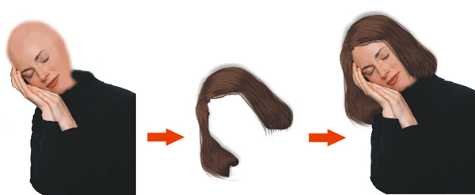

# Рисуем волосы в CorelDRAW

_Дата публикации: 02.11.2012  
Автор: KarLsoN_

Часто задаваемые вопрос на powerclip «как нарисовать волосы???» Решил описать свой способ, достаточно простотой, эффективный и удобный.

На первом этапе мы нарисуем один волос, пусть это будет волнистый тип волос, цвет абсолютно не принципиален. Берем инструмент Безье или Pen tool и рисуем треугольник.

На полученной форме добавляем дополнительные узлы с помощью инструмента «форма» для приданию объекту нужной формы

Этим же инструментом преобразовываем линию в кривую.

Волосы бликуют, поэтому рисуем на нем несколько бликов тем же способом, что и сам волос.

Далее закрашиваем волос в понравившейся вам цвет, я выбрал два оттенка.

Далее делаю еще несколько вариантов волоса.

теперь из полученного волоса формируем небольшой локон из 4-6 волосков, чтобы они не казались однообразными, применяем инструмент «интерактивная оболочка» (Interactive Envelope Tool) и задаем каждому отдельному объекту форму на свой вкус.

Тем же самым образом я создаю остальные локоны, у вас их может быть больше, я для наглядности использую только три.

На втором этапе нам необходимо создать из полученных локонов рабочие кисти «Artistic Media». Для этого проделываем следующие действия, заходим в меню ОКНА\ДОКЕРЫ\ХУДОЖЕСТВЕННЫЙ СПОСОБ. (Windows - Dockers - Artistic Media)

Появляется окно с кистями. Теперь создаем новую кисть. Для этого просто перетаскиваем один из локонов, в докер с кистями.

У вас появится окно «Create a new stroke» оставляете brush по умолчанию и нажимаете «ОК» сохраняете полученную кисть. В докере у вас появится ваша собственная кисть, те же действия необходимо проделать, с оставшимися локонами.

Третий этап, это построение прически, для наглядности я приготовил лысый манекен

На нем мы создаем основу для прически и закрашиваем ее, тем же не хитрым способом которым мы рисовали волос.

Далее выбираем инструмент «живопись» (Artistic Media Tool), созданную вами кисть и локон за локоном начинаем создавать прическу. И так до тех пор, пока не добьетесь нужного вам результата.

**Спасибо, за внимание**