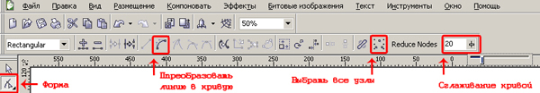
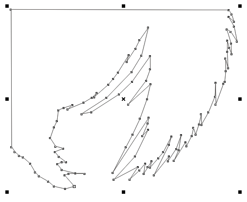
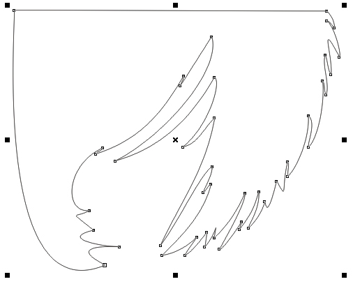
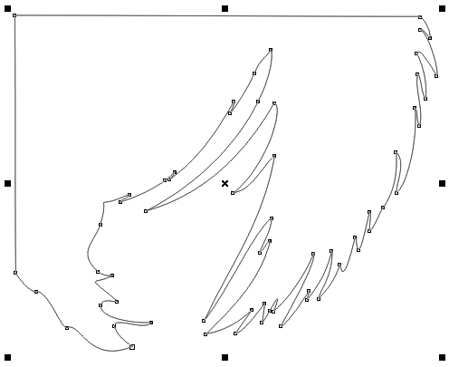

# Сглаживание кривой в CorelDRAW

_Дата публикации: 02.11.2012  
Автор: KarLsoN_

Достаточно простой и полезный урок, именно для тех пользователей CorelDRAW, которые этой функцией никогда не пользовались. Многие знают, что при работе с векторными изображениями число узлов в каждой кривой не должно превышало 1500, а в контуре Powerclip либо в любом помещенном в него объекте — не более 300\. Да и даже если ваша не кривая не насчитывает такого количества узлов, лишние вам все равно ни к чему. Мы разобрались, что их вообще нужно минимизировать, а вот каким способом делаете это вы? Лично я, долгое время убирал их вручную, это скучный, но нужный процесс, который отнимает время… Чтобы и у вас это занятие не отнимало уйму времени, разработчики CorelDRAW создали функцию сглаживание кривой, которая позволяет быстро и просто избавится от всех лишних узлов.

Например вы имеете контур

Далее вы все точки преобразовываете в к кривую, задаете форму как вам угодно.

Но узлов на кривой много, и вы начинаете задумываться о том, что нужно убрать ненужные, и снова в ручную ((( как раз тут нам и пригодится выше упомянутое сглаживание кривой. Выбираете инструмент «форма» (F10), нажимаете кнопку выбрать все узлы. И при помощи ползунка сглаживание кривой регулируете их количество. Чем больше сглаживание, тем меньше будет создано узлов. Если узлов слишком мало - вы проторяете исходную форму вашей кривой и придётся дольше подгонять.

Обычно нормально получается при сглаживании около 20%, хотя это зависит от ломанности самого контура. И при правильном использование вы получаете контур с минимальным количеством узлов и с сохранением желаемой формы.

**Огромная благодарность за помощь, Оглушевичу Алексею!!!**