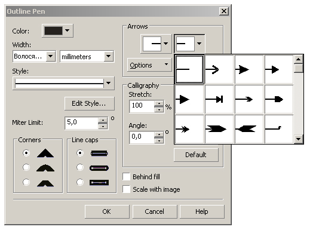
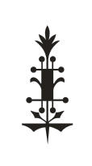
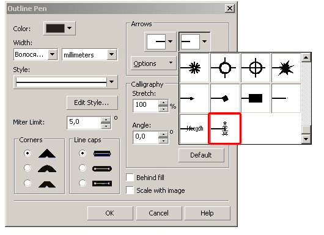
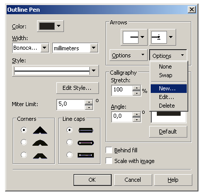
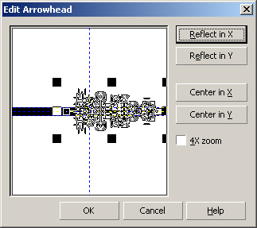

# Создаем свой «arrowhead»

_Дата публикации: 02.11.2012  
Автор: KarLsoN_

Многие знают, что в CorelDRAW существуют такая функция

Но как быть, если из доступных окончаний вас ничего не устраивает?  
Да все очень просто! Рисуем любой элемент, например это будет такой наконечник

Изменяем масштаб объекта так, чтобы его наибольший размер составлял около 14-16 сантиметров. Далее создаем arrowhead, выделяем объект, идем в меню, Tools (инструменты) -> Create (создать) -> Arrow (стрелка). Полученный результат можно сразу увидеть в низу списка окончаний.

Далее настраиваем расположение. Выбираем нужное окончание, нажимаем кнопку Options (опции), и выбираем в появившемся меню Edit (редактировать)

видим следующее окно.

Настраиваем положение, нажимаем «OK». Проверяем результат.