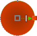
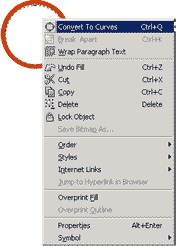
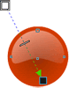
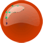
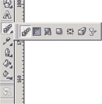
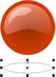

# Создание круглой кнопки

_Дата публикации: 02.11.2012  
Автор: VVV_

Создаем **круг с радиальной заливкой** от светлых тонов (снаружи) до темных (внутри)

Делаем уменьшенную **копию круга** и окрашиваем его в белый

**Кривим** белый круг

и **придаем форму** большого блика

Применяем линейную прозрачность к белой кривой

А для пущей убедительности ставим блеск следующим образом: копируем «большой блик», уменьшаем его и удаляем нижний, правый узел. Остается немного подправить линии чтоб получилось, что-то вроде этого:

Для того, чтоб посадить нашу кнопку на поверхность можно применить контур (темного тона) к кругу с радиальной заливкой, то есть к нижнему кругу который мы сделали первым:

А для того чтоб подвесить кнопку над поверхностью создаем имитацию тени при помощи инструмента Blend Tool:

А делается эта тень следующим образом: создаем овал цвета фона (в нашем случае белого) главное не забудьте, применить к овалу цвет фона, даже если он будет белым

Делаем уменьшенную копию овала "цвета фона" и затемняем его при помощи черного. Так например если у вас цвет фона белый (C0 M0 Y0 K0)* то добавляя черного (K), например 10%, мы получим серый (C0 M0 Y0 K10), а если у вас сложный фон - например (C0 M10 Y10 K0), то процедура ничем не меняется кроме результата - (C0 M10 Y10 K10) цвет получится не серым а темно-розовым.

Применяем к овалам инструмент Blend Tool

Не забудьте убрать контур иначе получиться не совсем то, что хотелось

А вот и результат наших стараний

* (CMYK)- цветовая модель используемая в полиграфии, где C - голубой, M - пурпурный Y - желтый K - черный.