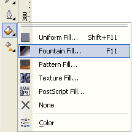

# Создание Веб 2.0 бейджа

_Дата публикации: 02.11.2012  
Автор: Artur_

Самый подробный мой урок, поэтому думаю справятся все, даже самые начинающие пользователи CorelDraw (собственно урок на новичков и рассчитан). Итак будем рисовать модные Web 2.0 бейджи для своих блогов и сайтов, поехали!

Для работы с цветом лучше использовать специальную палитру web 2.0 цветов (файл палитры в архиве с векторным исходником)  
Скопируйте файл web20.cpl в папку с палитрами (по умолчанию C:\Program Files\Corel\CorelDRAW Graphics Suite X4\Languages\EN\Custom Data) и нажав на кнопку со стрелочкой над стандартной палитрой выберите пункт Palette>Open…, в появившемся окошке выберите скопированный файл и нажмите OK.

Совет: чтобы не тратить время на поиск папки можно сразу скопировать файл в окно открытия палитры сочетаниями Ctrl+C/V, такие окна работают аналогично стандартному Проводнику Windows.  
Для удобной работы с палитрой, чтобы она отображалась в диалогах градиентной заливки, заливки контура и т.д. нужно назначить ее палитрой по умолчанию, опять кликните по иконке со стрелочкой и отметьте пункт Set Us Default.

Приступим к рисованию.

Инструментом Ellipse Tool (F7) с зажатым Ctrl рисуем кружок:

с зажатым Shift тянем за угловой маркер внутрь и не отпуская левой клавиши мыши кликаем правой, таким образом получаем уменьшенную копию точно в центре:

таким же образом сделаем еще одну копию примерно как на картинке, размер можно подправить позже с зажатым Shift:

Выделяем больший кружок и кликаем по инструменту Interactive Distortion Tool, в появившейся панели свойств инструмента выбираем тип искажения Zipper Distortion и выставляем параметры искажения примерно как на скриншоте:

Теперь разукрасим: выделяем меньший кружок, кликаем по иконке Fill (заливка) и выбираем Fountain fill… (градиентная заливка) или нажимаем F11:

В появившемся окне в выпадающем списке выбираем радиальный градиент (Type: Radial), тип заливки Custom и кликая по маркерам над нижним полем предпросмотра градиента выбираем цвета из палитры справа, для создания промежуточных маркеров достаточно сделать двойной щелчек на градиенте. Когда цвета выставлены в верхнем поле предпросмотра сместим центр градиента вправо и вверх и нажмем OK:

Скопируем градиент на больший кружок просто перетащив его с Property Bar`а, затем выделив больший кружок сделаем двойной щелчок на том же значке заливки, попадем в меню заливки и немного сместим центр градиента. Повторим тоже самое с «зубастым» кружком, можно немного высветлить градиент, получаем примерно следующее:

Теперь сделаем красивые ленточки:

инструментом Rectangle Tool нарисуем прямоугольник:

переведем его в кривые нажав Ctrl+Q, выберем инструмент Shape Tool (F10) сделав двойной щелчек на линии добавим узел и сместим его вверх:

двойным щелчком на инструменте Shape Tool выделим все узлы (или нажмем Ctrl+A) и переведем линии в кривые нажав соответствующую кнопку на панели свойств:

поискривляем линии шейпером чтобы стало больше похоже на ленту, сдублируем (перетаскивая в сторону не отпуская левой кнопки мыши нажать правую, или «+» на цифровой клавиатуре или Ctrl+D) и немного изменим копию, получится примерно так:

немного повернем ленты и раскрасим теперь уже линейными градиентами:

поместим ленточки под бейдж используя клавиши Ctrl+PdDn или кликнув по ним левой кнопкой мыши в появившемся меню выбрать Order>Behind… и появившейся стрелкой указать на больший кружок:

Добавим контуры: откроем докер Effects>Contour (Ctrl+F9), выберем Outside и подберем толщину в зависимости от размера, потоньше но чтоб было видно:

Отделим контур от объекта нажав Ctrl+K или через меню Arrange>Break Apart, покрасим его в темно-синий цвет и повторим тоже самое для ленточек:

Самая вкусная часть урока это блики и тень.

Нарисуем инструментом Bezier Tool форму будущего блика, выделим ее и зажав Shift кликнем по большему кружку и нажмем кнопку Intersect:

переместим получившийся объект на верх кнопками Shift+PgUp и покрасим в белый цвет, затем выберем инструмент Interactive Transparency Tool и сделаем прозрачность примерно так:

повторим тоже для ленточек, еще делая контуры побольше и пользуясь командой Intersect можно сделать теньки, закрасив их градиентами потемней, в конечном итоге получится что-то подобное:

Теперь тень, поскольку стандартный инструмент дает очень посредственный результат сделаем ее другим способом. Выделим весь бейдж и сделаем общий контур нажав на соответствующую кнопку:

закрасим его в темно-серый цвет с примесью синего (или примесью цвета бейджа если делаете другого цвета) и переведем в растровое изображение командой Bitmaps>Convert to Bitmap…:

Применим фильтр Bitmaps>Blur>Gaussian Blur… со значением 20-40 в зависимости от размера, поэксперементируйте. И наложим прозрачность примерно так:

Растр с прозрачностью может заметно тормозить работу, поэтому опять переведем его в битмап и положим под бейдж. Осталось сделать надпись (придать надписи легкий объем можно если разместить слегка смещенную копию темного цвета под основной) и Web 2.0 бейдж готов:

[Векторный файл и палитра.](http://narod.ru/disk/3610569000/web2.0.zip.html)  

Удачи!