# Стеклянные кнопки, Создание Rollover`а

_Дата публикации: 02.11.2012  
Автор: Steve Bain_

Речь пойдет о создании стеклянных полупрозрачных кнопок. На первый взгляд может показаться, что этот эффект создан с помощью 3D-программ, но на самом деле вы можете добиться такого эффекта, используя всего лишь два-три правильно настроенных векторных объектов. В этом уроке вы научитесь создавать стеклянные объекты в CorelDraw.

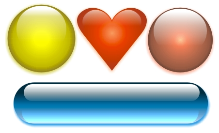

### Создание стеклянного шара

На эффект стекла влияют такие ключевые факторы, как направление света, его интенсивность, отражение, фокус и цвет. В любом прозрачном объекте его края темнее, чем середина. Мягкое освещение на стеклянный объект, направленное сверху, создает отражение источника света. Сфокусированное отражение делает поверхность более гладкой.

Использование CorelDraw для создания стеклянного эффекта требует внимательного применения цвета и прозрачности к вашим объектам. Чтоб посмотреть, как цвет и освещение влияют на эффект, давайте начнем с создания цветного стеклянного объекта.

1\. Нарисуйте окружность диаметром 50 мм (Ellipse tool), удерживая Ctrl.  
2\. Выберите инструмент Interactive Fill tool (G), в меню свойств выберите тип заливки Radial, а цвет желтый и белый

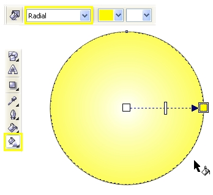

3\. Для точной настройки градиента используйте диалоговое окно Fountain Fill (F11), выберите пункт Custom. Выделите крайний левый цветовой маркер и нажмите кнопку Other, чтобы получить доступ к большему количеству цветов. Выставите цвет C40, M50, Y100, K20\. Затем так же выделите крайний правый маркер и установите цвет C0, M0, Y100, K0\. Двойным кликом добавьте два новых маркера в положение 25% и 80% и установите цвета C0, M5, Y100, K20 и C0, M0, Y100, K0 соответственно.

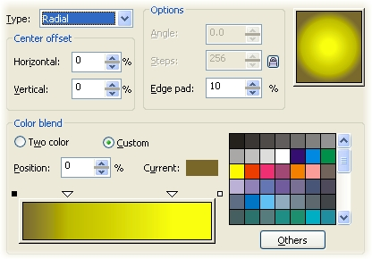

4\. Для завершения настройки цвета в меню свойств инструмента Interactive Fill tool в окне Fountain Fill Angle and Edge Pad выставите значение 5%. Удалите обводку с окружности.

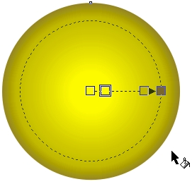

Для эффекта блика создайте вторую окружность приблизительно 30мм в диаметре, залейте белым цветом и разместите в вверху и в центре большого круга, чуть ниже его края. Не снимая выделения, примените Interactive Transparency Tool. Тяните маркер сверху окружности на три четверти вниз.

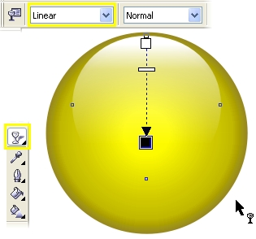

Только при помощи двух объектов вы создали реалистичный стеклянный объект. Обратите внимание, что примененная к объекту заливка придает такую иллюзию, что края сферы пропускают меньше света, чем в середине, что придает сфере объема.

Те же действия помогут вам придать стеклянный вид любому объекту. Для этого необходимо помнить, что нужно уделять особое внимание градиентной заливке и направлению эффекта прозрачности.  
Теперь на основе рассмотренных шагов мы создадим стеклянные кнопки.  
1\. Нарисуйте прямоугольник (Rectangle Tool, F6) примерно 115х30мм. (пропорции прямоугольника зависят от текста, который вы хотите поместить на кнопке).  
2\. Выделите прямоугольник и закруглите у него все углы при помощи введение значения 100% в полях Rectangle Corner Roundness в верхнем меню. Обратите внимание, что замочек Round Corners Together должен быть включен. Вы также можете скруглить углы вручную, потянув их инструментом Shape.

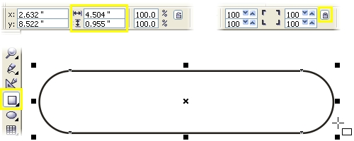

Примечание: для сохранения симметрии закругленного прямоугольника, создавайте сразу фигуру того размера, какой вам нужен, чтоб после не трансформировать ее, тем самым нарушая пропорции скругленный углов.

3\. Выберите инструмент Interactive Fill и примените градиентную заливку с параметрами по умолчанию, потянув мышкой сверху вниз. Затем откройте диалоговое окно градиента (F11) и перейдите в закладку Custom. В данном примере были использованы такие цвета: маркер 0% - C100, M20, Y0, K80, маркер 100% - C10, M0, Y0, K0, новый маркер 40% - C100, M20, Y0, K20\. Прежде чем закрыть окно, установите значение Edge Pad 5%. Нажмите ок и удалите у объекта обводку.

4\. Нарисуйте еще один прямоугольник размером примерно 100х13мм, закруглите у него углы, залейте белым цветом, удалите обводку и разместите его поверх первого по центру и вверху, как показано ниже.

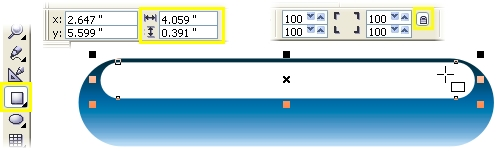

5\. Выбрав Interactive Transparency Tool потянине мышкой сверху вниз, чтобы применить прозрачность. В меню свойст установите для параметра Edge Pad 8%.

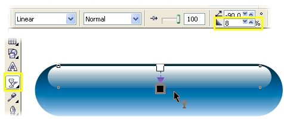

6\. Выделите инструментом Pick Tool маленький прямоугольник и скопируйте его, нажав + на клавиатуре. Трансформируйте новый прямоугольник, потянув за нижний центральный маркер вниз и зайлейте цветом Cyan из палитры.  
7\. Выберите Interactive Transparency Tool и установите маркеры так, как показано на рисунке ниже. Для того, чтобы немного смягчить эффект, перетащите из палитры цветов образец 60% черного цвета на нижний белый маркер. Для завершения смените режим наложения с Normal на Add в меню свойств. Ваша кнопка готова.

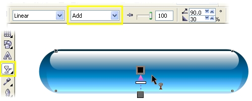

Вы можете изменять цвета заливки, создавая различные цветовые варианты кнопок

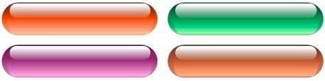

Для создания эффекта прозрачного стекла вы можете использовать эффект линзы, который будет искажать поверхность, на которой располагается ваш объект.  
Для начала сохдайте больший прямоугольник, чем ваша кнопка, который послужит фоном. В данном примере была использована растровая текстура. Чтобы применить такую текстуру, выберите Interactive Fill Tool и найдите в выпадающем меню Fill Type параметр Bitmap Pattern.  
Создайте прямоугольник с закругленными углами для будущей кнопки и откройте докер Lens (Alt+F3). Выдерите параметр Fish Eye. Измените значение Rate до тех пор, пока искажение фона не будет достаточным и нажмите Apply или Enter. Чем больше значение параметра Rate, тем сильнее искажается объект.  
Затем создайте два меньших прямоугольника для бликов, как было описано в предыдущем примере, залейте их белым и примените Interactive Transparency Tool (сверху-вниз для меньшего, снизу-вверх для большего).

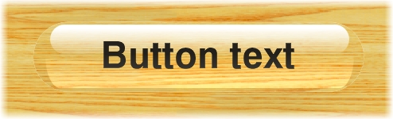

Впишите ваш текст посередине кнопки с помощью Text tool. Для точного центрирования текста объените в группу все элементы кнопки (Ctrl+G), затем выделите группу и текст и нажмите C для центрирования по вертикали и E – по горизонтали.

### Подготовка кнопки для веба

Имея готовую кнопку, мы можем сделать ее интерактивной и задать ей режимы нажатия и перекрытия, называемые Rollover. Поскольку мы имитируем трехмерный эффект с реалистичными бликами, добавление теней станет следующим логическим шагом.

Для создания эффекта Rollover мы будем использовать Internet Toolbar.  
1\. Разгруппируйте элементы созданной на предыдущих этапах кнопки (Ctrl+U).  
2\. Выберите Interactive Drop Shadow Tool и кликните на нижнем прямоугольнике. Удерживая Ctrl, потяните от центра к низу. Таким образом вы примените тень с параметрами по умолчанию. В меню свойств установите смещение по X=0, по Y=–0.7мм, прозрачность (opacity) 80, размытие (feathering) 7; цвет тени выберите cyan.

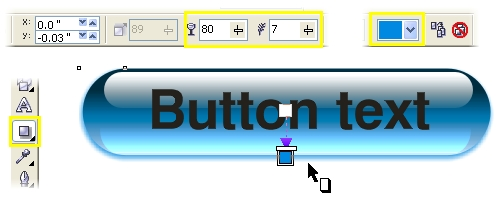

3\. Откройте меню веб-инструментов Window > Toolbars > Internet, затем выделите всю кнопку целиком. Нажмите на кнопку Create Rollover (крайняя левая). Убедитесь, что кнопка Live Preview of Rollovers выключена.

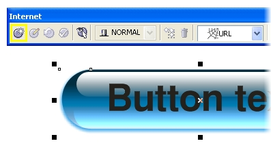

4\. Нажмите на кнопку Edit Rollover (вторая слева), чтобы установить активное состояние кнопки (сейчас это Normal). Так как мы уже создали основную кнопку, изменять в в ней для этого состояния мы ничего не будем, поэтому перейдем сразу к режиму Перекрытия.  
5\. Для того, чтобы переключить активное состояние на перекрытие мышкой, выберите в выпадающем меню Over. Выделите надпись и измените ее цвет. В этом примере был выбран белый, чтобы при наведении мышкой на кнопку, ее текст подсвечивался.

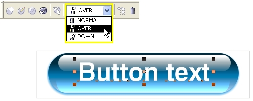

6\. Теперь перейдите в активное состояние нажатия мышкой на кнопку – Down. Инструментом Pick Tool кликните на тени и в меню Effect выберите Clear Drop Shadow. Этим действием вы удалите тень от кнопки.  
7\. Оставаясь в режиме редактирования состояния Down, выделите все объекты и откройте докер трансормации расположения объектов (Arrange > Transformations > Position, Alt+F7). Введите значение H=0, а V=–0.7мм и нажмите Apply или Enter. Как вы помните, такие значения мы вводили для эффекта тени, а значит сейчас мы смещаем кнопку на то же место, где находилась тень.

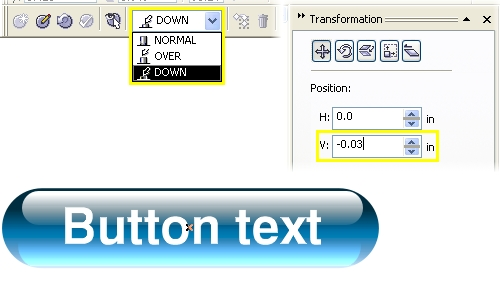

8\. Закройте окно трансформации и нажмите на Finish Editing Rollover в меню веб-инструментов. Rollover готов.

Чтобы просмотреть результат, достаточно включить параметр Live Preview of Rollovers.

Перевод - [Shmell](http://arttower.ru/forum/index.php?showtopic=1261)