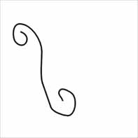
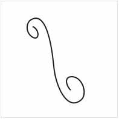
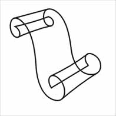
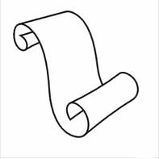
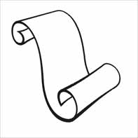
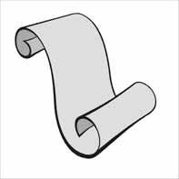
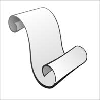

# Свиток

_Дата публикации: 02.11.2012  
Автор: Oldman_

### I. Рисуем форму.

1\. Используя freehand tool рисуем загогулину, похожую на боковину свитка, и с помощью shape tool (F10) сглаживаем неровности и подправляем.

 

2\. Дублируйте свою линию (путем перетаскивания в нужное место и, не отпуская левую клавишу мыши, кликните правой), немного исказите ее и подредактируйте тем же способом, что и в п.1\.  
Затем дорисуйте по три прямые линии сверху и снизу свитка, соединяя боковины.

3\. Теперь, двойным щелчком на линии, создавая и удаляя точки, убираем ту часть свитка, которая видна быть не должна.

4\. Выделив все линии, нажмем кнопку combine (ctrl+L), объединив тем самым наши линии в одну.

### II. Придание объема.

1\. Теперь нужно обводку преобразовать в объект – Arrange > Convert Outline to Object или Ctrl+Shift+Q.  
Результат должен быть виден в каркасном режиме: View > Simple Wireframe.  
2\. В середине видна (в каркасном режиме) старая линия, выделите ее и удалите.  
3\. Далее вернемся в режим Enhanced, возьмем shape tool и немного трансформируем внешнюю и внутреннюю стороны, чтобы придать свитку объем.

4\. Выделите свиток. Arrange > Breake Curve Apart (ctrl+K). Этим действием мы разбиваем объект на части (группу объектов). Поместите самую верхнюю сплошную часть позади всех (shift+page down). Теперь каждую из этих фигур можно закрасить отдельным цветом.

 

5\. Заливаете каждую деталь свитка подходящим градиентом:

### III. Оформление.

Добавим стилизованный текст.  
1\. Рисуем прямые линии инструментом Freehand, объединяем их нажатием на combine (ctrl+L). Затем преобразовываем линии в объект (Ctrl+Shift+Q) и, используя eraser tool (X), деформируем края линий. Вуаля!

пример

Перевод - [Shmell](http://arttower.ru/forum/index.php?showtopic=88)