# Трехмерные здания - иконки

_Дата публикации: 02.11.2012  
Автор: Azure_

1\. Инструментом Rectangle Tool (F6) нарисуйте три прямоугольника. Для удобства работы с ними залейте каждый разным оттенком.

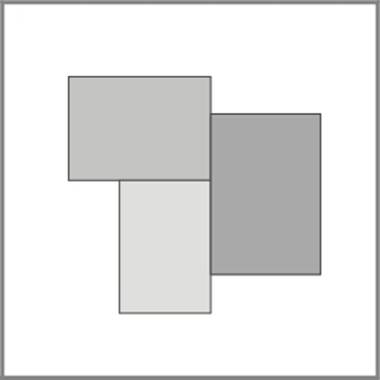

2\. Сгруппируйте объекты (выделите их и нажмите ctrl+G). Примените перспективу: Effects > Add Perspective.

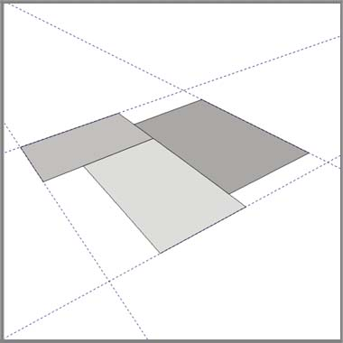

3\. Чтобы сделать здания разной высоты, разгруппируйте объекты и передвиньте прямоугольники вверх или вниз в зависимости от того, ниже или выше здание вы хотите сделать.

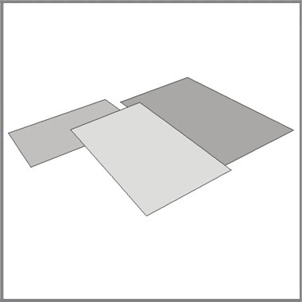

4\. Примените Interactive Extrude Tool. Настройки по-умолчанию, тяните мышью вниз.  
Чтобы соблюсти перспективу, тяните средний прямоугольник ровно вниз, а крайние вниз и к центру.

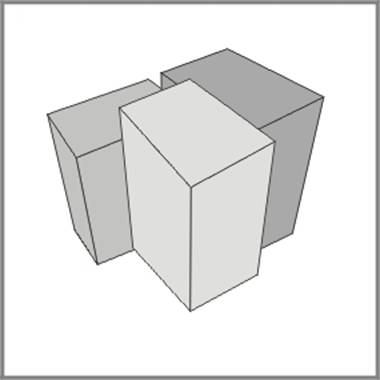

5\. Теперь необходимо преобразить эффект в отдельные объекты: Arrange > Break Extrude Group Apart, затем Ungroup. Проделайте это с каждым объектом. В итоге у вас должно получиться 9 отдельных прямоугольников.  
6\. Залейте фасад более темным цветом, а боковые стены более светлым.

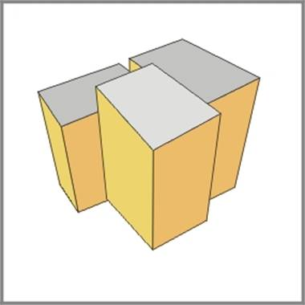

7\. У зданий должны быть окна. Нарисуйте с помощью Rectangle tool и Shape tool (F10) несколько окон разной формы, затем дублируйте их нужное вам количество раз.  
Примечание: после того, как вы скопировали первое окно, пользуйтесь Edit > Dublicate (ctrl+D) для последующего равномерного копирования.

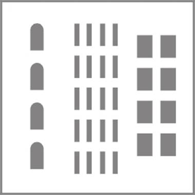

8\. Объедините каждую группу окон в один объект: Arrange > Combine (ctrl+L). Выберите эффект Add Perspective и примените его, чтобы исказить их и вписать в стены.

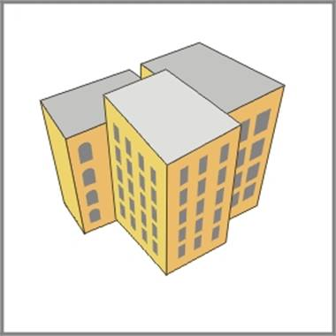

Теперь мы имеем полноценные здания, но все равно иллюстрация выглядит как-то безлико.  
Для завершения добавим теней на фасад с помощью Interactive Transparency Tool.  
9\. Скопируйте прямоугольники и вставьте поверх исходных. Расположите их с помощью ctrl+PgUp/PgDn (меню Arrange > Order) сразу за окнами.  
10\. Выберите Interactive Transparency Tool и тяните снизу вверх. (Применив эффект к одному прямоугольнику, вы можете скопировать его на следующий, выделив его, нажав на значок (Copy Transparency Properties) и указав стрелкой на объект, с которого вы хотите скопировать эффект).

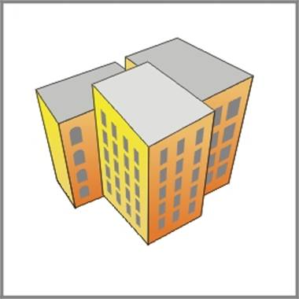

11\. Выделите все ваши окна и установите градиент (F11):

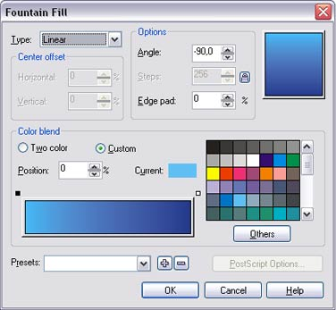

Вот и все, остались последние штрихи.  
12\. С помощью Freehand tool нарисуйте прямоугольники на крышах зданий, залейте и уберите у них обводку.

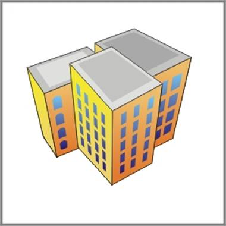

13\. Обратите внимание, на иллюстрации расстояние от объекта до наблюдателя определяется толщиной линий.

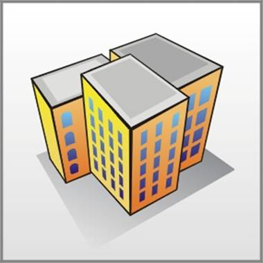

Для достижения такого эффекта используйте следующий способ:  
а). Выделите все стороны ваших зданий и в панеле Outline tool установите необходимую толщину обводки.  
б). Не снимая выделения нажмите Ctrl+Shift+Q чтобы преобразовать линии в объект.  
в). Нажимая ctrl+PgUp расположите черные линии-объекты поверх стен, таким образом, чтобы все их стороны были видны.  
Выберите Shape Tool. Все лишние точки, кроме угловых, необходимо удалить.  
Затем немного трансформируйте линии. Готово.

Перевод - [Shmell](http://arttower.ru/forum/index.php?showtopic=88)