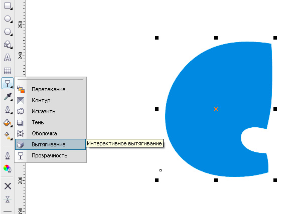
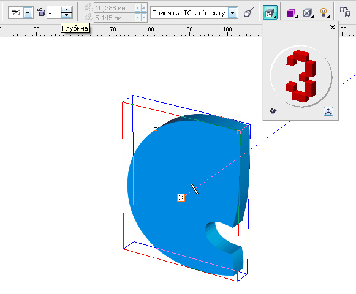
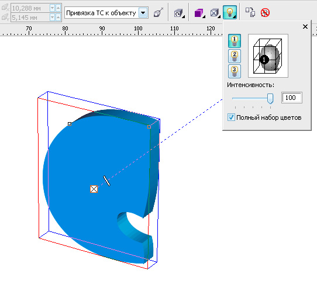
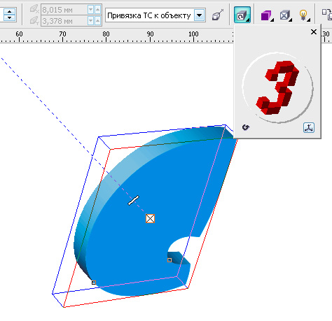
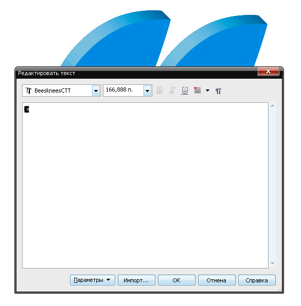
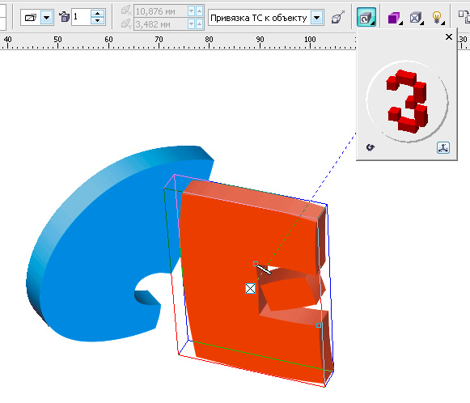
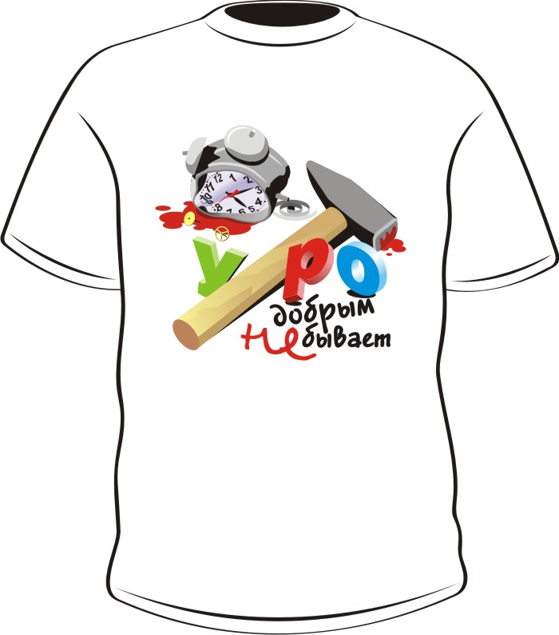

# Весёленькие буковки

_Дата публикации: 02.11.2012  
Автор: sergey_

Как-то раз была поставлена задача, сделать текст весёленьким... Весёленький, так весёленький! Надеюсь, кому-нибудь пригодится.  
Выбираем шрифт и применяем интерактивное вытягивание с помощью инструмента **Extrude**.

Задаём глубину с помощью панели свойств.

Освещаем.  
P.S. не забывайте экспериментировать, перемещая кружок с циферкой.

Окончательно задаём желаемый ракурс (поворот вытягивания).

Копируем готовую буковку для другой. Редактируем с помощью кнопки **Edit text** или сочетания Ctrl+Shift+T

и задаём ей желаемый "поворот вытягивания", цвет и освещение.

Получилось вот так. По-моему весёленько и заказчику понравилось.

P.S. Вот такую вот майку нарисовал. Назвал, как С. Дали "Утреннее убийство мешающего спать и веселящиеся буквы". Плюс, вариация на тему стеклянных букв.

 

Всем удачи и творческих успехов!