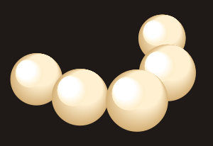
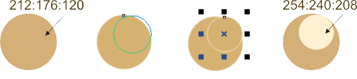
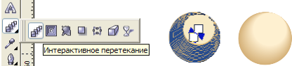
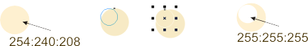

# Жемчуг в CorelDRAW

_Дата публикации: 02.11.2012  
Автор: ElizaLIV_

Вероятно это один из способов элементарно нарисовать жемчуг

Для начала рисуем кружочек, чтобы он был пропорциональным удерживайте Ctrl.  
Далее пропорционально уменьшаем и не отпуская левой кнопки мыши нажимаем правую, тем самым мы создаём уменьшенный клон.

Теперь применим “интерактивное перетекание”

Рисуем ещё один маленький кружочек и аналогично создаём его уменьшенную копию...

Аналогично применяем “Интерактивное перетекание” ну вот осталось только соединить 2 половинки :)))

